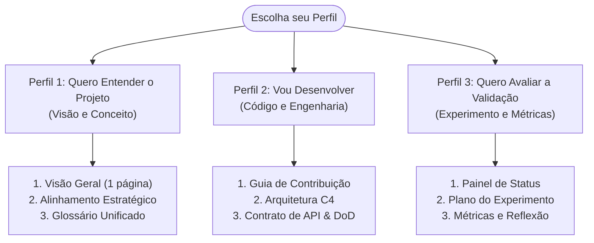

# EvidencIA — Documentação do Projeto

> **Extensão de Fact-Checking para YouTube (Manifest V3 + Arquitetura Evidence-First)**  
> Sistema de apoio ao discernimento crítico que extrai alegações de vídeos, recupera evidências factuais em bases jornalísticas auditadas brasileiras e organiza a investigação para a pessoa usuária sem emitir vereditos algorítmicos.

[](https://github.com/evidencia-grupo/documentation/actions/workflows/ci-docs.yml)
[](https://github.com/evidencia-grupo/EvidencIA)
[](docs/visao/status.md)

---

## 1. O que é o EvidencIA e para Quem É

O **EvidencIA** é uma extensão de navegador de código aberto desenvolvida sob o padrão **Manifest V3** para navegadores Chromium (Google Chrome, Microsoft Edge e Brave). Ao ser acionada durante a reprodução de um vídeo no YouTube (`youtube.com/watch*`), ela analisa a transcrição do áudio, identifica alegações verificáveis e busca reportagens de agências de checagem reconhecidas (como Aos Fatos e Agência Lupa).

### Pergunta Fundamental (Essential Question do CBL)
> *"Como sistemas de IA podem ajudar as pessoas a avaliar a confiabilidade de informações sem substituir seu pensamento crítico?"*

Ao invés de tentar arbitrar a verdade com uma pontuação ou rótulo fechado, o EvidencIA adota a arquitetura **Evidence-First** ([ADR-006](docs/arquitetura/decisoes/ADR-006-evidence-first-architecture.md)): ele expõe os fatos e as fontes de maneira transparente, indicando lacunas de evidência e estimulando a reflexão autônoma de quem assiste.

### Público-Alvo
- **Pessoas consumidoras leigas:** que desejam verificar temas sensíveis de saúde, ciência e notícias sem sair da plataforma de vídeo.
- **Estudantes e pesquisadores:** que necessitam de links diretos para apurações jornalísticas e dados com proveniência auditável.
- **Educadores:** que trabalham com educação midiática e conscientização sobre desinformação em ambientes digitais.

---

## 2. Guia de Leitura por Perfil (15 Minutos)

Selecione o seu objetivo para acessar diretamente a trilha recomendada de leitura:



### Perfil 1 — Quem Quer Entender o Projeto (Gestores, Curiosos e Usuários)
1. Inicie pela síntese executiva: [Visão Geral do Projeto (1 página)](docs/visao/visao-geral-do-projeto.md) *(leitura: 5 min)*.
2. Entenda a proposta de valor e a Essential Question: [Alinhamento Estratégico](docs/requisitos/alinhamento-estrategico.md) *(leitura: 4 min)*.
3. Consulte as convenções e termos essenciais: [Glossário Oficial do Projeto](docs/glossario.md) *(leitura: 3 min)*.
4. Visualize o ecossistema gráfico: [Mapa do Projeto e Topologia](docs/visao/mapa-do-projeto.md) *(leitura: 3 min)*.

### Perfil 2 — Quem Vai Desenvolver ou Contribuir (Engenharia e Produto)
1. Prepare o ambiente local: [Guia de Contribuição e Execução Local](docs/arquitetura/guia-contribuicao.md).
2. Compreenda os componentes e a separação de responsabilidades: [Arquitetura do Sistema (Modelos C4)](docs/arquitetura/arquitetura.md).
3. Consulte as decisões estruturais: [ADR-001 (Manifest V3)](docs/arquitetura/decisoes/ADR-001-manifest-v3.md) e [ADR-006 (Evidence-First)](docs/arquitetura/decisoes/ADR-006-evidence-first-architecture.md).
4. Verifique os critérios de entrega e qualidade: [Definition of Done (DoD)](docs/validacao/criterios-de-pronto.md) e [Product Backlog](docs/validacao/backlog-produto.md).
5. Explore os endpoints e schemas: [Contrato de Dados e API](docs/arquitetura/contrato-api.md).

### Perfil 3 — Quem Quer Avaliar a Validação e Qualidade (Avaliadores e Pesquisadores)
1. Acompanhe a situação atual das entregas: [Painel de Status Consolidado](docs/visao/status.md).
2. Conheça a metodologia de teste empírico: [Plano do Experimento com Usuários](docs/validacao/plano-experimento.md).
3. Inspecione os indicadores de eficácia e usabilidade: [Métricas de Validação (M1 a M9)](docs/validacao/definicao-metricas.md).
4. Analise os impactos cognitivos e de discernimento: [Síntese e Reflexão Crítica](docs/validacao/reflexao-critica.md).

---

## 3. Mapa dos 4 Pilares da Documentação

| Pilar | Documentos Principais | Propósito Técnico e Metodológico |
|:---|:---|:---|
| **1. Visão Geral** | [Visão em 1 Página](docs/visao/visao-geral-do-projeto.md) · [Mapa Visual](docs/visao/mapa-do-projeto.md) · [Status](docs/visao/status.md) · [Glossário](docs/glossario.md) | Panorama executivo do produto, topologia, painel de entregas e definições formais unificadas. |
| **2. Requisitos & Produto** | [Elicitação](docs/requisitos/elicitacao.md) · [Catálogo RF/RNF](docs/requisitos/catalogo-requisitos.md) · [Casos de Uso](docs/requisitos/casos-de-uso.md) · [Personas & UX](docs/requisitos/personas-e-jornadas.md) · [Histórias Gherkin](docs/requisitos/backlog-e-historias.md) · [Matriz MoSCoW](docs/requisitos/matriz-rastreabilidade.md) | Levantamento empírico, catálogo RF-01 a RF-15, RNF-01 a RNF-07, casos de uso UC-01 a UC-06, personas e matriz de priorização. |
| **3. Arquitetura & Engenharia** | [Arquitetura C4](docs/arquitetura/arquitetura.md) · [Pipeline RAG Local](docs/arquitetura/ia-e-datasets.md) · [Contrato de API](docs/arquitetura/contrato-api.md) · [Threat Model](docs/arquitetura/modelagem-ameacas.md) · [ADRs 001–006](docs/arquitetura/decisoes/ADR-001-manifest-v3.md) · [Testes & CI/CD](docs/arquitetura/estrategia-testes.md) | Diagramas de contêineres e sequência, isolamento de segredos, schemas Pydantic, modelo STRIDE, decisões arquiteturais e setup. |
| **4. Validação & Qualidade** | [Plano do Experimento](docs/validacao/plano-experimento.md) · [Protocolo de Teste](docs/validacao/protocolo-participante.md) · [Métricas M1 a M9](docs/validacao/definicao-metricas.md) · [Telemetria](docs/validacao/especificacao-telemetria.md) · [DoD](docs/validacao/criterios-de-pronto.md) · [Reflexão Crítica](docs/validacao/reflexao-critica.md) | Desenho experimental com usuários reais no YouTube, protocolo de teste, métricas objetivas de discernimento e critérios de entrega. |

---

## 4. Parâmetros Técnicos do Produto

| Parâmetro | Especificação Homologada | Rastreabilidade |
|:---|:---|:---:|
| **Padrão da Extensão** | Manifest V3 (Google Chrome Extensions API) | [ADR-001](docs/arquitetura/decisoes/ADR-001-manifest-v3.md) |
| **Navegadores Homologados** | Google Chrome, Microsoft Edge e Brave (Chromium ≥ 110) | [RNF-03](docs/requisitos/catalogo-requisitos.md#rnf-03) |
| **Domínio de Operação** | Exclusivo em URLs de reprodução ativa: `https://www.youtube.com/watch*` | [RF-01](docs/requisitos/catalogo-requisitos.md#rf-01) |
| **SLA de Latência** | Primeira evidência em ≤ 5s (P90); resultado completo em ≤ 10s (P90) | [RNF-01](docs/requisitos/catalogo-requisitos.md#rnf-01) |
| **Sobrecarga de Renderização** | Impacto máximo de **+50 ms** em Total Blocking Time (TBT) | [RNF-02](docs/requisitos/catalogo-requisitos.md#rnf-02) |
| **Armazenamento e Cache** | Retenção local temporária de 24 horas via `chrome.storage.local` | [ADR-003](docs/arquitetura/decisoes/ADR-003-estrategia-cache-local.md) |
| **Segurança de Credenciais** | Zero chaves no cliente; intermediação estrita via Backend Proxy | [ADR-002](docs/arquitetura/decisoes/ADR-002-backend-proxy.md) |
| **Acessibilidade Digital** | Conformidade com as diretrizes internacionais WCAG 2.1 nível AA | [RNF-07](docs/requisitos/catalogo-requisitos.md#rnf-07) |

---

## 5. Como Executar a Documentação Localmente

Este repositório gerencia dependências e documentação através do gerenciador de pacotes **[uv](https://docs.astral.sh/uv/)**:

```bash
# 1. Instalar as dependências sincronizadas
uv sync --frozen

# 2. Iniciar o servidor local com recarregamento em tempo real (hot-reload)
uv run mkdocs serve

# 3. Validar a integridade estrita de links e páginas (modo CI/CD)
uv run mkdocs build --strict
```

O portal de documentação ficará disponível em: [http://127.0.0.1:8000](http://127.0.0.1:8000).

---

## 6. Estado de Maturidade e Prontidão (Release Candidate)

O projeto encontra-se no estado **PRÉ-RELEASE CANDIDATA** (`PRERELEASE_CANDIDATE`).

- **Funcional (100% testado):** Extensão Manifest V3, painel lateral em Preact (WCAG 2.1 AA), extração de legendas, timestamps interativos sincronizados com o player, backend proxy FastAPI com rate limiting 429, tokens de sessão efêmeros, separação epistemológica estrita entre discurso do vídeo e checagem jornalística, e degradação graciosa Evidence-Only.
- **Parcial (Preparado / Isolado):** Pipeline de dados e corpus de fact-checking pronto tecnicamente (`TECHNICALLY_READY`), aguardando aprovação jurídica de licença para distribuição pública (Portão **H2**). Framework de avaliação de IR pronto com rotulação humana pendente (`PENDING_HUMAN_ANNOTATION`, Portão **H3**).
- **Pendente (Ações Humanas):** Homologação de infraestrutura de produção e credenciais (Portões **H1**, **H4**, **H5**), e validação empírica presencial com usuários voluntários (Portão **H6**). Consulte [`HUMAN-DECISIONS.md`](HUMAN-DECISIONS.md) e [`RELEASE-READINESS.md`](RELEASE-READINESS.md).