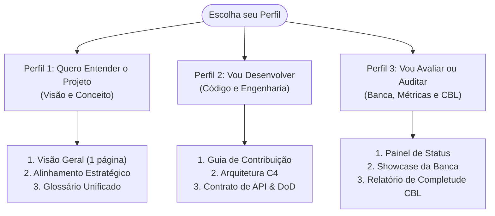

# EvidencIA — Documentação do Projeto

> **Extensão de Fact-Checking para YouTube (Manifest V3 + Arquitetura Evidence-First)**  
> Sistema de apoio ao discernimento crítico que extrai alegações de vídeos, recupera evidências factuais em bases jornalísticas auditadas brasileiras e organiza a investigação para a pessoa usuária sem emitir vereditos algorítmicos.

[](https://github.com/evidencia-grupo/documentation/actions/workflows/ci-docs.yml)
[](https://github.com/evidencia-grupo/EvidencIA)
[](docs/visao-geral/status.md)

---

## 1. O que é o EvidencIA e para Quem É

O **EvidencIA** é uma extensão de navegador de código aberto desenvolvida sob o padrão **Manifest V3** para navegadores Chromium (Google Chrome, Microsoft Edge e Brave). Ao ser acionada durante a reprodução de um vídeo no YouTube (`youtube.com/watch*`), ela analisa a transcrição do áudio, identifica alegações verificáveis e busca reportagens de agências de checagem reconhecidas (como Aos Fatos e Agência Lupa).

### Pergunta Fundamental (Essential Question do CBL)
> *"Como sistemas de IA podem ajudar as pessoas a avaliar a confiabilidade de informações sem substituir seu pensamento crítico?"*

Ao invés de tentar arbitrar a verdade com uma pontuação ou rótulo fechado, o EvidencIA adota a arquitetura **Evidence-First** ([ADR-006](docs/tecnico/decisoes/ADR-006-evidence-first-architecture.md)): ele expõe os fatos e as fontes de maneira transparente, indicando lacunas de evidência e estimulando a reflexão autônoma de quem assiste.

### Público-Alvo
- **Pessoas consumidoras leigas:** que desejam verificar temas sensíveis de saúde, ciência e notícias sem sair da plataforma de vídeo.
- **Estudantes e pesquisadores:** que necessitam de links diretos para apurações jornalísticas e dados com proveniência auditável.
- **Educadores:** que trabalham com educação midiática e conscientização sobre desinformação em ambientes digitais.

---

## 2. Guia de Leitura por Perfil (15 Minutos)

Selecione o seu objetivo para acessar diretamente a trilha recomendada de leitura:



### Perfil 1 — Quem Quer Entender o Projeto (Gestores, Curiosos e Usuários)
1. Inicie pela síntese executiva: [Visão Geral do Projeto (1 página)](docs/visao-geral/visao-geral-do-projeto.md) *(leitura: 5 min)*.
2. Entenda a proposta de valor e a Essential Question: [Alinhamento Estratégico](docs/visao/alinhamento-estrategico.md) *(leitura: 4 min)*.
3. Consulte as convenções e termos essenciais: [Glossário Oficial do Projeto](docs/glossario.md) *(leitura: 3 min)*.
4. Visualize o ecossistema gráfico: [Mapa do Projeto e Topologia](docs/visao-geral/mapa-do-projeto.md) *(leitura: 3 min)*.

### Perfil 2 — Quem Vai Desenvolver ou Contribuir (Engenharia e Produto)
1. Prepare o ambiente local: [Guia de Contribuição e Execução Local](docs/tecnico/guia-contribuicao.md).
2. Compreenda os componentes e a separação de responsabilidades: [Arquitetura do Sistema (Modelos C4)](docs/tecnico/arquitetura.md).
3. Consulte as decisões estruturais: [ADR-001 (Manifest V3)](docs/tecnico/decisoes/ADR-001-manifest-v3.md) e [ADR-006 (Evidence-First)](docs/tecnico/decisoes/ADR-006-evidence-first-architecture.md).
4. Verifique os critérios de entrega e qualidade: [Definition of Done (DoD)](docs/scrum/definition-of-done.md) e [Product Backlog](docs/scrum/product-backlog.md).
5. Explore os endpoints e schemas: [Contrato de Dados e API](docs/tecnico/contrato-api.md).

### Perfil 3 — Quem Vai Avaliar, Auditar ou Pesquisar (Banca Acadêmica e Avaliadores)
1. Acompanhe a situação atual das entregas: [Painel de Status Consolidado](docs/visao-geral/status.md).
2. Conheça o roteiro de apresentação formal: [Roteiro de Showcase para Banca](docs/cbl/reflect-share/showcase-script.md).
3. Leia o ensaio metodológico de fechamento: [Síntese Acadêmica e Reflexão Crítica](docs/cbl/reflect-share/reflection.md).
4. Inspecione os portões de decisão: [Matriz Go / No-Go Final](docs/cbl/reflect-share/go-no-go-final.md) e [Relatório de Completude CBL](docs/cbl/reflect-share/CBL_COMPLETENESS_REPORT.md).

---

## 3. Mapa Completo da Documentação

| Seção | Principais Documentos | Propósito Técnico e Metodológico |
|:---|:---|:---|
| **Visão Geral** | [Visão em 1 Página](docs/visao-geral/visao-geral-do-projeto.md) · [Mapa](docs/visao-geral/mapa-do-projeto.md) · [Status](docs/visao-geral/status.md) | Panorama executivo do produto, topologia e painel de entregas. |
| **Visão Estratégica (Engage)** | [Alinhamento Estratégico](docs/visao/alinhamento-estrategico.md) · [Guiding Questions](docs/visao/guiding-questions.md) · [Decisões](docs/visao/decision-log.md) | Problema de pesquisa, 12 perguntas orientadoras e log de decisões de negócio. |
| **Engenharia de Requisitos** | [Elicitação](docs/requisitos/elicitacao.md) · [Catálogo RF/RNF](docs/requisitos/catalogo-requisitos.md) · [Casos de Uso](docs/requisitos/casos-de-uso.md) · [Histórias](docs/requisitos/backlog-e-historias.md) · [Rastreabilidade](docs/requisitos/matriz-rastreabilidade.md) | Levantamento empírico, requisitos RF-01 a RF-15, RNF-01 a RNF-07, casos de uso UC-01 a UC-06 e matriz bidirecional. |
| **Arquitetura e Engenharia** | [Arquitetura C4](docs/tecnico/arquitetura.md) · [Pipeline de IA](docs/tecnico/ia-e-datasets.md) · [Contrato de API](docs/tecnico/contrato-api.md) · [Threat Model](docs/tecnico/threat-model.md) · [Testes](docs/tecnico/estrategia-testes.md) | Diagramas de contêineres e sequência, isolamento de segredos, schemas Pydantic e estratégia de testes. |
| **Decisões Arquiteturais** | [Índice de ADRs](docs/tecnico/decisoes/README.md) · [ADR-001 a ADR-006](docs/tecnico/decisoes/ADR-006-evidence-first-architecture.md) | Architecture Decision Records fundamentando escolhas técnicas irreversíveis. |
| **Governança Ágil (Scrum)** | [Product Backlog](docs/scrum/product-backlog.md) · [DoD](docs/scrum/definition-of-done.md) · [Cerimônias](docs/scrum/ceremonies.md) · [Sprint 01](docs/scrum/sprint-01/README.md) · [Sprint 02](docs/scrum/sprint-02/README.md) | Processo iterativo, planejamento das sprints, reviews e retrospectivas formais. |
| **Design e Experiência** | [Personas e Jornadas](docs/design/personas-e-jornadas.md) · [Design System](docs/design/design-system.md) | Arquétipos de uso, fluxos TO-BE, componentes do painel e diretrizes WCAG AA. |
| **Planejamento e Riscos** | [Priorização e MVP](docs/planejamento/priorizacao-e-mvp.md) · [Gestão de Riscos](docs/planejamento/gestao-riscos.md) · [Telemetria](docs/planejamento/metricas-telemetria.md) | Matriz MoSCoW, Lean Inception, matriz de riscos técnicos e telemetria ética sem rede. |
| **Experimento de Campo (Act)** | [Plano Experimental](docs/cbl/act/experiment-plan.md) · [Métricas M1-M9](docs/cbl/act/metrics-definition.md) · [Protocolo](docs/cbl/act/participant-protocol.md) | Desenho do estudo científico comparativo (*between-subjects*) para validação comportamental. |
| **Fechamento Metodológico** | [Síntese e Reflexão](docs/cbl/reflect-share/reflection.md) · [Portfólio de Pesquisa](docs/cbl/reflect-share/research-portfolio.md) · [Roteiros](docs/cbl/reflect-share/showcase-script.md) · [Go/No-Go](docs/cbl/reflect-share/go-no-go-final.md) | Relatório acadêmico, catalogação de evidências com hashes e roteiro de demonstração. |
| **Referência e Legado** | [Glossário Unificado](docs/glossario.md) · [Pasta de Arquivo Histórico](docs/arquivo/README.md) | Definições formais vigentes e preservação de artefatos descontinuados com notas explicativas. |

---

## 4. Parâmetros Técnicos do Produto

| Parâmetro | Especificação Homologada | Rastreabilidade |
|:---|:---|:---:|
| **Padrão da Extensão** | Manifest V3 (Google Chrome Extensions API) | [ADR-001](docs/tecnico/decisoes/ADR-001-manifest-v3.md) |
| **Navegadores Homologados** | Google Chrome, Microsoft Edge e Brave (Chromium ≥ 110) | [RNF-03](docs/requisitos/catalogo-requisitos.md#rnf-03) |
| **Domínio de Operação** | Exclusivo em URLs de reprodução ativa: `https://www.youtube.com/watch*` | [RF-01](docs/requisitos/catalogo-requisitos.md#rf-01) |
| **SLA de Latência** | Primeira evidência em ≤ 5s (P90); resultado completo em ≤ 10s (P90) | [RNF-01](docs/requisitos/catalogo-requisitos.md#rnf-01) |
| **Sobrecarga de Renderização** | Impacto máximo de **+50 ms** em Total Blocking Time (TBT) | [RNF-02](docs/requisitos/catalogo-requisitos.md#rnf-02) |
| **Armazenamento e Cache** | Retenção local temporária de 24 horas via `chrome.storage.local` | [ADR-003](docs/tecnico/decisoes/ADR-003-estrategia-cache-local.md) |
| **Segurança de Credenciais** | Zero chaves no cliente; intermediação estrita via Backend Proxy | [ADR-002](docs/tecnico/decisoes/ADR-002-backend-proxy.md) |
| **Acessibilidade Digital** | Conformidade com as diretrizes internacionais WCAG 2.1 nível AA | [RNF-07](docs/requisitos/catalogo-requisitos.md#rnf-07) |

---

## 5. Como Executar a Documentação Localmente

Este repositório gerencia dependências e documentação através do gerenciador de pacotes **[uv](https://docs.astral.sh/uv/)**:

```bash
# 1. Instalar as dependências sincronizadas
uv sync --frozen

# 2. Iniciar o servidor local com recarregamento em tempo real (hot-reload)
uv run mkdocs serve

# 3. Validar a integridade estrita de links e páginas (modo CI/CD)
uv run mkdocs build --strict
```

O portal de documentação ficará disponível em: [http://127.0.0.1:8000](http://127.0.0.1:8000).