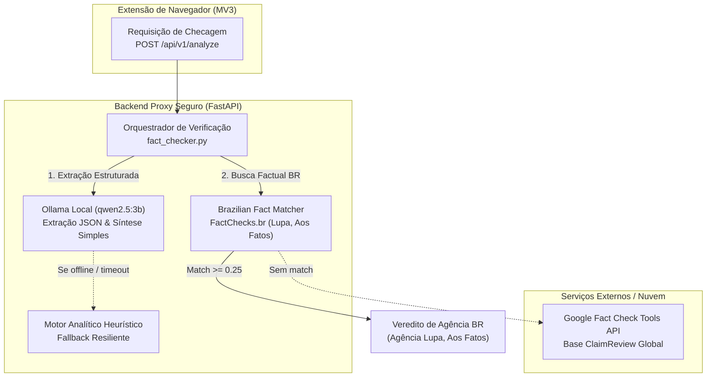

# ADR-005 — Modelo Local de IA (Ollama + Qwen 2.5-3B) e Datasets Brasileiros

| Campo | Valor |
|:---|:---|
| **Status** | Aceito |
| **Data** | 2026-09 |
| **Autores** | Equipe de Engenharia (IA & Backend Proxy) |
| **Revisores** | Comitê Técnico de Arquitetura |

---

## Contexto

O pipeline de verificação do **EvidencIA** necessita processar transcrições em português brasileiro, extrair alegações atômicas checáveis e redigir sínteses analíticas compreensíveis para públicos leigos (Dona Lurdes — [HU02](../../requisitos/backlog-e-historias.md#hu02)) e pesquisadores (Amanda — [HU04](../../requisitos/backlog-e-historias.md#hu04)), operando sob um teto estrito de latência no servidor de 8,0 segundos ([RNF-01](../../requisitos/catalogo-requisitos.md#rnf-01)).

Três desafios centrais demandavam deliberação arquitetural:

1. **Dependência e Custo de Provedores Proprietários em Nuvem:**  
   O acoplamento exclusivo a APIs pagas de LLM (como OpenAI ou Gemini corporativo) impõe riscos severos de faturamento imprevisto por volume de requisições, estrangulamento de quotas (*rate limits*) e potencial vazamento de dados de navegação dos usuários.

2. **Desalinhamento Cultural e Temático:**  
   Modelos e bases em língua inglesa ou genéricos falham em capturar nuances da desinformação regional brasileira (como receitas caseiras curativas propagadas no WhatsApp, gírias locais e atribuições fraudulentas a órgãos públicos como Anvisa, SUS e IBGE).

3. **Governança de Código e Limites do GitHub (MLOps):**  
   Pesos binários de modelos de linguagem variam de 2 a 6 GB. Versioná-los diretamente no Git viola o limite estrito de 100 MB por arquivo imposto pelo GitHub e sobrecarrega a esteira de CI/CD.

!!! danger "Inviabilidade de Aprendizado por Reforço (RL) Online com a Google Fact Check API"
    A proposta inicial de utilizar a Google Fact Check Tools API diretamente em um loop de *Reinforcement Learning* (RL) é conceitualmente e operacionalmente inviável. A API opera por busca textual pontual em artigos indexados de agências jornalísticas; para afirmações ainda não checadas formalmente, o retorno é nulo, gerando **esparsidade extrema de sinal** (gradientes nulos) e rápido bloqueio por cota de requisições. A validação precisa operar como **RAG Factual em tempo de inferência**.

---

## Decisão

**Adotar o Ollama com o modelo Qwen 2.5-3B-Instruct em execução local no Backend Proxy**, associado a um motor de correspondência direta com **datasets abertos de fact-checking brasileiros** e fallback resiliente.

### Diretrizes de Implementação

1. **Motor Generativo Local (Ollama + Qwen 2.5-3B):**
    - Execução via API HTTP REST local (`http://localhost:11434`), aproveitando o modelo **Qwen 2.5-3B-Instruct** quantizado em 4-bit (`qwen2.5:3b`), com consumo de apenas ~2.2 GB de RAM.
    - Modo estrito `format: "json"` para extração determinística de alegações, garantindo compatibilidade direta com os contratos Pydantic v2 do backend.
    - Janela de contexto nativa de até 32.768 tokens, processando transcrições de vídeos longos sem truncamento.

2. **Priorização de Datasets Nacionais:**
    - **`FactChecks.br` (UFG / Agências IFCN):** Base de verdade com checagens da Agência Lupa, Aos Fatos e Boatos.org para consulta instantânea.
    - **`Fake.br Corpus` (NILC - USP São Carlos):** Referência acadêmica em PT-BR para calibração de estilo e detecção de sensacionalismo.
    - **`ClaimPT`:** Referência de anotação para separação entre sentenças checáveis (*check-worthy*) e conversa informal.

3. **Governança MLOps e Repositório Limpo:**
    - **Zero Binários no Git:** Arquivos de pesos (`.safetensors`, `.bin`, `.gguf`) e pastas de dados brutos são permanentemente bloqueados pelo `.gitignore`.
    - **Amostra de Ouro Versionada (`sample_facts.json`):** Base curada ultraleve (< 40 KB) acompanha o repositório, garantindo testes unitários imediatos e esteira de CI/CD sem dependência de internet.
    - **Download Automatizado sob Demanda:** Script utilitário (`dataset_downloader.py`) via Hugging Face Hub para desenvolvedores que desejam a base integral.

4. **Degradação Graciosa (*Graceful Degradation*):**
    - Caso o daemon do Ollama não esteja em execução, o serviço aciona automaticamente o fallback heurístico analítico e a base de amostra local, mantendo a resposta HTTP 200 e preservando a experiência de Dona Lurdes e Amanda.

---

## Alternativas Consideradas

### Alternativa A — Ollama Local + Qwen 2.5-3B + FactChecks.br (Escolhida)

| Vantagens | Desvantagens |
|:---|:---|
| **Custo Zero e Autonomia:** Nenhuma despesa recorrente com tokens ou licenças proprietárias de API. | Exige a instalação prévia do executável do Ollama no ambiente de desenvolvimento local. |
| **Privacidade Absoluta (LGPD):** Nenhum trecho de áudio ou transcrição é enviado para provedores de nuvem estrangeiros. | Modelos de 3B parâmetros demandam uso de CPU/RAM em máquinas com recursos restritos. |
| **Soberania Linguística:** O Qwen 2.5-3B possui excelente representação em PT-BR e suporte a JSON nativo. | — |
| **Latência Mínima:** Elimina a latência de tráfego de rede para a extração primária de alegações. | — |

**Veredito:** **Aprovada.** Combina alto desempenho técnico, custo zero, respeito estrito à LGPD e alinhamento com a realidade das agências de checagem do Brasil.

---

### Alternativa B — APIs Proprietárias de Nuvem (OpenAI GPT-4o-mini / Google Gemini Flash)

| Vantagens | Desvantagens |
|:---|:---|
| Dispensa configuração de motores locais na máquina do desenvolvedor. | **Risco de Custo:** Faturamento imprevisível que inviabiliza a sustentabilidade do projeto sem orçamento dedicado. |
| Capacidade de raciocínio de modelos maiores. | **Privacidade e LGPD:** Transmissão de transcrições de vídeos assistidos por usuários para servidores internacionais. |
| — | **Esgotamento de Quotas:** Vulnerável a *rate limits* e interrupções em momentos de alto volume. |

**Veredito:** **Rejeitada como dependência primária.** O acesso a APIs externas fica restrito à Google Fact Check Tools API para busca lexical de artigos pré-existentes.

---

### Alternativa C — Fine-Tuning Supervisionado Manual Imediato (SFT no Colab/Kaggle)

| Vantagens | Desvantagens |
|:---|:---|
| Modelo especializado com pesos calibrados exatamente para a tarefa de checagem do EvidencIA. | **Risco Crítico de Prazo:** O ciclo de anotação, ajuste de hiperparâmetros, quantização GGUF e validação atrasaria as entregas da Sprint 1. |
| Redução potencial de tamanho para 1B ou 0.5B de parâmetros. | **Sobrecarga de Manutenção:** Necessidade de pipeline dedicado de MLOps para retreinamento e versionamento de pesos. |

**Veredito:** **Diferida para a Onda 2 (Pesquisa e Evolução).** A combinação de *In-Context Learning* com Ollama Qwen 2.5-3B e RAG em bases brasileiras atende plenamente ao MVP com entrega imediata.

---

## Consequências

### Positivas

- **Independência Operacional:** O backend funciona de forma autônoma em qualquer máquina local, inclusive offline para testes.
- **Conformidade com a LGPD:** O tratamento de dados da transcrição permanece estritamente confinado ao ambiente de servidor seguro ([Threat Model](../modelagem-ameacas.md)).
- **Aderência Cultural:** Checagens priorizam agências nacionais reconhecidas pela IFCN (Agência Lupa, Aos Fatos e Boatos.org).
- **CI/CD Ultrarrápido:** A suíte de testes unitários roda em menos de 0.5 segundos sem depender de conexão de rede ou chaves secretas.

### Negativas e Mitigações

| Consequência Negativa | Estratégia de Mitigação |
|:---|:---|
| Desenvolvedores precisam ter o Ollama instalado para usufruir da extração generativa local. | O backend implementa detecção automática do Ollama; se offline, ativa o classificador analítico com a base brasileira sem interromper a execução. |
| Desempenho variável dependendo da CPU da máquina hospedeira. | Uso da quantização em 4-bit (`qwen2.5:3b`), que requer apenas ~2.2 GB de memória RAM e executa confortavelmente em processadores modernos. |
| Bases de dados de checagem sofrem desatualização periódica. | Scripts utilitários de sincronização periódica via Hugging Face Hub e integração com a Google Fact Check Tools API para checagens recentes. |

---

## Rastreabilidade com Requisitos do Sistema

- [RF-03 — Evidências em Linguagem Clara](../../requisitos/catalogo-requisitos.md#rf-03): Viabilizado pelas instruções em português brasileiro e síntese acessível para Dona Lurdes.
- [RF-06 — Síntese Estruturada de Resultados](../../requisitos/catalogo-requisitos.md#rf-06): Garantido pela saída nativa em JSON com categorização explícita de alegações para Amanda.
- [RNF-01 — Desempenho e Tempo de Resposta](../../requisitos/catalogo-requisitos.md#rnf-01): Mantido por meio da inferência local de baixa latência e controle de timeout de 8,0s.
- [RNF-04 — Segurança e Gestão de Credenciais](../../requisitos/catalogo-requisitos.md#rnf-04): Chaves de API externas isoladas no backend e ausência de envio de dados para servidores terceiros.
- [RNF-05 — Privacidade e Conformidade com a LGPD](../../requisitos/catalogo-requisitos.md#rnf-05): Dados de navegação e transcrições processados localmente.

---

**Referências:**

- [ADR-002 — Intermediação via Backend Proxy Dedicado](ADR-002-backend-proxy.md)
- [ADR-004 — Definição da Stack Tecnológica](ADR-004-stack-tecnologica.md)
- [Guia Técnico: Pipeline de IA e Datasets Brasileiros](../ia-e-datasets.md)
- [Repositório Oficial do Qwen 2.5 (Alibaba Cloud)](https://github.com/QwenLM/Qwen2.5)
- [Documentação Oficial do Ollama](https://ollama.com/)
- [Dataset FactChecks.br no Hugging Face](https://huggingface.co/datasets/fake-news-UFG/FactChecksbr)
- [Fake.br Corpus (USP São Carlos)](https://github.com/roneysco/Fake.br-Corpus)
