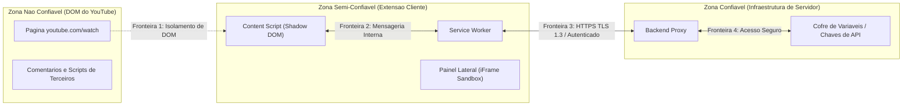

# Threat Model e Conformidade com a LGPD

## Nesta página

- [Objetivo e Metodologia](#objetivo-e-metodologia)
- [Fronteiras de Confiança e Superfície de Ataque](#fronteiras-de-confianca)
- [Análise de Ameaças (Modelo STRIDE)](#analise-stride)
  - [Spoofing (Falsificação de Identidade)](#spoofing)
  - [Tampering (Adulteração de Dados e Injeção)](#tampering)
  - [Repudiation (Repúdio)](#repudiation)
  - [Information Disclosure (Vazamento de Informações)](#information-disclosure)
  - [Denial of Service (Negação de Serviço e Abuso)](#denial-of-service)
  - [Elevation of Privilege (Elevação de Privilégio)](#elevation-of-privilege)
- [Regras Específicas contra Mau Uso (Critérios de Exclusão)](#regras-contra-mau-uso)
- [Avaliação de Conformidade com a LGPD](#conformidade-lgpd)

---

## Objetivo e Metodologia {: #objetivo-e-metodologia }

Este documento estabelece a análise formal de segurança e privacidade da **Extensão de Fact-Checking para YouTube**, utilizando a metodologia **STRIDE** combinada com uma avaliação de conformidade sob os preceitos da **Lei Geral de Proteção de Dados (LGPD — Lei nº 13.709/2018)**.

A prioridade é assegurar que a extensão não exponha o usuário a riscos de espionagem ou sequestro de dados e que o backend proxy permaneça imune a abusos coordenados e custos descontrolados.

---

## Fronteiras de Confiança e Superfície de Ataque {: #fronteiras-de-confianca }

---

## Análise de Ameaças (Modelo STRIDE) {: #analise-stride }

### 1. Spoofing (Falsificação de Identidade) {: #spoofing }

| Ameaça Mapeada | Impacto | Medida Mitigatória Implementada |
|:---|:---|:---|
| Requisições forjadas enviadas ao Backend Proxy por atacantes para consumir quotas de IA sem utilizar a extensão legítima | **Alto** (prejuízo financeiro e esgotamento de quota) | Validação do cabeçalho de origem (`chrome-extension://<id_oficial>`), emissão de tokens de sessão efêmeros e restrição de CORS no servidor. |

### 2. Tampering (Adulteração de Dados e Injeção) {: #tampering }

| Ameaça Mapeada | Impacto | Medida Mitigatória Implementada |
|:---|:---|:---|
| Injeção de scripts maliciosos (XSS) via transcrição manipulada ou metadados de fontes fraudulentas | **Crítico** (execução indevida de código na aba) | Renderização do painel em `iframe` com atributo `sandbox="allow-scripts"` (sem `allow-same-origin`); renderização do botão via Shadow DOM; escape automático de HTML pelo framework de UI. |
| Tentativas de *Prompt Injection* inseridas no áudio do vídeo para burlar a análise da IA | **Médio** (geração de veredito incorreto) | O backend estrutura o prompt com separadores rígidos de contexto de sistema (*system instructions*) e instrui o modelo a tratar a transcrição estritamente como dado não executável. |

### 3. Repudiation (Repúdio) {: #repudiation }

| Ameaça Mapeada | Impacto | Medida Mitigatória Implementada |
|:---|:---|:---|
| Falhas na identificação de incidentes operacionais ou abusos de infraestrutura | **Baixo** | Registro estruturado de logs de auditoria no Backend Proxy contendo data/hora, código de erro e tempo de resposta, sem persistir dados pessoais de usuários. |

### 4. Information Disclosure (Vazamento de Informações) {: #information-disclosure }

| Ameaça Mapeada | Impacto | Medida Mitigatória Implementada |
|:---|:---|:---|
| Extensão capturar histórico geral de navegação em outros domínios ou ler cookies da conta do usuário | **Crítico** (violação grave de privacidade e LGPD) | O arquivo `manifest.json` restringe estritamente `host_permissions` a `https://www.youtube.com/*` e exige `activeTab`. Nenhuma permissão para `cookies`, `history`, `webNavigation` ou acesso indiscriminado a abas é solicitada. |
| Vazamento de chaves secretas de APIs de IA no código do cliente | **Crítico** (furto de credenciais) | Nenhuma chave reside no pacote da extensão. Todas as chamadas a provedores externos ocorrem exclusivamente via Backend Proxy ([ADR-002](decisoes/ADR-002-backend-proxy.md)). |

### 5. Denial of Service (Negação de Serviço e Abuso) {: #denial-of-service }

| Ameaça Mapeada | Impacto | Medida Mitigatória Implementada |
|:---|:---|:---|
| Ataques volumétricos ou testes em lote automatizados (*scraping*) sobrecarregando o backend | **Alto** (indisponibilidade do serviço e custos elevados) | Aplicação de *Rate Limiting* rigoroso por endereço IP (máximo de 10 requisições por minuto) e bloqueio de padrões de chamada típicos de automação com respostas HTTP 429. |
| Injeção de transcrições astronômicas para travar o analisador | **Médio** (sobrecarga de memória) | Limitação estrita do tamanho da carga de entrada no Backend Proxy (máximo de 150.000 caracteres por transcrição; rejeição com HTTP 413 em excessos). |

### 6. Elevation of Privilege (Elevação de Privilégio) {: #elevation-of-privilege }

| Ameaça Mapeada | Impacto | Medida Mitigatória Implementada |
|:---|:---|:---|
| Execução de código arbitrário fora da sandbox do navegador | **Crítico** | Adoção integral do **Manifest V3**, que proíbe terminantemente `eval()`, carregamento de scripts externos em tempo de execução (*remotely hosted code*) e políticas de segurança permissivas. |

---

## Regras Específicas contra Mau Uso (Critérios de Exclusão) {: #regras-contra-mau-uso }

Em consonância com as diretrizes consolidadas no planejamento de produto:

1. **Sem Feedback de Contorno:** O sistema nunca expõe métricas, pontuações parciais ou explicações técnicas detalhadas sobre os pesos algorítmicos que possam instruir criadores de desinformação a mascarar conteúdos para burlar a ferramenta.
2. **Vedação de Automação Pública:** Não serão disponibilizadas APIs públicas sem credenciamento formal nem mecanismos que facilitem a raspagem massiva ou auditoria reversa automatizada.
3. **Não Recomendação Clínica:** A interface inclui declaração explícita de que a ferramenta não emite diagnósticos, pareceres farmacológicos ou orientações terapêuticas individualizadas.

---

## Avaliação de Conformidade com a LGPD {: #conformidade-lgpd }

A extensão foi projetada sob o princípio de **Privacidade desde a Concepção (*Privacy by Design*)**:

| Princípio Legal (Art. 6º da LGPD) | Aplicação Prática no Produto |
|:---|:---|
| **Finalidade** (Inciso I) | O processamento limita-se exclusivamente à checagem de fatos do vídeo em exibição solicitado pelo usuário. |
| **Adequação e Necessidade** (Incisos II e III) | Minimização de dados: a extensão coleta unicamente o identificador (`videoId`) e o texto da legenda pública. Nenhum dado cadastral (nome, e-mail, telefone) é exigido ou armazenado. |
| **Livre Acesso e Transparência** (Incisos IV e VI) | O usuário tem total clareza de quando a extensão está ativa através do botão visível; o código do cliente é auditável. |
| **Segurança e Prevenção** (Incisos VII e VIII) | Toda a comunicação utiliza criptografia HTTPS TLS 1.3; o cache local expira em 24h e permanece retido no próprio dispositivo do usuário. |
| **Não Discriminação** (Inciso IX) | A análise de alegações baseia-se em literatura científica e bases de checagem consolidadas, sem categorização de perfil ideológico ou comportamental do usuário. |

---

**Próximo:** [Estratégia de Testes e Definition of Done](estrategia-testes.md) — governança de qualidade e critérios de aceite.  
**Ver também:** [Arquitetura do Sistema](arquitetura.md) — visão técnica dos componentes e isolamento.
