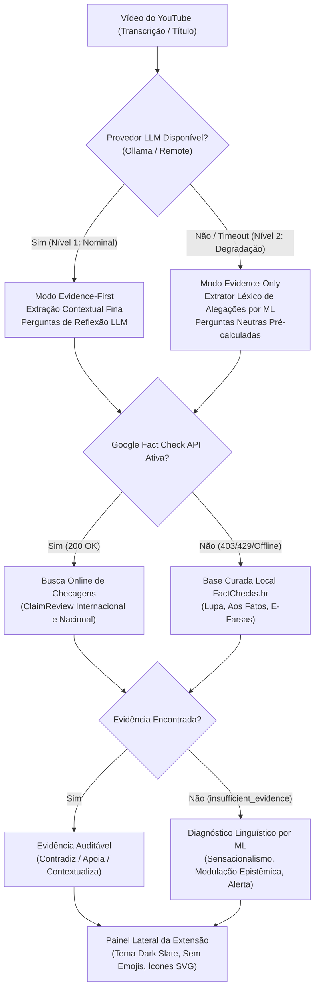

# Plano de Contingência Multinível — EvidencIA

| Campo | Valor |
|:---|:---|
| **Status** | Aprovado / Ativo |
| **Versão** | 1.1.0 |
| **Data** | 2026-10-07 |
| **Escopo** | Backend Proxy (`FastAPI`), Extensão YouTube (`Manifest V3`), Módulo de Machine Learning |
| **Alinhamento** | [ADR-006 — Arquitetura Evidence-First](decisoes/ADR-006-evidence-first-architecture.md) · [Gestão de Riscos](../requisitos/gestao-riscos.md) |

---

## 1. Visão Geral e Princípios Norteadores

O **EvidencIA** foi concebido sob o princípio de **alta disponibilidade epistemológica e técnica**: a indisponibilidade transitória de modelos de linguagem (LLMs), provedores de nuvem ou APIs externas de checagem **nunca pode resultar em falha catastrófica ou deixar o usuário sem resposta investigativa**.

### Princípios Invioláveis de Contingência:
1. **Zero Silent Crashes:** Nenhuma exceção de rede (`TimeoutError`, `HTTP 403`, `HTTP 429`, `ConnectionRefused`) pode quebrar a extensão ou a interface do usuário.
2. **Honestidade Epistêmica:** Na ausência de dados comprovados, o sistema declara explicitamente o estado de incerteza analítica (`insufficient_evidence` ou `evidence_only`), jamais fabricando vereditos.
3. **Autonomia Local (Soberania de Dados):** O sistema deve ser capaz de operar e fornecer checagens e diagnósticos mesmo quando 100% desconectado de serviços externos pagos ou proprietários.

---

## 2. Arquitetura de Contingência Multinível (3 Níveis)



---

## 3. Matriz de Contingência e Modos de Falha

| Componente Crítico | Modo de Falha | Sintoma Técnico | Ação de Contingência Automática | Impacto para o Usuário |
|:---|:---|:---|:---|:---|
| **Provedor de LLM** (Ollama / Remote) | Daemon offline, timeout (>15s), cota excedida | `ProviderUnavailableError` ou `asyncio.TimeoutError` | Ativação do **Extrator de Alegações por ML** (`claim_extractor.py`) e transição para `analysisMode: "evidence_only"`. | Exibição de banner explicativo suave; evidências e perguntas continuam operacionais. |
| **Google Fact Check API** | Chave sem permissão, restrição de política, quota | `HTTP 403` ou `HTTP 429` | Ativação automática e transparente do matcher local de checagens brasileiras (`brazilian_fact_matcher`). | Nenhuma mensagem de erro; checagens de agências nacionais continuam sendo exibidas. |
| **Serviço de Embedding / ChromaDB** | Falha de carregamento de índices compilados | `ChromaDB unavailable` | Fallback imediato para busca baseada em BM25 determinístico (`ml.retrieval.search`). | Recuperação de documentos mantida com latência inferior a 15ms. |
| **Corpus Jornalístico Específico** | Alegação inédita sem checagem prévia catalogada | `0 hits` nos repositórios | Registro do estado explícito `insufficient_evidence` e execução do **Classificador Supervisionado de ML** (`classifier_service.py`). | Usuário é informado com transparência; recebe diagnóstico dos gatilhos linguísticos identificados. |
| **Rede / Backend Proxy** | Servidor local não iniciado ou porta bloqueada | `NetworkError` / `Failed to fetch` | Tratamento amigável pelo Service Worker e Content Script com opção clara de nova tentativa. | Mensagem amigável orientando verificação ou retry sem crash. |

---

## 4. O Papel do Machine Learning no Plano de Contingência

O módulo de Machine Learning atua como a **coluna vertebral de soberania e resiliência** do EvidencIA, garantindo inferência independente de APIs:

### 4.1 Extrator Determinístico de Alegações (`claim_extractor.py`)
Quando o modelo de linguagem generativo está fora do ar, o extrator estatístico:
1. Segmenta o áudio/transcrição em proposições gramaticais completas;
2. Filtra ruídos conversacionais do YouTube (*"deixe seu like"*, *"se inscreva no canal"*, *"link na descrição"*);
3. Calcula a **Saliência de Alegação Factual** com base em verbos de asserção (*anunciou*, *comprovou*, *proibiu*, *cura*, *confiscou*), entidades institucionais (*Anvisa*, *Banco Central*, *Fiocruz*) e termos quantitativos;
4. Isola as alegações de maior densidade factual para auditoria.

### 4.2 Classificador Supervisionado Calibrado (`ClaimClassifier`)
- **Arquitetura:** Naive Bayes Multinomial calibrado com TF-IDF (2500 n-gramas) e suavização de Laplace ($\alpha = 0.5$).
- **Treinamento e Balanceamento:** 139 amostras rigorosamente pareadas por entidades (Saúde, Economia/Pix, Eleições/Urnas, Ciência, Legislação).
- **Curva de Aceitação:** No limiar de contingência ($\tau = 0.60$), atinge **83.3% de precisão nos aceitos**; em $\tau = 0.65$, atinge **90.0%**.
- **Diagnóstico Interpretável:** Identifica gatilhos de sensacionalismo, dogmatismo e apelos de autoridade, enriquecendo o contexto analítico sem substituir o julgamento humano.

---

## 5. Procedimentos Operacionais e Runbooks de Recuperação

### Runbook 1: Ativação da Google Fact Check Tools API
Caso a API externa responda com `403 Not allowed by policy`:
1. Acesse o console Google Cloud: `https://console.cloud.google.com/apis/library/factchecktools.googleapis.com`
2. Garanta que o serviço está **Ativado** para o projeto da credencial.
3. Em *Credenciais > Chave de API*, certifique-se de que a *Fact Check Tools API* está inclusa na lista de permissões da chave.
4. Reinicie o backend: o cliente reconecta automaticamente na próxima requisição.

### Runbook 2: Inicialização do Motor LLM Local (Ollama)
Para operação 100% autônoma com modelos abertos:
```bash
# Baixa e executa o modelo Qwen 2.5-3B
ollama run qwen2.5:3b

# No backend/.env, ative o provedor Ollama:
LLM_PROVIDER=ollama
OLLAMA_BASE_URL=http://localhost:11434
OLLAMA_MODEL=qwen2.5:3b
```

---

## 6. Verificação e Conformidade dos Gates

Todos os cenários descritos neste plano de contingência são validados continuamente pela suíte automatizada de testes:
- [`backend/tests/test_contingency_pipeline.py`](file:///Users/aluno1/Documents/challenge%20fake%20news/evidencia/backend/tests/test_contingency_pipeline.py)
- [`backend/tests/test_provider_failure.py`](file:///Users/aluno1/Documents/challenge%20fake%20news/evidencia/backend/tests/test_provider_failure.py)
- [`backend/tests/test_ml_classifier.py`](file:///Users/aluno1/Documents/challenge%20fake%20news/evidencia/backend/tests/test_ml_classifier.py)
- [`backend/tests/test_health_probes.py`](file:///Users/aluno1/Documents/challenge%20fake%20news/evidencia/backend/tests/test_health_probes.py)
