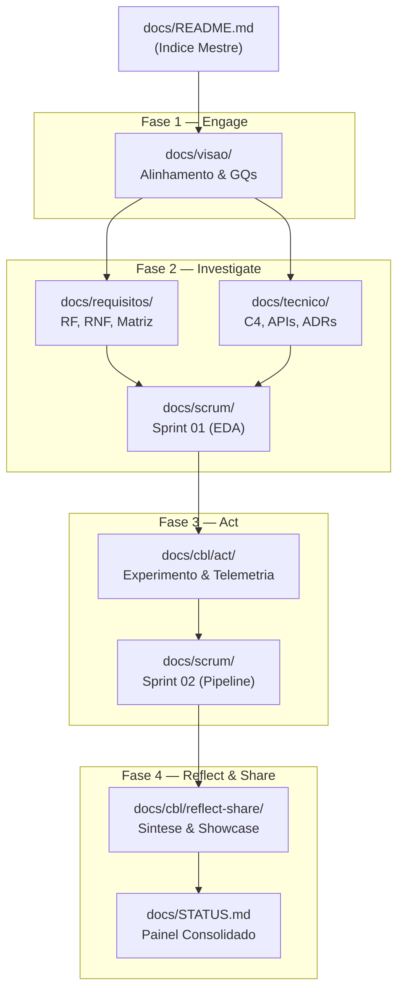

# Indice Mestre da Documentacao — EvidencIA

> **Portal Consolidado de Arquitetura de Informacao e Governanca**  
> Repositorio: `evidencia-grupo/documentation`  
> Referencia Arquitetural: [ADR-001](../tecnico/decisoes/ADR-001-manifest-v3.md) · [ADR-006](../tecnico/decisoes/ADR-006-evidence-first-architecture.md)

---

## 1. Mapa Geral de Diretorios

A tabela abaixo sintetiza a finalidade de cada pasta da documentacao, sua vinculacao com as fases do framework **Challenge Based Learning (CBL)** e seus artefatos centrais.

| Diretorio | Proposito | Fase CBL | Principais Arquivos | Status |
|:---|:---|:---:|:---|:---:|
| [`docs/visao/`](../visao/README.md) | Alinhamento estrategico, log de decisoes e formulacao das 12 GQs | **Engage** | `guiding-questions.md`, `essential-question-alignment.md`, `decision-log.md` | `EVIDENCIADO` |
| [`docs/requisitos/`](../requisitos/README.md) | Elicitacao, catalogo formal de requisitos (RF/RNF), casos de uso e matriz | **Investigate** | `catalogo-requisitos.md`, `backlog-e-historias.md`, `matriz-rastreabilidade.md` | `EVIDENCIADO` |
| [`docs/tecnico/`](../tecnico/README.md) | Modelos C4, contrato de API, threat model STRIDE, estrategia de testes e DoD | **Investigate** | `arquitetura.md`, `contrato-api.md`, `threat-model.md`, `estrategia-testes.md` | `EVIDENCIADO` |
| [`docs/tecnico/decisoes/`](../tecnico/decisoes/README.md) | Registros formais de decisao arquitetural (ADR-001 a ADR-006) | **Investigate** | `ADR-001-manifest-v3.md`, `ADR-006-evidence-first-architecture.md` | `EVIDENCIADO` |
| [`docs/adr/`](../adr/README.md) | Indice alias de compatibilidade para decisoes arquiteturais | **Investigate** | `README.md` (redireciona para `tecnico/decisoes/`) | `EVIDENCIADO` |
| [`docs/investigate/`](../investigate/README.md) | Indice metodologico da fase de investigacao exploratoria e EDA | **Investigate** | `README.md` (aponta para requisitos, arquitetura e notebooks) | `EVIDENCIADO` |
| [`docs/scrum/`](../scrum/README.md) | Governanca agil: cerimonias, Definition of Done, Product Backlog e Sprints | **Investigate / Act** | `ceremonies.md`, `definition-of-done.md`, `product-backlog.md` | `EVIDENCIADO` |
| [`docs/scrum/sprint-01/`](../scrum/sprint-01/README.md) | Artefatos da Sprint 1: fundacao investigativa, EDA e catalogos | **Investigate** | `sprint-goal.md`, `sprint-backlog.md`, `review.md`, `retrospective.md` | `EVIDENCIADO` |
| [`docs/scrum/sprint-02/`](../scrum/sprint-02/README.md) | Artefatos da Sprint 2: pipeline evidence-first, telemetria e validacao | **Act** | `sprint-goal.md`, `sprint-backlog.md`, `review.md`, `retrospective.md` | `ESQUELETO` |
| [`docs/design/`](../design/README.md) | Design system sem score global, componentes Preact e personas | **Investigate** | `personas-e-jornadas.md`, `design-system.md` | `EVIDENCIADO` |
| [`docs/planejamento/`](../planejamento/README.md) | Matriz MoSCoW, plano de gestao de riscos e metricas de telemetria | **Investigate** | `priorizacao-e-mvp.md`, `gestao-riscos.md`, `metricas-telemetria.md` | `EVIDENCIADO` |
| [`docs/cbl/act/`](../cbl/act/README.md) | Desenho experimental, definicao de metricas M1 a M9 e protocolo do participante | **Act** | `experiment-plan.md`, `metrics-definition.md`, `telemetry-spec.md` | `EVIDENCIADO` |
| [`docs/cbl/reflect-share/`](../cbl/reflect-share/README.md) | Sintese reflexiva, portfolio de pesquisa, showcase para banca e auditoria | **Reflect & Share** | `reflection.md`, `research-portfolio.md`, `showcase-script.md`, `CBL_COMPLETENESS_REPORT.md` | `EVIDENCIADO` |
| [`docs/meta/`](../meta/README.md) | Auditoria de organizacao de repositorios, caminhos protegidos e convencoes | **Transversal** | `protected-paths.md`, `convencoes.md`, `repo-audit-2026-10-02.md` | `EVIDENCIADO` |
| [`docs/referencia/`](indice-referencia-anterior.md) | Glossario tecnico legado de infraestrutura e extensoes | **Referencia** | `glossario.md` | `EVIDENCIADO` |

---

## 2. Diagrama de Navegacao Recomendada

---

## 3. Guias Rapidos
- **Para novos desenvolvedores:** Consulte [docs/tecnico/guia-contribuicao.md](../tecnico/guia-contribuicao.md) e [docs/scrum/definition-of-done.md](../scrum/definition-of-done.md).
- **Para avaliadores academicos:** Inicie por [docs/cbl/reflect-share/showcase-script.md](../cbl/reflect-share/showcase-script.md) e [docs/cbl/reflect-share/reflection.md](../cbl/reflect-share/reflection.md).
- **Para auditores de conformidade:** Verifique [docs/STATUS.md](../visao-geral/status.md) e [docs/meta/protected-paths.md](../meta/protected-paths.md).
