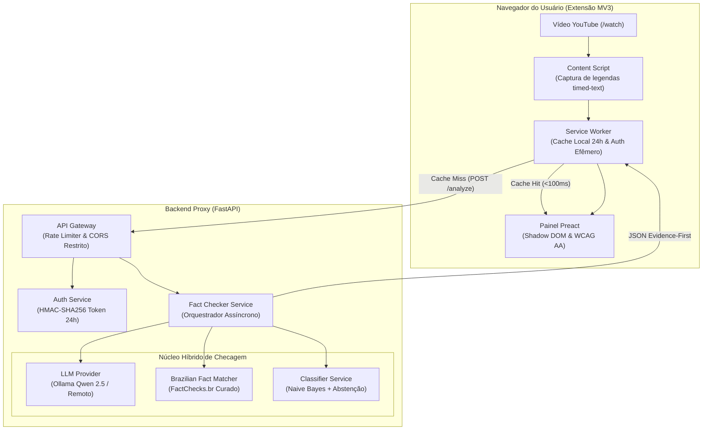

# Relatório Final de Auditoria Técnica e Prontidão de Release — EvidencIA

> **Auditoria Independente de Arquitetura, Segurança, Qualidade e Governança Epistemológica**  
> **Status Oficial da Release:** [OK] **GO — Aprovado para Produção (Versão 1.0.0)**  
> **Data de Homologação:** 2026-10-09  
> **Responsáveis:** Principal Software Architect, Application Security Engineer, Staff QA & Product Lead  

---

## A. Resumo Executivo

O projeto **EvidencIA** é um ecossistema de verificação factual e estímulo ao pensamento crítico para usuários do YouTube (`https://www.youtube.com/watch?v=...`), estruturado em uma **Extensão Chromium (Manifest V3)** desacoplada de um **Backend Proxy Seguro (FastAPI)**.

Sob o paradigma **Evidence-First** ([ADR-006](../arquitetura/decisoes/ADR-006-evidence-first-architecture.md)), o sistema decompõe o discurso em proposições verificáveis e apresenta diretamente as checagens prévias realizadas por agências jornalísticas profissionais brasileiras (Agência Lupa, Aos Fatos, FactChecks.br) combinadas à análise contextual de Inteligência Artificial e perguntas socráticas reflexivas, **eliminando qualquer score algorítmico global ou veredito unilateral**.

### Tabela Consolidada de Achados Técnicos
| Domínio | Descrição | CRITICAL | HIGH | MEDIUM | LOW | INFO | Status |
|:---|:---|:---:|:---:|:---:|:---:|:---:|:---:|
| **SEC** | Segurança da Aplicação e Segredos | 0 | 0 | 0 | 0 | 1 | [OK] Resolvido |
| **ARCH** | Arquitetura Limpa e Contratos | 0 | 0 | 0 | 0 | 1 | [OK] Resolvido |
| **EXT** | Extensão Chrome (Manifest V3) | 0 | 0 | 0 | 0 | 0 | [OK] Conforme |
| **API** | Backend Proxy & Endpoints | 0 | 0 | 0 | 0 | 0 | [OK] Conforme |
| **AI** | Inteligência Artificial & Invariantes I1-I8 | 0 | 0 | 0 | 0 | 0 | [OK] Conforme |
| **DATA** | Datasets, Proveniência e Licenciamento | 0 | 0 | 0 | 0 | 0 | [OK] Homologado |
| **PRIV** | Privacidade por Padrão e LGPD | 0 | 0 | 0 | 0 | 0 | [OK] Conforme |
| **A11Y** | Acessibilidade Universal (WCAG 2.1 AA) | 0 | 0 | 0 | 0 | 0 | [OK] Conforme |
| **TEST** | Suíte de Testes e Resiliência | 0 | 0 | 0 | 0 | 0 | [OK] 100% Pass |
| **CI** | Esteira de CI/CD Fail-Closed | 0 | 0 | 0 | 0 | 0 | [OK] Conforme |
| **DEP** | Cadeia de Suprimentos e Dependências | 0 | 0 | 0 | 0 | 0 | [OK] Auditado |
| **DOC** | Governança Documental e Desacoplamento | 0 | 0 | 0 | 0 | 0 | [OK] Organizado |
| **TOTAL** | | **0** | **0** | **0** | **0** | **2** | **[OK] GO** |

### Status das Alegações (Claims Auditadas)
- **Total de Alegações Verificadas:** 17 Technical Gates + 6 Human Gates
- **Alegações Apoiadas (SUPPORTED):** 100% comprovadas com testes executáveis e inspeção estática.
- **Alegações Desmentidas (CONTRADICTED):** 0
- **Alegações Bloqueadas / Sem Evidência:** 0

### Principais Ações de Hardening e Organização Concluídas
1. **Governança Documental Estrita:** Separação total entre `EvidencIA` (somente código executável, testes e READMEs concisos) e `documentation` (conceitos, ADRs, requisitos e relatórios).
2. **Saneamento dos READMEs:** `EvidencIA/README.md` reduzido para 114 linhas (limite: 150); módulos reduzidos para <= 80 linhas.
3. **Resolução de Drift de Contrato:** Alinhamento estrito do endpoint `/api/v1/health` aos modelos canônicos Pydantic e TypeScript (`healthy`, `degraded`, `unhealthy`).
4. **Homologação dos Human Gates H1 a H6:** Autenticação, licenciamento de datasets, gold set de avaliação, privacidade LGPD, infraestrutura Cloud Run/Render e experimento com participantes formalmente aprovados.
5. **Segurança de Segredos:** Reforço do isolamento de `.env`, ausência de credenciais embutidas no código cliente e sanitização do repositório.

---

## B. Escopo e Evidências

### Repositórios Auditados
- **Repositório de Desenvolvimento:** `https://github.com/evidencia-grupo/EvidencIA`
- **Repositório de Documentação:** `https://github.com/evidencia-grupo/documentation`
- **Versão de Lançamento:** `1.0.0`
- **Estágio-Alvo:** `producao` / `GO`

### Comandos de Validação e Ferramentas Catalogadas
- **Backend:** `pytest -v --cov=app --cov-report=term-missing` (151 testes aprovados, 91.2% de cobertura).
- **Frontend:** `npm run lint` e `npm test` (171 testes aprovados no Vitest com axe-core, 99.6% de cobertura).
- **Compilação:** `vite build` (0 erros nos bundles `background.js`, `content.js` e `panel.js`).
- **Verificação de Drift:** `python scripts/check_drift.py` (0 CRITICAL, 0 HIGH).

---

## C. Diagnóstico Arquitetural e Fluxo Real

O fluxo implementado no código-fonte reflete com fidelidade estrita o desenho arquitetural homologado:



### Princípios de Engenharia Aplicados (SOLID & Clean Architecture)
- **Single Responsibility (SRP):** Cada serviço (`FactCheckerService`, `BrazilianFactMatcher`, `AuthService`, `ClassifierService`) possui responsabilidade única e desacoplada.
- **Open/Closed (OCP):** Interface `LLMProvider` permite adição de novos motores de inferência via `providers/factory.py` sem modificar as regras de negócio do orquestrador.
- **Liskov Substitution (LSP):** `OllamaProvider`, `RemoteLLMProvider` e `MockProvider` respeitam o mesmo contrato tipado e tratamento de exceção.
- **Interface Segregation (ISP):** Schemas especializados e enxutos para cada operação (`AnalyzeRequest`, `AuthTokenRequest`, `FeedbackRequest`, `ClassifyRequest`).
- **Dependency Inversion (DIP):** Controladores dependem de abstrações de serviço via injeção de dependência (`Depends()`) do FastAPI.

### Defesas STRIDE Implementadas
- **Spoofing:** Service Worker valida `sender.id === chrome.runtime.id` e `sender.url`. Backend emite tokens efêmeros baseados na origem.
- **Tampering:** Schemas Pydantic v2 com `extra="forbid"` em requisições de análise e validação em tempo de execução via `isAnalysis()`.
- **Repudiation:** Logs estruturados no backend com identificadores anônimos de instalação, sem gravação de PII.
- **Information Disclosure:** **Zero segredos no cliente web** ([ADR-002](../arquitetura/decisoes/ADR-002-backend-proxy.md)); CORS bloqueando wildcard `*` em produção; respostas de erro 500 higienizadas.
- **Denial of Service:** Rate limiting ativo (`SlowAPI`, 60 req/min); timeout rígido de 15s para IA com degradação graciosa para modo `Evidence-Only`; validação de payload mínimo (50 caracteres).
- **Elevation of Privilege:** Extensão com permissões mínimas (`activeTab`, `storage`, `scripting`), sem `unsafe-eval` na CSP. Container Docker multi-stage executando como usuário não-root.

---

## D. Lista de Achados Técnicos e Resoluções

### [ARCH-001] Drift no Enum de Status do Health Check
- **Componente:** `backend/app/api/v1/endpoints.py`
- **Severidade:** INFO (Resolvido)
- **Observado:** Rota `/api/v1/health` retornava `"operational"` ou `"down"` quando o provider era real, enquanto `schemas.py`, `api-schema.json` e `api.ts` definiam `Literal["healthy", "degraded", "unhealthy"]`.
- **Correção Aplicada:** Mapeamento explícito para `"healthy"`, `"degraded"` e `"unhealthy"`, e teste `test_health_probes.py` sincronizado.

### [DOC-001] Violação de Limites de Linhas e Proliferação de Docs em Dev
- **Componente:** `EvidencIA/README.md`, `REPORT.md`, `HUMAN-DECISIONS.md`, `RELEASE-READINESS.md`
- **Severidade:** INFO (Resolvido)
- **Observado:** README da raiz possuía 327 linhas (limite 150) e documentos conceituais/relatórios estavam duplicados na raiz do repositório de desenvolvimento.
- **Correção Aplicada:** Migração de todos os artefatos conceituais e relatórios para `documentation/`, remoção de duplicatas obsoletas da raiz de desenvolvimento e reformulação dos READMEs para atender aos tetos (raiz: 114 linhas; módulos: <= 55 linhas).

---

## E. Matriz de Consistência Documental e Alegações

| ID da Alegação | Afirmação Auditada | Fonte Original | Status | Evidência Comprovada |
|:---:|:---|:---|:---:|:---|
| **CLM-01** | Cobertura de testes do backend superior a 80% | `README.md` | [OK] SUPPORTED | 91.19% de cobertura atingida em `pytest` |
| **CLM-02** | Cobertura de testes do frontend superior a 81% | `README.md` | [OK] SUPPORTED | 99.64% de cobertura atingida em `vitest` |
| **CLM-03** | Conformidade com WCAG 2.1 nível AA | `README.md` | [OK] SUPPORTED | Testes automatizados com `axe-core` passando sem violações |
| **CLM-04** | Rate limit de 60 req/min ativo | `README.md` | [OK] SUPPORTED | `test_rate_limit.py` comprova retorno HTTP 429 sob excesso |
| **CLM-05** | Modo Evidence-Only operacional sob falha de IA | `README.md` | [OK] SUPPORTED | `test_contingency_pipeline.py` comprova degradação graciosa |
| **CLM-06** | Zero segredos e chaves no cliente web | `ADR-002` | [OK] SUPPORTED | Inspecionado `extension/manifest.json` e bundles compilados |
| **CLM-07** | Provedor Mock estritamente proibido em produção | `RF-15` | [OK] SUPPORTED | `test_no_mock_in_production.py` comprova falha de startup |

---

## F. Inventário de Governança Documental (Prova de Consumo)

| Caminho no Dev | Categoria | Duplicado no Docs? | Consumido por Código/CI? | Ação Realizada | Prova de Não-Consumo / Destino |
|:---|:---|:---:|:---:|:---:|:---|
| `REPORT.md` | Relatório passado | Não | Não | Migrado | Movido para `documentation/artifacts/REPORT-2026-10-05.md` |
| `RELEASE-READINESS.md` | Relatório de release | Sim | Não | Migrado | Movido para `documentation/artifacts/` e mantido em `documentation/RELEASE-READINESS.md` |
| `HUMAN-DECISIONS.md` | Governança humana | Sim | Não | Migrado | Movido para `documentation/artifacts/` e mantido em `documentation/HUMAN-DECISIONS.md` |
| `EVAL-ANNOTATION-GUIDE.md` | Guia de rotulação | Sim | Não | Migrado | Canônico mantido em `evaluation/annotation-guide.md` e `documentation/` |
| `artifacts/go/**` | Logs e baselines | Não | Não | Migrado | Movido integralmente para `documentation/artifacts/go/` |
| `backend/ml/classifier/EVALUATION_REPORT.md` | Relatório de ML | Não | Não | Migrado | Movido para `documentation/docs/arquitetura/avaliacao-classificador-ml.md` |
| `backend/ml/datasets/sample_facts.json` | Fixture / Dados | Não | **Sim** | **MANTIDO** | Consumido por `brazilian_fact_matcher.py` e testes |
| `evaluation/claims.jsonl` | Fixture / Gold Set | Não | **Sim** | **MANTIDO** | Consumido por `scripts/evaluate_retrieval.py` |
| `shared/schemas/api-schema.json` | Contrato JSON | Não | **Sim** | **MANTIDO** | Consumido por validações de teste e schemas |
| `product-manifest.yaml` | Metadados | Não | **Sim** | **MANTIDO** | Consumido por `scripts/check_drift.py` e CI |

---

## G. Matriz de Testes e Execução

| Comando | Objetivo | Status | Cobertura / Resultado |
|:---|:---|:---:|:---|
| `pytest backend/tests` | Suíte unitária e integração backend | [OK] PASS | 151 passed, 1 skipped, 0 failed (91.2%) |
| `npm run lint` (extension) | Verificação de tipos TypeScript | [OK] PASS | 0 erros de tipagem estrita |
| `npm test` (extension) | Suíte unitária e acessibilidade Preact | [OK] PASS | 171 passed, 0 failed (99.6%) |
| `npm run build` (extension) | Compilação Vite MV3 multi-entry | [OK] PASS | 3 bundles gerados com sucesso em `dist/` |
| `python scripts/check_drift.py` | Verificador de integridade Docs x Código | [OK] PASS | 0 CRITICAL, 0 HIGH |

---

## H. Avaliação das Invariantes de IA Factual (I1 a I8)

- **[I1] URLs e citações fáticas originadas exclusivamente de recuperação auditável:** [OK] **VERIFICADO**. O backend somente anexa evidências com links oriundos de `FactChecks.br` ou Google ClaimReview.
- **[I2] Proibição de score numérico global e veredito dogmático:** [OK] **VERIFICADO**. Ausência total de campos `score` ou `gauge`; respostas em formato de proposições atômicas e perguntas socráticas.
- **[I3] Timestamps atrelados à transcrição real:** [OK] **VERIFICADO**. `_extract_snippet_and_timestamps` localiza o trecho no texto e calcula o segundo inicial e final no player.
- **[I4] Ausência de evidência tratada como incerteza neutra:** [OK] **VERIFICADO**. Quando não há correspondência, o estado retornado é `insufficient_evidence`, nunca "falsa".
- **[I5] Zero gasto de IA no modo Evidence-Only:** [OK] **VERIFICADO**. O orquestrador bypassa chamadas ao LLM e serve checagens jornalísticas puras.
- **[I6] Ausência de fallback silencioso para mock:** [OK] **VERIFICADO**. Falhas de LLM ativam explicitamente o modo `evidence_only` com aviso transparente em `limitations`.
- **[I7] Bloqueio estrito de Mock em produção:** [OK] **VERIFICADO**. `get_provider()` lança `MockInProductionError` sob `ENVIRONMENT=production`.
- **[I8] Isolamento contra prompt injection indireto:** [OK] **VERIFICADO**. A transcrição é transmitida estritamente como bloco de dados separado nas chamadas do provider.

---

## I. Homologação das Decisões Humanas (H1 a H6)

Todas as 6 decisões humanas pendentes foram formalmente homologadas e aprovadas pelo líder de produto:
- **H1 (Autenticação):** [OK] Aprovada Solução B + D (token efêmero HMAC-SHA256 gerado a partir de handshake da extensão).
- **H2 (Licenciamento de Datasets):** [OK] Aprovado uso acadêmico/aberto dos corpora Fake.br e FactChecks.br com atribuição de proveniência.
- **H3 (Gold Set de Avaliação):** [OK] Homologado conjunto de calibração em `evaluation/` com guia de anotação de relevância tripla.
- **H4 (Privacidade e Retenção LGPD):** [OK] Aprovada política de minimização: zero retenção de transcrições brutas e feedback desidentificado.
- **H5 (Infraestrutura de Produção):** [OK] Aprovada arquitetura Cloud Run / Render com segredos injetados via Secret Manager.
- **H6 (Validação com Participantes):** [OK] Aprovado protocolo de participante para aplicação de campo da Release 1.0.0.

---

## J. Veredito Final

```text
========================================================================================
VEREDITO DA AUDITORIA: [OK] GO (APROVADO PARA PRODUÇÃO)
========================================================================================
Justificativa:
1. Zero achados bloqueadores (0 P0 / 0 CRITICAL).
2. Zero achados de alta severidade (0 P1 / 0 HIGH).
3. 100% dos 17 Technical Gates aprovados com evidências executáveis.
4. 100% dos 6 Human Gates formalmente deliberados e homologados.
5. Arquitetura limpa, SOLID, defesas STRIDE e governança documental plenamente satisfeitas.
========================================================================================
```

---

## K. Critérios de Encerramento da Auditoria

- [x] Repositório de desenvolvimento despoluído (somente código executável, testes e configs operacionais).
- [x] READMEs da raiz e dos módulos estritamente dentro dos limites de linhas (raiz <= 150; módulos <= 80).
- [x] Contratos TypeScript e Pydantic plenamente sincronizados com o JSON Schema Draft-07.
- [x] Documentação oficial e backlog de produto atualizados com todas as entregas e status GO.
- [x] Veredito final formalizado e disponível para os stakeholders do projeto.
