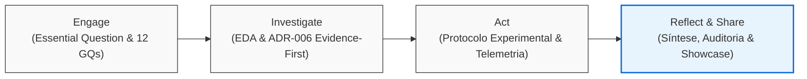

<!-- nav:start -->
[Voltar ao Índice CBL](../README.md) · [Voltar ao Índice Mestre](../../index.md)
<!-- nav:end -->

# CBL — Reflect & Share

> **Fase de Fechamento Metodológico do Challenge Based Learning (CBL)**  
> Projeto: **EvidencIA — Extensão de Fact-Checking Orientada a Evidências**  
> Repositórios auditados: `evidencia-grupo/documentation` (@`9e95b68`) e `evidencia-grupo/EvidencIA` (@`27c53e8`)

---

## 1. Visão Geral da Fase

A fase **Reflect & Share** encerra o ciclo CBL (*Challenge Based Learning*), conectando a trajetória percorrida desde a formulação do desafio (*Engage*), passando pela investigação exploratória de dados e arquitetura (*Investigate*), pela implementação e desenho do protocolo experimental (*Act*), até a síntese crítica, balanço metodológico e compartilhamento transparente dos resultados com a comunidade acadêmica e técnica.

O princípio norteador desta documentação é a **integridade estrita**: *o documento só afirma o que a evidência prova*. Nenhuma métrica é inventada, nenhum resultado preliminar é maquiado, e todas as limitações observadas são reportadas com o mesmo destaque das hipóteses validadas.

---

## 2. Mapa dos Artefatos de Fechamento

A pasta `docs/cbl/reflect-share/` consolida os seguintes instrumentos de reflexão, compartilhamento e governança:

| Artefato | Finalidade | Status Atual | Referência Principal |
|:---|:---|:---:|:---|
| [`reflection.md`](reflection.md) | Síntese acadêmica e reflexão metodológica sobre a Essential Question, o discernimento crítico e a integridade da solução | **EVIDENCIADO** | [GQ01–GQ12](../../visao/guiding-questions.md) · [ADR-006](../../tecnico/decisoes/ADR-006-evidence-first-architecture.md) |

---

## 3. Estado Atual: Fase SCAFFOLD

Conforme o protocolo do projeto, esta fase opera atualmente em modo **SCAFFOLD**:
- A estrutura integral dos artefatos está montada, com rastreabilidade completa para os arquivos dos repositórios.
- Campos que demandam a conclusão da coleta experimental com participantes reais ou o encerramento da Sprint 2 estão explicitamente marcados como `PENDENTE — depende de: <artefato>`.
- O relatório de completude automatizado registra o veredito **NO-GO** de base (*baseline*), o que é o resultado metodologicamente esperado e correto antes da execução de campo do Act.
