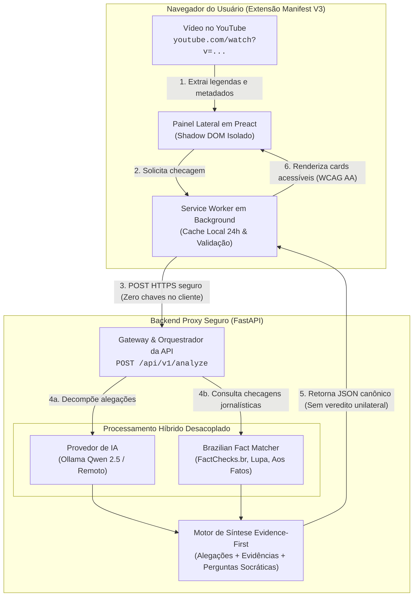
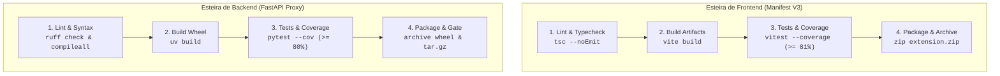

# EvidencIA — Extensão de Fact-Checking para YouTube

> **Ecossistema de Verificação Factual de Vídeos do YouTube em Tempo Real (Manifest V3)**  
> Implementado sob o paradigma **Evidence-First** ([ADR-006](https://github.com/evidencia-grupo/documentation/blob/main/docs/arquitetura/decisoes/ADR-006-evidence-first-architecture.md)), com **Zero Segredos no Cliente** ([ADR-002](https://github.com/evidencia-grupo/documentation/blob/main/docs/arquitetura/decisoes/ADR-002-backend-proxy.md)), isolamento via **Shadow DOM** e conformidade estrita com **WCAG 2.1 nível AA** ([RNF-07](https://github.com/evidencia-grupo/documentation/blob/main/docs/requisitos/catalogo-requisitos.md#rnf-07)).

[](https://github.com/evidencia-grupo/EvidencIA/actions/workflows/ci.yml)
[](https://developer.chrome.com/docs/extensions/develop/migrate/what-is-mv3)
[](https://www.python.org/)
[](https://fastapi.tiangolo.com/)
[](https://preactjs.com/)
[](https://www.typescriptlang.org/)
[](extension/vitest.config.ts)
[](backend/pyproject.toml)
[](LICENSE)

---

## 1. Visão Geral do Produto

O **EvidencIA** é uma solução de software livre projetada para capacitar cidadãos, pesquisadores e comunicadores a exercerem o pensamento crítico ao consumir conteúdos noticiosos e informativos no YouTube (`https://www.youtube.com/watch?v=...`).

Diferente de ferramentas tradicionais que impõem notas algorítmicas de "verdadeiro ou falso", o EvidencIA segue a premissa de que **o julgamento pertence ao leitor**. O sistema decompõe o discurso em proposições verificáveis e apresenta diretamente as checagens prévias realizadas por agências jornalísticas profissionais brasileiras (Agência Lupa, Aos Fatos, FactChecks.br) combinadas à análise contextual de Inteligência Artificial.



#### Fluxo de Execução do Sistema:
1. **Captura sob demanda:** O usuário clica em *Checar Alegações*. O script injetado extrai legendas oficiais (*timed text*) e metadados temporais diretamente do player do YouTube.
2. **Consulta de cache local:** O Service Worker checa o `chrome.storage.local`. Se o vídeo foi analisado nas últimas 24h, o painel abre em menos de 100 ms sem fazer chamadas de rede.
3. **Fronteira segura (Zero Segredos):** Sem cache prévio, uma requisição HTTPS é despachada ao Backend Proxy via `POST /api/v1/analyze` sem expor qualquer chave de API no navegador.
4. **Análise paralela desacoplada:** O backend aciona simultaneamente a extração de alegações atômicas e perguntas reflexivas via IA, e o cruzamento léxico/semântico com bases jornalísticas brasileiras (FactChecks.br, Agência Lupa, Aos Fatos).
5. **Síntese Evidence-First:** Os dados são estruturados segundo o schema canônico, sem notas numéricas globais ou vereditos algorítmicos simplistas.
6. **Apresentação acessível:** O painel em Preact injetado via Shadow DOM renderiza as alegações, evidências com links para as fontes originais e perguntas reflexivas com conformidade WCAG 2.1 AA.

### Princípios Técnicos Não-Negociáveis
- **Arquitetura Evidence-First ([ADR-006](https://github.com/evidencia-grupo/documentation/blob/main/docs/arquitetura/decisoes/ADR-006-evidence-first-architecture.md)):** Não há score numérico global de "veracidade" (0–100%) nem selos definitivos de "verdadeiro/falso". O resultado exibe alegações atômicas, evidências rastreáveis e perguntas reflexivas socráticas ([HU15](https://github.com/evidencia-grupo/documentation/blob/main/docs/requisitos/backlog-e-historias.md#hu15)).
- **Zero Segredos no Cliente ([ADR-002](https://github.com/evidencia-grupo/documentation/blob/main/docs/arquitetura/decisoes/ADR-002-backend-proxy.md) / [RNF-01](https://github.com/evidencia-grupo/documentation/blob/main/docs/requisitos/catalogo-requisitos.md#rnf-01)):** Nenhuma chave de API (OpenAI, Gemini, Serper) reside na extensão. Todo tráfego externo passa pelo Backend Proxy autenticado e protegido por rate limiting.
- **Defesa Contra Provedores Falsos ([RF-15](https://github.com/evidencia-grupo/documentation/blob/main/docs/requisitos/catalogo-requisitos.md#rf-15)):** Travas em nível de configuração impedem a execução de `MockLLMProvider` em ambiente de produção (`ENVIRONMENT=production`).
- **Degradação Graciosa Evidence-Only ([RF-14](https://github.com/evidencia-grupo/documentation/blob/main/docs/requisitos/catalogo-requisitos.md#rf-14)):** Caso o provedor de IA fique indisponível ou sofra *timeout*, o sistema ativa o modo *Evidence-Only*, preservando as checagens das agências sem interromper o serviço.
- **Cache Local com TTL de 24 Horas ([ADR-003](https://github.com/evidencia-grupo/documentation/blob/main/docs/arquitetura/decisoes/ADR-003-estrategia-cache-local.md) / [RNF-04](https://github.com/evidencia-grupo/documentation/blob/main/docs/requisitos/catalogo-requisitos.md#rnf-04)):** Ao revisitar um vídeo recentemente analisado, os dados são resgatados de `chrome.storage.local` em menos de 100 ms.
- **Acessibilidade Universal ([RNF-07](https://github.com/evidencia-grupo/documentation/blob/main/docs/requisitos/catalogo-requisitos.md#rnf-07) / [HU11](https://github.com/evidencia-grupo/documentation/blob/main/docs/requisitos/backlog-e-historias.md#hu11)):** Total conformidade com as normas WCAG 2.1 nível AA: navegação estruturada via teclado, suporte a leitores de tela e contraste visual mínimo de 4.5:1.
- **Privacidade por Padrão ([RNF-05](https://github.com/evidencia-grupo/documentation/blob/main/docs/requisitos/catalogo-requisitos.md#rnf-05) / LGPD):** Zero coleta de histórico de navegação, zero telemetria de perfil de usuário e host permissions restritas exclusivamente a `*://*.youtube.com/*`.

---

## 2. Estado de Maturidade e Prontidão (Release Candidate)

Este repositório encontra-se no estado **PRÉ-RELEASE CANDIDATA** (`PRERELEASE_CANDIDATE`). Abaixo declaramos com transparência factual o que está funcional, o que é parcial e o que permanece pendente de ações humanas:

### 🟢 O Que Funciona (Pronto e Testado com Evidências)
- **Extensão Manifest V3:** Injeção Shadow DOM no YouTube (`youtube.com/watch*`), extração de legendas oficiais (*timed text*) e renderização acessível (WCAG 2.1 AA).
- **Análise & Decomposição Factual:** Endpoint `POST /api/v1/analyze` extraindo alegações atômicas e perguntas reflexivas socráticas sem score global.
- **Separação Epistemológica:** `ClaimCard` exibe estritamente o discurso do vídeo; `EvidenceCard` exibe a checagem da agência jornalística com link original e justificativa transparente (`matchReason`).
- **Navegação por Timestamps:** Marcadores temporais clicáveis no painel lateral sincronizam diretamente o player do YouTube via `video.currentTime`.
- **Cache Local com TTL de 24h:** Armazenamento em `chrome.storage.local` com resposta sub-100ms para vídeos já analisados.
- **Camada Agnóstica de Provedores:** Suporte a execução local (Ollama com Qwen 2.5), provedor remoto (OpenRouter / Groq / OpenAI) e Mock em testes.
- **Proteção Anti-Mock em Produção:** O backend falha na inicialização se `MockLLMProvider` for referenciado sob `ENVIRONMENT=production`.
- **Degradação Graciosa Evidence-Only:** Operação preservada em caso de lentidão ou timeout de IA, exibindo evidências curadas sem quebrar o fluxo.
- **Hardening de Segurança:** Rate limiting real (retornando HTTP 429 sob excesso), CORS bloqueando wildcard `*` em produção, e tokens efêmeros de sessão (`/api/v1/auth/token`).

### 🟡 O Que É Parcial (Preparado Tecnicamente / Portões Isolados)
- **Corpus Completo de Fact-Checking:** O pipeline de ingestão e indexação está tecnicamente pronto (`TECHNICALLY_READY`), mas a ingestão de bases completas de terceiros aguarda aprovação jurídica de licença de redistribuição comercial/hospedada (Portão Humano **H2**).
- **Framework de Avaliação Científica:** A estrutura de avaliação (`evaluation/claims.jsonl`, `candidates.jsonl`, `annotation-guide.md` e `scripts/evaluate_retrieval.py`) está 100% implementada. O status de rotulação humana encontra-se como `PENDING_HUMAN_ANNOTATION` (Portão Humano **H3**) para evitar fabricação de métricas por IA.
- **Feedback dos Usuários:** Endpoint `/api/v1/feedback` validado com privacidade e minimização LGPD (descarte de IP/User-Agent). Persistência de telemetria analítica aguarda homologação de infraestrutura.

### 🔴 O Que É Pendente (Dependências Genuinamente Humanas para o GO de Produção)
- **Validação com Usuários Finais:** Condução dos experimentos práticos com pessoas voluntárias assistindo a vídeos no YouTube (Portão Humano **H6**).
- **Decisão e Homologação de Produção:** Definição do provedor cloud (Google Cloud Run / Render) e injeção de credenciais finais (`JWT_SECRET`, `GOOGLE_FACT_CHECK_API_KEY`) via Secret Manager (Portões **H1**, **H4** e **H5**).
- **Submissão à Chrome Web Store:** Publicação manual do `.zip` gerado na loja de extensões da Google após revisão humana final.

---

## 3. Estrutura do Monorepo

O repositório é organizado de forma modular, com fronteiras estritas de responsabilidade:

```text
evidencia/
├── extension/             # Extensão de navegador (Manifest V3)
│   ├── manifest.json      # Declaração de permissões mínimas (activeTab, storage)
│   ├── package.json       # Preact, TypeScript, Vite e Vitest
│   ├── tsconfig.json      # Configuração estrita de compilação TypeScript
│   ├── vite.config.ts     # Build multi-entry (service-worker, content-script, panel)
│   ├── vitest.config.ts   # Limiares de cobertura estritos por arquivo (>= 81%)
│   └── src/
│       ├── background/    # Service Worker, gerenciador de cache e validador de contratos
│       ├── content/       # Content Script, injeção Shadow DOM e parsers de legenda
│       └── panel/         # Interface do painel lateral em Preact (Cards de Alegação e Evidência)
├── backend/               # Backend Proxy de segurança e orquestração de IA
│   ├── pyproject.toml     # Dependências, empacotamento uv e cobertura pytest (>= 80%)
│   ├── requirements.txt   # FastAPI, Pydantic v2, Uvicorn, SlowAPI, httpx
│   ├── .python-version    # Fixação do runtime Python 3.12
│   ├── app/
│   │   ├── main.py        # Ponto de entrada FastAPI, middlewares de CORS e Rate Limiting
│   │   ├── config.py      # Gestão tipada de variáveis de ambiente com Pydantic Settings
│   │   ├── schemas.py     # Modelos Pydantic v2 estritamente sincronizados com o contrato JSON
│   │   ├── api/v1/        # Endpoints operacionais: /analyze e /health
│   │   ├── providers/     # Camada agnóstica de LLM (Protocolo, Factory, Ollama, Remote, Mock)
│   │   └── services/      # Orquestrador assíncrono, Brazilian Fact Matcher e síntese
│   ├── ml/                # Módulo de Inteligência Artificial e Datasets Nacionais
│   │   └── datasets/      # Script de ingestão e base curada de checagens (FactChecks.br)
│   └── tests/             # Suíte de testes automatizados com Pytest (91.2% de cobertura)
├── shared/                # Fonte única da verdade para integração entre Front e Back
│   ├── schemas/           # api-schema.json (JSON Schema Draft-07 canônico)
│   └── types/             # api.ts (Interfaces TypeScript compartilhadas para o frontend)
└── .github/
    └── workflows/ci.yml   # Esteira de CI/CD em 4 estágios (Lint, Build, Test, Deploy)
```

> **Aviso de Governança Editorial:**  
> Por diretriz arquitetural, **este repositório de desenvolvimento não contém arquivos de documentação conceitual**. Todo o detalhamento analítico reside exclusivamente no repositório oficial [evidencia-grupo/documentation](https://github.com/evidencia-grupo/documentation) na branch `main`.

---

## 4. Matriz Canônica de Rastreabilidade

O desenvolvimento do EvidencIA é estritamente orientado a requisitos. Abaixo está a correlação completa entre os **8 Épicos**, as **16 Histórias de Usuário (HUs)**, os requisitos formais e os arquivos de implementação no código-fonte:

| Épico | História de Usuário | Requisitos Vinculados | Módulos e Arquivos no Código-Fonte | Status no MVP |
|:---|:---|:---|:---|:---:|
| **E1: Extração e Processamento** | [HU01: Extração de Transcrição](https://github.com/evidencia-grupo/documentation/blob/main/docs/requisitos/backlog-e-historias.md#hu01) | [RF-01](https://github.com/evidencia-grupo/documentation/blob/main/docs/requisitos/catalogo-requisitos.md#rf-01), [RF-02](https://github.com/evidencia-grupo/documentation/blob/main/docs/requisitos/catalogo-requisitos.md#rf-02) | [`extension/src/content/caption-parser.ts`](extension/src/content/caption-parser.ts)<br>[`extension/src/background/player-captions.ts`](extension/src/background/player-captions.ts) | Concluído (Sprint 1) |
| **E1: Extração e Processamento** | [HU02: Linguagem Clara e Amigável](https://github.com/evidencia-grupo/documentation/blob/main/docs/requisitos/backlog-e-historias.md#hu02) | [RF-03](https://github.com/evidencia-grupo/documentation/blob/main/docs/requisitos/catalogo-requisitos.md#rf-03), [RNF-07](https://github.com/evidencia-grupo/documentation/blob/main/docs/requisitos/catalogo-requisitos.md#rnf-07) | [`extension/src/content/friendly-messages.ts`](extension/src/content/friendly-messages.ts)<br>[`backend/app/services/synthesis.py`](backend/app/services/synthesis.py) | Concluído (Sprint 1) |
| **E1: Extração e Processamento** | [HU03: Ativação Sob Demanda](https://github.com/evidencia-grupo/documentation/blob/main/docs/requisitos/backlog-e-historias.md#hu03) | [RF-04](https://github.com/evidencia-grupo/documentation/blob/main/docs/requisitos/catalogo-requisitos.md#rf-04), [RNF-01](https://github.com/evidencia-grupo/documentation/blob/main/docs/requisitos/catalogo-requisitos.md#rnf-01) | [`extension/src/content/content-script.ts`](extension/src/content/content-script.ts) | Concluído (Sprint 1) |
| **E2: Checagem Factual e IA** | [HU04: Extração de Alegações](https://github.com/evidencia-grupo/documentation/blob/main/docs/requisitos/backlog-e-historias.md#hu04) | [RF-06](https://github.com/evidencia-grupo/documentation/blob/main/docs/requisitos/catalogo-requisitos.md#rf-06), [RNF-02](https://github.com/evidencia-grupo/documentation/blob/main/docs/requisitos/catalogo-requisitos.md#rnf-02) | [`backend/app/services/fact_checker.py`](backend/app/services/fact_checker.py)<br>[`backend/app/providers/ollama.py`](backend/app/providers/ollama.py) | Concluído (Sprint 1) |
| **E2: Checagem Factual e IA** | [HU05: Busca em Agências Nacionais](https://github.com/evidencia-grupo/documentation/blob/main/docs/requisitos/backlog-e-historias.md#hu05) | [RF-07](https://github.com/evidencia-grupo/documentation/blob/main/docs/requisitos/catalogo-requisitos.md#rf-07), [RF-08](https://github.com/evidencia-grupo/documentation/blob/main/docs/requisitos/catalogo-requisitos.md#rf-08) | [`backend/app/services/brazilian_fact_matcher.py`](backend/app/services/brazilian_fact_matcher.py)<br>[`backend/ml/datasets/sample_facts.json`](backend/ml/datasets/sample_facts.json) | Concluído (Sprint 1) |
| **E3: Interface e Desempenho** | [HU06: Cache Local com TTL](https://github.com/evidencia-grupo/documentation/blob/main/docs/requisitos/backlog-e-historias.md#hu06) | [RF-09](https://github.com/evidencia-grupo/documentation/blob/main/docs/requisitos/catalogo-requisitos.md#rf-09), [RNF-04](https://github.com/evidencia-grupo/documentation/blob/main/docs/requisitos/catalogo-requisitos.md#rnf-04) | [`extension/src/background/cache-manager.ts`](extension/src/background/cache-manager.ts) | Concluído (Sprint 1) |
| **E3: Interface e Desempenho** | [HU07: Painel Lateral em Preact](https://github.com/evidencia-grupo/documentation/blob/main/docs/requisitos/backlog-e-historias.md#hu07) | [RF-11](https://github.com/evidencia-grupo/documentation/blob/main/docs/requisitos/catalogo-requisitos.md#rf-11), [RNF-07](https://github.com/evidencia-grupo/documentation/blob/main/docs/requisitos/catalogo-requisitos.md#rnf-07) | [`extension/src/panel/index.tsx`](extension/src/panel/index.tsx)<br>[`extension/src/panel/styles/theme.css`](extension/src/panel/styles/theme.css) | Concluído (Sprint 1) |
| **E4: Transparência Temporal** | [HU08: Metadados Temporais](https://github.com/evidencia-grupo/documentation/blob/main/docs/requisitos/backlog-e-historias.md#hu08) | [RF-16](https://github.com/evidencia-grupo/documentation/blob/main/docs/requisitos/catalogo-requisitos.md#rf-16) | [`extension/src/panel/components/ClaimCard.tsx`](extension/src/panel/components/ClaimCard.tsx)<br>[`backend/app/schemas.py`](backend/app/schemas.py) | Concluído (Sprint 1) |
| **E5: Tratamento de Incerteza** | [HU09: Incerteza e Controvérsia](https://github.com/evidencia-grupo/documentation/blob/main/docs/requisitos/backlog-e-historias.md#hu09) | [RF-13](https://github.com/evidencia-grupo/documentation/blob/main/docs/requisitos/catalogo-requisitos.md#rf-13) | [`extension/src/panel/components/UncertaintyAlert.tsx`](extension/src/panel/components/UncertaintyAlert.tsx) | Concluído (Sprint 1) |
| **E5: Tratamento de Incerteza** | [HU10: Feedback sem Legendas](https://github.com/evidencia-grupo/documentation/blob/main/docs/requisitos/backlog-e-historias.md#hu10) | [RF-02](https://github.com/evidencia-grupo/documentation/blob/main/docs/requisitos/catalogo-requisitos.md#rf-02), [RF-03](https://github.com/evidencia-grupo/documentation/blob/main/docs/requisitos/catalogo-requisitos.md#rf-03) | [`extension/src/content/content-script.ts`](extension/src/content/content-script.ts)<br>[`extension/src/panel/index.tsx`](extension/src/panel/index.tsx) | Concluído (Sprint 2) |
| **E6: Ética e Acessibilidade** | [HU11: Acessibilidade WCAG AA](https://github.com/evidencia-grupo/documentation/blob/main/docs/requisitos/backlog-e-historias.md#hu11) | [RNF-07](https://github.com/evidencia-grupo/documentation/blob/main/docs/requisitos/catalogo-requisitos.md#rnf-07) | [`extension/src/panel/index.tsx`](extension/src/panel/index.tsx)<br>[`extension/src/panel/components/`](extension/src/panel/components/) | Concluído (Sprint 2) |
| **E6: Ética e Acessibilidade** | [HU12: Feedback do Usuário](https://github.com/evidencia-grupo/documentation/blob/main/docs/requisitos/backlog-e-historias.md#hu12) | [RF-10](https://github.com/evidencia-grupo/documentation/blob/main/docs/requisitos/catalogo-requisitos.md#rf-10) | [`extension/src/panel/components/FeedbackSection.tsx`](extension/src/panel/components/FeedbackSection.tsx)<br>[`backend/app/main.py`](backend/app/main.py) (`/api/feedback`) | Concluído (Sprint 2) |
| **E7: Evidence-First Core** | [HU13: Decomposição Atômica](https://github.com/evidencia-grupo/documentation/blob/main/docs/requisitos/backlog-e-historias.md#hu13) | [RF-06](https://github.com/evidencia-grupo/documentation/blob/main/docs/requisitos/catalogo-requisitos.md#rf-06), [ADR-006](https://github.com/evidencia-grupo/documentation/blob/main/docs/arquitetura/decisoes/ADR-006-evidence-first-architecture.md) | [`backend/app/services/fact_checker.py`](backend/app/services/fact_checker.py)<br>[`extension/src/panel/components/ClaimCard.tsx`](extension/src/panel/components/ClaimCard.tsx) | Concluído (Sprint 2) |
| **E7: Evidence-First Core** | [HU14: Evidências Rastreáveis](https://github.com/evidencia-grupo/documentation/blob/main/docs/requisitos/backlog-e-historias.md#hu14) | [RF-12](https://github.com/evidencia-grupo/documentation/blob/main/docs/requisitos/catalogo-requisitos.md#rf-12) | [`extension/src/panel/components/EvidenceCard.tsx`](extension/src/panel/components/EvidenceCard.tsx)<br>[`backend/app/schemas.py`](backend/app/schemas.py) | Concluído (Sprint 2) |
| **E7: Evidence-First Core** | [HU15: Perguntas Reflexivas](https://github.com/evidencia-grupo/documentation/blob/main/docs/requisitos/backlog-e-historias.md#hu15) | [RF-05](https://github.com/evidencia-grupo/documentation/blob/main/docs/requisitos/catalogo-requisitos.md#rf-05), [ADR-006](https://github.com/evidencia-grupo/documentation/blob/main/docs/arquitetura/decisoes/ADR-006-evidence-first-architecture.md) | [`extension/src/panel/components/ReflectionQuestions.tsx`](extension/src/panel/components/ReflectionQuestions.tsx)<br>[`backend/app/providers/base.py`](backend/app/providers/base.py) | Concluído (Sprint 2) |
| **E8: Resiliência e Provedores** | [HU16: Camada de Provedores](https://github.com/evidencia-grupo/documentation/blob/main/docs/requisitos/backlog-e-historias.md#hu16) | [RF-14](https://github.com/evidencia-grupo/documentation/blob/main/docs/requisitos/catalogo-requisitos.md#rf-14), [RF-15](https://github.com/evidencia-grupo/documentation/blob/main/docs/requisitos/catalogo-requisitos.md#rf-15) | [`backend/app/providers/`](backend/app/providers/) (`base.py`, `factory.py`, `ollama.py`, `remote.py`, `mock.py`) | Concluído (Sprint 2) |

---

## 5. Guia Rápido de Instalação e Execução

### 4.1 Pré-requisitos
- **Node.js** >= 20 LTS e **npm** >= 10
- **Python** >= 3.12 (ou a ferramenta de alto desempenho [`uv`](https://github.com/astral-sh/uv))
- Navegador compatível com Chromium (Google Chrome, Microsoft Edge ou Brave)
- *(Opcional)* **Ollama** com o modelo `qwen2.5:3b` para inferência local soberana

---

### 4.2 Executando o Backend Proxy (FastAPI)

1. **Acessar a pasta do backend:**
   ```bash
   cd backend
   ```

2. **Instalar dependências com `uv` (Recomendado):**
   ```bash
   uv sync
   ```
   *Ou utilizando virtualenv padrão no Windows PowerShell:*
   ```powershell
   python -m venv .venv
   .\.venv\Scripts\Activate.ps1
   pip install -r requirements.txt
   ```

3. **Configurar variáveis de ambiente:**
   ```bash
   cp ../.env.example .env
   ```
   *(O arquivo de exemplo já vem pronto para desenvolvimento com `LLM_PROVIDER=mock` ou `ollama`)*

4. **Iniciar o servidor:**
   ```bash
   uv run uvicorn app.main:app --reload --host 127.0.0.1 --port 8000
   ```
   - API ativa em: `http://127.0.0.1:8000`
   - Documentação OpenAPI/Swagger interativa: `http://127.0.0.1:8000/docs`
   - Detalhes adicionais em [`backend/README.md`](backend/README.md)

---

### 4.3 Compilando e Carregando a Extensão (Manifest V3)

1. **Acessar a pasta da extensão:**
   ```bash
   cd extension
   ```

2. **Instalar dependências:**
   ```bash
   npm install
   ```

3. **Compilar os bundles multi-entry:**
   ```bash
   npm run build
   ```
   Os arquivos compilados são gerados em `extension/dist/`.

4. **Instalar no Navegador:**
   1. Abra `chrome://extensions/` (ou `edge://extensions/`).
   2. Ative a chave **Modo do desenvolvedor** (*Developer mode*).
   3. Clique em **Carregar sem compactação** (*Load unpacked*).
   4. Selecione o diretório compilado `extension/dist`.
   5. Navegue até qualquer vídeo no YouTube (`https://www.youtube.com/watch?v=...`) e clique em **Checar Alegações**.
   - Detalhes adicionais em [`extension/README.md`](extension/README.md)

---

## 5. Como Executar os Testes Automatizados

A esteira de testes é calibrada para garantir alta fidelidade e prevenir qualquer regressão nos limiares de cobertura:

### 5.1 Testes do Backend (Pytest)
```bash
cd backend
# Execução simples de testes
uv run pytest -v

# Execução completa com relatório de cobertura e guarda contra avisos (-W error)
uv run pytest -v --cov=app --cov-report=term-missing -W error
```
- **Cobertura Atingida:** **91.19%** (limiar mínimo obrigatório: **80.0%**).
- **Escopo:** Validação de schemas Pydantic, isolamento de segredos, trava anti-mock em produção ([RF-15](https://github.com/evidencia-grupo/documentation/blob/main/docs/requisitos/catalogo-requisitos.md#rf-15)), degradação graciosa Evidence-Only ([RF-14](https://github.com/evidencia-grupo/documentation/blob/main/docs/requisitos/catalogo-requisitos.md#rf-14)), resiliência de rede e matching local.

### 5.2 Testes da Extensão (Vitest & Preact Testing Library)
```bash
cd extension
# Verificação estrita de tipagem TypeScript
npm run lint

# Execução com cobertura por arquivo (thresholds >= 81%)
npm run test:coverage
```
- **Cobertura Atingida:** **99.64%** statements, **93.37%** branches, **100%** functions, **99.64%** lines.
- **Escopo:** Parser de legendas Timed Text ([RF-02](https://github.com/evidencia-grupo/documentation/blob/main/docs/requisitos/catalogo-requisitos.md#rf-02)), gerenciador de cache com expiração por TTL ([RF-09](https://github.com/evidencia-grupo/documentation/blob/main/docs/requisitos/catalogo-requisitos.md#rf-09)), validação em tempo de execução dos contratos JSON e componentes Preact com suporte a acessibilidade ARIA e teclado ([RNF-07](https://github.com/evidencia-grupo/documentation/blob/main/docs/requisitos/catalogo-requisitos.md#rnf-07)).

---

## 6. Arquitetura da Esteira de CI/CD

O repositório conta com uma esteira automatizada no GitHub Actions ([`.github/workflows/ci.yml`](.github/workflows/ci.yml)) configurada em 4 estágios lineares:



Ambas as esteiras são acionadas em todo `push` ou `pull_request` direcionado à branch `main`.

---

## 7. Rastreabilidade com a Documentação Oficial

Para entender a fundamentação teórica, atas de decisões e modelos conceituais, consulte a documentação oficial no repositório [evidencia-grupo/documentation](https://github.com/evidencia-grupo/documentation) (branch `main`):

| Categoria | Documento Oficial | Descrição |
|:---|:---|:---|
| **Visão do Produto** | [Visão Geral do Projeto](https://github.com/evidencia-grupo/documentation/blob/main/docs/visao/visao-geral-do-projeto.md) | Propósito, persona (Dona Lurdes), premissas éticas e proposta de valor |
| **Mapa do Projeto** | [Mapa do Projeto](https://github.com/evidencia-grupo/documentation/blob/main/docs/visao/mapa-do-projeto.md) | Visão executiva de módulos, fluxos de dados e matriz de entregáveis |
| **Status Atual** | [Status do Desenvolvimento](https://github.com/evidencia-grupo/documentation/blob/main/docs/visao/status.md) | Andamento das sprints, progresso dos épicos e métricas de qualidade |
| **Arquitetura Geral** | [Documento de Arquitetura (DAS)](https://github.com/evidencia-grupo/documentation/blob/main/docs/arquitetura/arquitetura.md) | Visão C4 (Níveis 1 e 2), componentes, segurança e limites de confiança |
| **Contrato de API** | [Contrato Canônico de API](https://github.com/evidencia-grupo/documentation/blob/main/docs/arquitetura/contrato-api.md) | Especificação das rotas `/analyze` e `/health`, schemas e modelos de incerteza |
| **IA & Datasets** | [Pipeline de IA e Datasets](https://github.com/evidencia-grupo/documentation/blob/main/docs/arquitetura/ia-e-datasets.md) | Detalhamento do modelo local (Qwen 2.5), FactChecks.br e matching léxico |
| **Design System** | [Design System e Preact](https://github.com/evidencia-grupo/documentation/blob/main/docs/requisitos/design-system.md) | Tokens visuais, Shadow DOM, acessibilidade e estados dos componentes |
| **ADR-001** | [ADR-001: Manifest V3](https://github.com/evidencia-grupo/documentation/blob/main/docs/arquitetura/decisoes/ADR-001-manifest-v3.md) | Decisão pelo Manifest V3, permissões mínimas e isolamento de scripts |
| **ADR-002** | [ADR-002: Backend Proxy](https://github.com/evidencia-grupo/documentation/blob/main/docs/arquitetura/decisoes/ADR-002-backend-proxy.md) | Eliminação de chaves e segredos no cliente web |
| **ADR-003** | [ADR-003: Cache Local](https://github.com/evidencia-grupo/documentation/blob/main/docs/arquitetura/decisoes/ADR-003-estrategia-cache-local.md) | Estratégia de cache offline em `chrome.storage.local` com TTL de 24 horas |
| **ADR-004** | [ADR-004: Stack Tecnológica](https://github.com/evidencia-grupo/documentation/blob/main/docs/arquitetura/decisoes/ADR-004-stack-tecnologica.md) | Justificativa para Preact, FastAPI, Vite, uv e TypeScript |
| **ADR-005** | [ADR-005: Modelo Local e Datasets](https://github.com/evidencia-grupo/documentation/blob/main/docs/arquitetura/decisoes/ADR-005-modelo-local-e-datasets-brasileiros.md) | Seleção do modelo Qwen 2.5 3B e priorização de datasets em PT-BR |
| **ADR-006** | [ADR-006: Evidence-First](https://github.com/evidencia-grupo/documentation/blob/main/docs/arquitetura/decisoes/ADR-006-evidence-first-architecture.md) | Abandono de vereditos autoritários em favor de evidências e reflexão socrática |
| **Requisitos & Histórias** | [Backlog e Histórias de Usuário](https://github.com/evidencia-grupo/documentation/blob/main/docs/requisitos/backlog-e-historias.md) | Catálogo dos 8 Épicos canônicos e 16 Histórias de Usuário |
| **Matriz Global** | [Matriz de Rastreabilidade](https://github.com/evidencia-grupo/documentation/blob/main/docs/requisitos/matriz-rastreabilidade.md) | Rastreabilidade bidirecional entre Necessidades, RFs, RNFs, UCs e HUs |
| **Ameaças & Segurança** | [Threat Model (STRIDE)](https://github.com/evidencia-grupo/documentation/blob/main/docs/arquitetura/modelagem-ameacas.md) | Análise de superfícies de ataque, limites de confiança e salvaguardas |
| **Estratégia de Testes** | [Estratégia Global de Testes](https://github.com/evidencia-grupo/documentation/blob/main/docs/arquitetura/estrategia-testes.md) | Pirâmide de testes, cobertura mínima, testes unitários, JSDOM e E2E |

---

## 8. Licença

Este projeto é distribuído sob os termos da licença **MIT**. Consulte o arquivo [LICENSE](LICENSE) para maiores informações.
