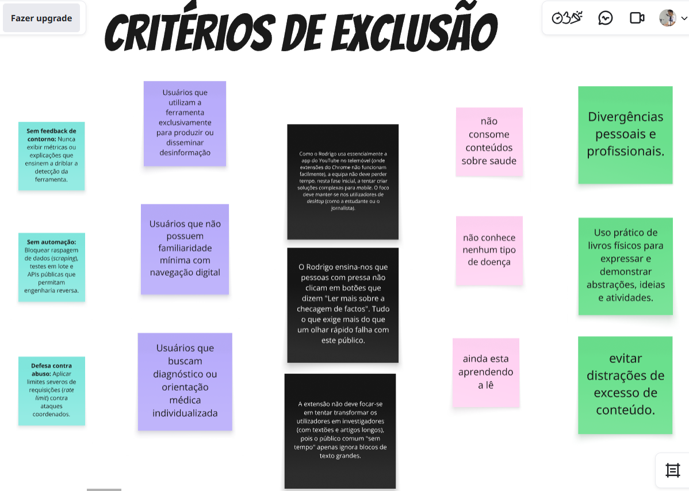
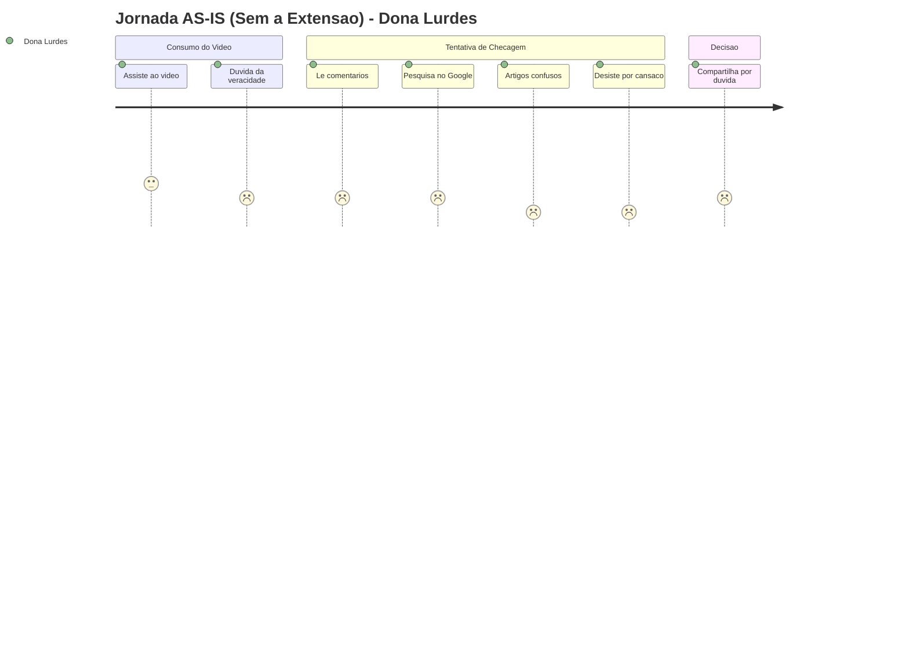
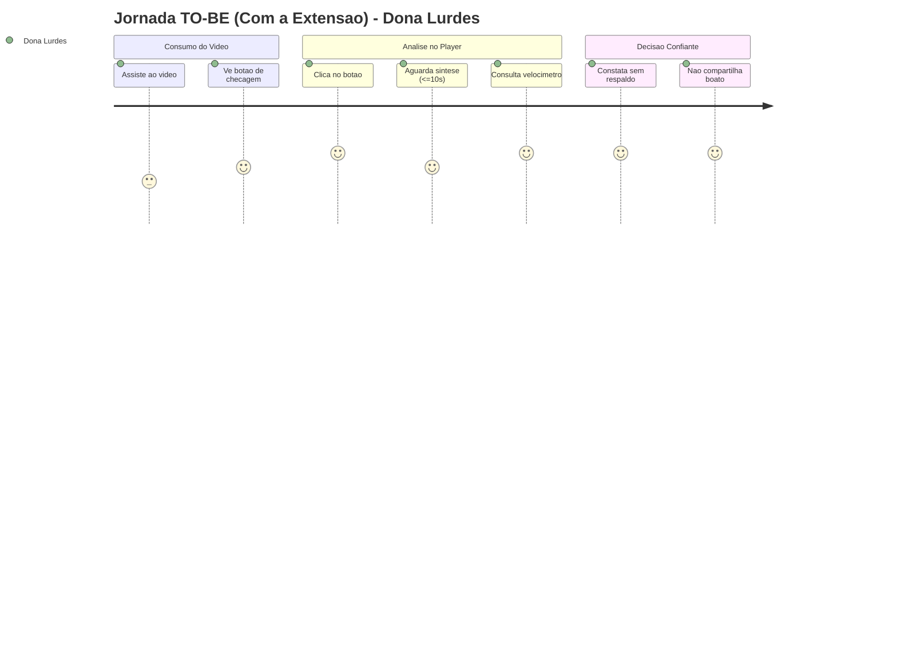

# Personas e Jornadas de Usuário

## Nesta página

- [Personas Primárias](#personas-primarias)
- [Personas Secundárias](#personas-secundarias-uso-ocasional)
- [Antipersonas e Critérios de Exclusão](#antipersonas)
- [Jornadas do Usuário](#jornadas-do-usuario)
  - [Jornada AS-IS (Sem a Extensão)](#as-is-jornada-atual-sem-a-extensao)
  - [Jornada TO-BE (Com a Extensão)](#to-be-jornada-proposta-com-a-extensao)

> **Nota:** Os diagramas de jornada abaixo utilizam a sintaxe `journey` do Mermaid, suportada nativamente no tema Material para MkDocs.

---

## Personas Primárias {: #personas-primarias }

### Persona 01: Dona Lurdes (Consumidora Leiga de Conteúdo) {: #dona-lurdes }

| Atributo | Detalhes |
|:---|:---|
| **Identificação** | 70 anos, aposentada |
| **Letramento Digital** | Baixo a nulo. Concluiu ensino médio; utiliza o celular e o computador com o auxílio de netos para acessar WhatsApp, Facebook e YouTube |
| **Contexto de Uso** | Diabética com preocupação constante sobre saúde. Assiste a vídeos recomendados com títulos apelativos prometendo receitas e curas milagrosas antes de repassar a familiares |
| **Dores Centrais** | Intimidada por termos médicos e científicos complexos; receio de disseminar desinformação prejudicial; frustração com a lentidão e divergência de resultados em buscas manuais |
| **Objetivos no Produto** | Veredito rápido, visual e em linguagem estritamente simples (sem jargões técnicos) diretamente na página do vídeo |
| **Rastreabilidade** | [HU01, HU02](../requisitos/backlog-e-historias.md#hu01), [UC-01](../requisitos/casos-de-uso.md#uc-01) |

### Persona 02: Amanda (Estudante Universitária) {: #amanda }

| Atributo | Detalhes |
|:---|:---|
| **Identificação** | 23 anos, estudante de Psicologia |
| **Letramento Digital** | Intermediário. Utiliza tablets e notebooks diariamente para estudos acadêmicos e pesquisa de artigos científicos |
| **Contexto de Uso** | Consome palestras e vídeos de divulgação científica no YouTube para complementar fichamentos e trabalhos de neurociência e comportamento |
| **Dores Centrais** | Perda de tempo ao alternar abas para verificar afirmações e medo de citar premissas falsas ou pseudocientíficas em apresentações acadêmicas |
| **Objetivos no Produto** | Análise e categorização factual em até 10 segundos, estruturando o que é apoiado por evidências científicas e o que é infundado |
| **Rastreabilidade** | [HU03, HU04](../requisitos/backlog-e-historias.md#hu03), [UC-03](../requisitos/casos-de-uso.md#uc-03) |

### Persona 03: Mariana Oliveira (Professora e Multiplicadora) {: #mariana }

| Atributo | Detalhes |
|:---|:---|
| **Identificação** | 35 anos, professora de ensino fundamental na rede pública |
| **Letramento Digital** | Intermediário. Navega com desenvoltura em ferramentas pedagógicas e aplicativos de comunicação |
| **Contexto de Uso** | Busca informações sobre saúde, prevenção e temas comunitários; frequente compartilhamento com grupos de pais e colegas de trabalho |
| **Dores Centrais** | Ansiedade em relação à responsabilidade social de suas mensagens; dificuldade de distinguir temas de controvérsia científica legítima de boatos fabricados |
| **Objetivos no Produto** | Sinalização visual instantânea quando houver carência de dados ou fontes em divergência, evitando o compartilhamento precipitado |
| **Rastreabilidade** | [HU09, HU10](../requisitos/backlog-e-historias.md#hu09), [UC-06](../requisitos/casos-de-uso.md#uc-06) |

---

## Personas Secundárias (Uso Ocasional) {: #personas-secundarias-uso-ocasional }

| Persona | Perfil e Ocupação | Foco de Interação | Rastreabilidade |
|:---|:---|:---|:---|
| **Carlos Augusto** {: #carlos-augusto } | 29 anos, analista de qualidade em cooperativa de tecnologia social | Validação de transcrições completas, precisão temporal e recuperação instantânea via cache local | [HU05, HU06](../requisitos/backlog-e-historias.md#hu05) |
| **Mayara** {: #mayara } | 34 anos, jornalista investigativa | Auditoria rigorosa de fontes primárias com hiperligações diretas e verificação de contexto temporal da publicação | [HU07, HU08](../requisitos/backlog-e-historias.md#hu07) |
| **Helena** {: #helena } | 54 anos, assistente administrativo | Questionamentos reflexivos e avaliação voluntária de utilidade da inferência (funcionalidades pós-MVP) | [HU11, HU12](../requisitos/backlog-e-historias.md#hu11) |

---

## Antipersonas e Critérios de Exclusão {: #antipersonas }

A definição formal de antipersonas orienta os limites de escopo do produto e impede o desvio para funcionalidades não prioritárias:

*Figura: Mapeamento de critérios de exclusão, diretrizes de antipersonas e salvaguardas de integridade do produto.*

### Lucas Ferreira (38 anos, Criador de Conteúdo Sensacionalista)
- **Perfil:** Opera em ecossistema de engajamento acelerado, focado em monetização orgânica através de pânico moral e visualizações.
- **Risco de Mau Uso:** Buscaria utilizar o produto para encontrar brechas editoriais ou obter validações unilaterais.
- **Diretriz de Produto:** O sistema não fornece relatórios de contorno algorítmico nem atua como selo de aprovação política. Em temas com divergência legítima, ambas as correntes são apresentadas neutralmente.

### Rodrigo (38 anos, Consumidor Exclusivamente Mobile)
- **Perfil:** Operário fabril com rotina intensa; consome YouTube Shorts exclusivamente em smartphone no transporte público.
- **Diretriz de Produto:** O produto não disponibilizará arquitetura complexa para navegadores móveis no MVP, concentrando-se integralmente no ecossistema desktop Chromium (Chrome, Edge e Brave).

### Usuário em Busca de Aconselhamento Clínico
- **Perfil:** Indivíduo buscando substituição de diagnóstico presencial para quadros agudos.
- **Diretriz de Produto:** O sistema recusa formalmente qualquer caráter de diagnóstico médico, prescrição terapêutica ou consultoria em saúde individualizada.

---

## Jornadas do Usuário {: #jornadas-do-usuario }

### Jornada AS-IS (Sem a Extensão) — Dona Lurdes {: #as-is-jornada-atual-sem-a-extensao }

A jornada atual evidencia a vulnerabilidade do usuário comum diante de vídeos apelativos de saúde ou notícias falsas, resultando em sobrecarga cognitiva, abandono da checagem e eventual compartilhamento de boatos por cautela mal orientada.

#### Mapeamento Detalhado da Experiência AS-IS

| Estágio da Jornada | Ação do Usuário | Pensamento e Emoção | Ponto de Fricção (Dor do Usuário) | Consequência no Mundo Real |
|:---|:---|:---|:---|:---|
| **1. Descoberta e Consumo** | Assiste a um vídeo com título apelativo prometendo tratamento caseiro rápido para problema crônico. | *"Será que isso funciona de verdade? Parece bom demais..."* Curiosidade inicial e leve esperança. | Título sensacionalista manipula a vulnerabilidade e a carência informacional do usuário. | Exposição a orientações sem respaldo médico. |
| **2. Leitura de Comentários** | Rola a página para baixo em busca de validação na seção de comentários do YouTube. | *"Deixa ver o que as outras pessoas estão falando..."* Sensação de desorientação. | Comentários contraditórios, testemunhos falsos e ausência de moderação especializada. | Incerteza amplificada sem qualquer critério técnico. |
| **3. Busca Manual Externa** | Abre nova aba do navegador para pesquisar termos da receita no Google. | *"Vou pesquisar no Google, mas tenho medo de me perder ou fechar o vídeo."* Tensão cognitiva. | Troca forçada de contexto, múltiplos resultados pagos e fragmentação de abas. | Desvio de foco e aumento substancial do esforço operacional. |
| **4. Confronto com Linguagem Técnica** | Encontra artigos acadêmicos longos, termos em inglês e jargões laboratoriais herméticos. | *"Não estou entendendo nada dessas palavras difíceis... isso não é para mim."* Frustração e cansaço. | Conteúdo jornalístico ou científico inacessível para quem possui baixa literacia digital ou visual. | **Abandono compulsório da checagem:** desiste por exaustão. |
| **5. Compartilhamento Involuntário** | Sem confirmação conclusiva, encaminha o link no WhatsApp da família com a legenda *"Não custa tentar"*. | *"Se for verdade pode ajudar alguém; se não for, mal não faz."* Ansiedade residual. | Falta de uma resposta imediata e sintetizada antes da decisão de compartilhar. | Disseminação involuntária de desinformação em redes interpessoais. |

---

### Jornada TO-BE (Com a Extensão EvidencIA) — Dona Lurdes {: #to-be-jornada-proposta-com-a-extensao }

A jornada proposta introduz checagem contextual direta no player do YouTube, simplificação visual instantânea (velocímetro) e entrega em linguagem clara, empoderando o usuário a tomar decisões conscientes sem atrito.

#### Mapeamento Detalhado da Experiência TO-BE

| Estágio da Jornada | Ação do Usuário | Pensamento e Emoção | Valor Entregue pela Solução | Resposta do Sistema (EvidencIA) |
|:---|:---|:---|:---|:---|
| **1. Identificação Integrada** | Assiste ao vídeo e nota o botão discreto *"Verificar Fatos"* posicionado logo abaixo do player. | *"Olha, tem um botão aqui para ver se é verdade ou mentira."* Curiosidade segura. | Sem necessidade de abrir abas adicionais ou copiar links; elemento totalmente integrado à página. | Botão injetado via Shadow DOM com ícone claro e alto contraste (WCAG 2.1 AA). |
| **2. Acionamento em 1 Clique** | Clica no botão de checagem enquanto o vídeo segue reproduzindo normalmente. | *"Vou clicar para ver. Que bom que não pausou meu vídeo!"* Sensação de controle e autonomia. | Respeito à preferência do usuário: sem interrupções forçadas ou congelamento da mídia ([RNF-06](../requisitos/catalogo-requisitos.md#rnf-06)). | Feedback visual imediato (< 1s) com indicador de carregamento sutil no botão. |
| **3. Processamento Rápido** | Aguarda poucos segundos enquanto o orquestrador analisa as alegações da fala. | *"Já está terminando, foi bem rapidinho."* Percepção de eficiência e agilidade. | SLA rigoroso de resposta útil em até 10 segundos ([RNF-01](../requisitos/catalogo-requisitos.md#rnf-01)). | Backend Proxy extrai a transcrição e consulta fontes com timeout assíncrono de 8,0s. |
| **4. Leitura do Painel Lateral** | Painel abre suavemente exibindo o velocímetro (ex.: 18% - Falso) e uma síntese de 2 linhas. | *"Entendi na hora: está no vermelho e diz que o chá não cura a doença."* Clareza cognitiva absoluta. | Comunicação imediata por cores e síntese em português claro, sem jargões científicos indecifráveis. | Velocímetro semafórico intuitivo + card analítico com contraste testado ($\ge$ 4.5:1). |
| **5. Decisão Emancipada** | Consulta as fontes oficiais (Fiocruz / Ministério da Saúde) e decide não repassar o vídeo. | *"Que alívio ter verificado antes de mandar no grupo da família!"* Segurança e empoderamento. | Quebra definitiva do ciclo de desinformação através de evidências confiáveis e links auditáveis. | Links diretos para agências e instituições abrindo em aba separada (`target="_blank"`). |

---

**Próximo:** [Design System e Interface](design-system.md) — padrões visuais e componentes do painel lateral.  
**Ver também:** [Backlog e Histórias de Usuário](../requisitos/backlog-e-historias.md) — critérios de aceitação em formato Gherkin.
