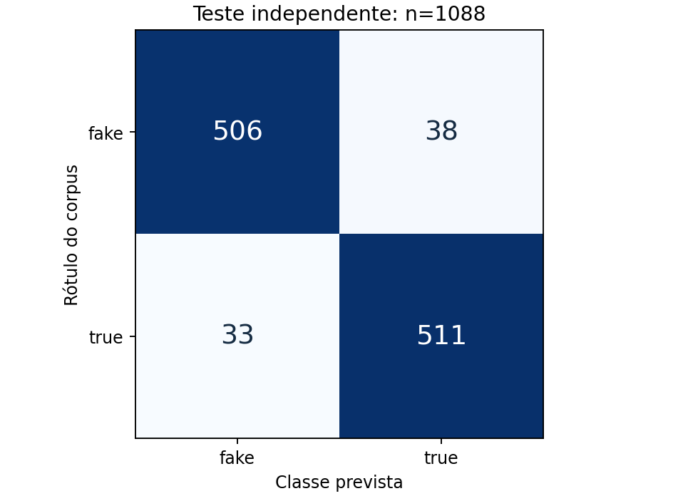
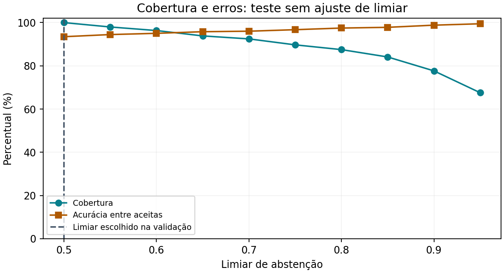

# Relatório técnico - treinamento e avaliação de IA

Entrega acadêmica - 09/10/2026 - Equipe EvidencIA

Este relatório consolida preparação dos dados, treinamento, seleção, calibração, avaliação e diagnóstico de abstenção. O pacote entregue contém notebook executado, modelo treinado e documentação. O experimento reproduzido está incorporado ao repositório em experiments/fakebr; o pacote de entregáveis inclui também código e documentação da aplicação. A avaliação do modelo e os testes do produto têm escopos separados.

### Resultado principal e seu limite

| Experimento | Acurácia | Macro-F1 |
| --- | --- | --- |
| Artefato anterior, aplicado ao corpus real | 51,75% | 0,4986 |
| Abordagem anterior retreinada no mesmo treino | 85,94% | 0,8591 |
| Novo candidato: TF-IDF + regressão logística calibrada | 93,47% | 0,9347 |
| Novo candidato: estresse com 40 palavras | 83,82% | 0,8382 |

O teste principal tem 1.088 notícias, em 544 grupos temáticos reservados. Estes resultados avaliam classificação linguística de notícias históricas do Fake.br; não representam acurácia de verificação factual de vídeos. O candidato foi reproduzido e incorporado como experimento acadêmico. Seu arquivo .plk é equivalente ao .pkl. A API mantém a política de decisão baseada em evidências e não utiliza o score deste modelo como veredito factual.

### Diagnóstico histórico e revisão atual

As respostas inconclusivas não decorrem apenas do treinamento. O diagnóstico recebido registrou mock, ausência de índice e chave externa e modelo Ollama não instalado na revisão 0ffe395. Esses registros históricos não comprovam a configuração atual de outro computador ou da versão online. A nova ferramenta scripts/check_readiness.py verifica os pré-requisitos locais sem exibir credenciais. O classificador não converte probabilidade linguística em fonte comprobatória.

Escopo do diagnóstico recebido: revisão 0ffe395. Escopo da continuação: branch codex/transcricao-entregaveis, criada da main b168b8b. A reprodução científica utiliza o mesmo snapshot Fake.br e as mesmas partições. A versão online e vídeos reais do usuário ainda não foram medidos.

## 1. Dados e preparação

A avaliação anterior do projeto registrava 27 exemplos de teste. O carregador atual contém 139 exemplos, incluindo 104 exemplos curados em código, fixtures e amostras locais. Nomes de datasets declarados nesses exemplos não comprovam que todos foram coletados da fonte oficial. O artefato anterior não contém manifesto de treino suficiente para reconstruir sua linhagem integral.

Nesta revisão, os dados foram obtidos diretamente do snapshot oficial Fake.br, com revisão Git fixada e SHA-256 conferido. Foi utilizada a versão size_normalized_texts, que reduz a diferença de tamanho entre notícias alinhadas. Não usamos a dimensão do documento como atributo explícito nem misturamos as amostras demonstrativas ao benchmark.

| Auditoria | Quantidade |
| --- | --- |
| Documentos originais | 7.200 |
| Documentos após deduplicação | 7.199 |
| Duplicata textual removida | 1 |
| Textos com rótulos conflitantes detectados | 0 |
| Metadados ausentes, mantidos como não informados | 4 |
| Grupos após união de pares e duplicatas | 3.599 |

Preparação: leitura UTF-8, descarte de textos vazios, chave de deduplicação baseada em normalização de acentos/caixa e SHA-256; união transitiva de pares alinhados e duplicatas. Metadados de data e URL não entram no modelo. URLs de origem constam no manifesto para rastreabilidade; não são evidências atuais.

### Divisão independente por grupos

| Partição | Notícias | Grupos | Finalidade |
| --- | --- | --- | --- |
| train | 4312 | 2156 | Ajustar TF-IDF e pesos |
| validation | 1082 | 541 | Selecionar modelo e limiar |
| calibration | 717 | 358 | Ajustar sigmoid |
| test | 1088 | 544 | Medir resultados finais |

Proporções por grupos: 60/15/10/15%; seed 42; estratificação por categoria temática do grupo. Os pares alinhados não atravessam partições. Asserções verificaram ausência de grupos e hashes de texto compartilhados. Isso reduz vazamento, mas não elimina possíveis paráfrases ou temas correlatos entre grupos.

## 2. Treinamento e seleção da abordagem

A tarefa é supervisionada e binária: fake=0 e true=1, conforme os rótulos históricos do corpus. A unidade é uma notícia, não um vídeo. O Qwen utilizado no produto é um modelo pré-treinado de extração; nenhum fine-tuning de Qwen foi executado nesta revisão.

### Representação e candidatos

TF-IDF ajustado apenas no treino: palavras e bigramas; até 30.000 atributos; min_df=3; max_df=0,98; TF sublinear; normalização de acentos e caixa. As notícias de validação, calibração e teste são apenas transformadas pelo vocabulário aprendido.

| Candidato | Macro-F1 validação | Acurácia validação |
| --- | --- | --- |
| multinomial_nb_alpha_0.5 | 0,8752 | 87,52% |
| logistic_C_1 | 0,9205 | 92,05% |
| logistic_C_4 | 0,9335 | 93,35% |

A regressão logística com C=4 foi selecionada pelo maior macro-F1 na validação. Naive Bayes foi mantido como baseline simples e econômico. A regressão logística aprende pesos discriminativos e trabalha bem com atributos esparsos; não exige treinamento de uma rede neural nem GPU para este corpus.

A escolha de uma abordagem linear considera dados rotulados disponíveis, execução local rápida, reprodução simples e possibilidade de inspecionar coeficientes. Modelos maiores não compensam ausência de fontes ou rotulagem inadequada.

### Calibração e limiar

Após congelar o estimador, uma regressão logística escalar ajusta a transformação sigmoid de seus escores nas 717 notícias de calibração. Esse ajuste é calibração de probabilidades. Alterar apenas o limiar, como no relatório antigo, não calibra probabilidades.

Na validação, o limiar é selecionado para maximizar cobertura mantendo acurácia nas aceitas >=90%, com pelo menos 50 aceitas. O resultado foi 0,50. A proteção lexical de 0,15 foi fixada antes da medição: textos com vocabulário insuficiente recebem abstenção. Não alteramos o limiar com base no teste.

O arquivo entregue mantém o modelo exatamente avaliado: ajuste no treino e calibração separada. Não foi retreinado com o conjunto de teste após a medição.

## 3. Desempenho em teste independente

| Métrica | Resultado |
| --- | --- |
| Acurácia / IC95% | 93,47% / 92,00% a 94,94% |
| Macro-F1 | 0,9347 |
| ROC-AUC | 0,9842 |
| Brier / log-loss | 0,0474 / 0,1601 |
| ECE (10 intervalos) | 0,0112 |

| Classe | Precisão | Recall | F1 | Suporte |
| --- | --- | --- | --- | --- |
| fake | 93,88% | 93,01% | 0,9344 | 544 |
| true | 93,08% | 93,93% | 0,9350 | 544 |

Houve 71 erros em 1.088 notícias. O bootstrap usa 1.000 reamostragens dos grupos de teste, preservando dependência entre notícias alinhadas. O intervalo descreve este corpus e o modelo ajustado; não é garantia sobre novos temas, fontes ou transcrições.

## 4. Calibração, confiança e abstenção

| Probabilidades do candidato | Brier (menor melhor) | ECE (menor melhor) |
| --- | --- | --- |
| Antes da sigmoid | 0,0645 | 0,1155 |
| Após a sigmoid | 0,0474 | 0,0112 |

A calibração reduziu o erro probabilístico neste teste. ECE depende do número e das fronteiras dos intervalos; isoladamente não garante calibração. Brier e log-loss complementam essa análise.

| Limiar | Cobertura | Abstenção | Acurácia nas aceitas |
| --- | --- | --- | --- |
| 0,50 | 100,00% | 0,00% | 93,47% |
| 0,60 | 96,32% | 3,68% | 95,04% |
| 0,80 | 87,50% | 12,50% | 97,48% |
| 0,90 | 77,67% | 22,33% | 98,82% |

A curva de teste é descritiva: seus pontos não foram usados para escolher o limiar. Em 0,50 há zero abstenção neste domínio; isso é possível em um classificador binário, mas não comprova certeza factual. Com limiares maiores, a cobertura cai e o erro entre aceitas tende a diminuir.

Sem exemplos aceitos, a acurácia seletiva é indefinida. O novo avaliador registra null/None, em vez de declarar 100% como fazia o avaliador anterior.

## 5. Diagnóstico histórico de respostas inconclusivas

A investigação do código distingue três processos: extração de alegações pelo provedor; recuperação de checagens com fonte; classificação linguística de contingência. O diagnóstico do classificador só acrescenta notas de estilo quando não há evidência. Sua saída não modifica insufficient_evidence para supported ou contradicted.

| Constatação histórica na revisão 0ffe395 | Consequência técnica |
| --- | --- |
| LLM_PROVIDER=mock | Extração demonstrativa, sem inferência real do Qwen. |
| Ollama configurado: qwen2.5:3b; instalado: qwen3.5:9b | Teste do modelo configurado retornou HTTP 404. Ao usar Ollama com esse nome, a extração falha e pode acionar fallback. |
| Índice backend/data/chroma ausente | Busca vetorial local sem corpus de evidências indexado. |
| GOOGLE_FACT_CHECK_API_KEY não configurada | Sem a consulta externa autenticada para complementar fontes. |
| 0 pares com relevância e stance humanos consolidados | Não há ground truth independente para validar retrieval ou relação claim-evidence. |

O artefato antigo teve acurácia de 51,75% e abstenção de 39,61% no corpus real de teste. Logo, ele não “só abstém”, mas também erra bastante fora do conjunto demonstrativo. Baixar o limiar indiscriminadamente faria emitir mais classificações sem resolver esse erro.

Retreinar com dados reais elevou a abordagem anterior para 85,94% e reduziu a abstenção para 13,97% no mesmo teste. O novo candidato atingiu 93,47%. Esses ganhos são de classificação de notícias; ainda não habilitam a classificação factual de uma fala sem evidências.

### Correções que o diagnóstico indica

Para a execução da aplicação, alinhar o provedor ao modelo realmente instalado, verificar timeouts, construir o índice com checagens rastreáveis e configurar a busca complementar. Para o modelo, manter treino real, controle de vazamento, calibração independente e métricas seletivas. A continuação adiciona o diagnóstico de configuração e o guia de evidências. Não transforma fixtures ou notícias do benchmark em evidências factuais de uma alegação.

A inspeção é local. Falta o vídeo/alegação específico e a configuração da versão online para confirmar a causa observada pelo usuário.

## 6. Desafios, análise de erros e limites

O teste de estresse usa as primeiras 40 palavras de cada notícia de teste, preservando o rótulo da notícia completa. Acurácia caiu de 93,47% para 83,82% e o macro-F1 para 0,8382. Esse é um proxy de textos curtos, não uma avaliação anotada de alegações atômicas. A queda mostra que transferir o modelo diretamente para legendas é arriscado.

| Categoria | N de teste | Acurácia |
| --- | --- | --- |
| ciencia_tecnologia | 18 | 88,89% |
| economia | 8 | 75,00% |
| não informado | 2 | 50,00% |
| politica | 628 | 93,47% |
| religiao | 8 | 100,00% |
| sociedade_cotidiano | 192 | 96,35% |
| tv_celebridades | 232 | 92,24% |

Política e celebridades dominam os dados. Economia tem apenas oito casos de teste; ciência e tecnologia têm dezoito. Acurácia de 100% em religião significa oito acertos, não validação ampla. Resultados por categoria pequena exigem mais dados, não conclusões universais.

Limitações: corpus histórico; regularidades de fonte/estilo; possíveis duplicatas semânticas não exatas; corpus de notícias diferente de transcrições; nenhuma avaliação humana independente de relação claim-evidence. Negação, ironia e números trocados podem preservar vocabulário e alterar completamente o fato. O modelo é inadequado como árbitro de verdade.

### Principais desafios enfrentados nesta revisão

Separar dados demonstrativos de benchmark verificável; preservar pares temáticos fora do teste; lidar com quatro metadados ausentes sem inventar datas/fontes; executar notebook em ambiente isolado; distinguir score de decisão de probabilidade calibrada; identificar falhas de configuração que aparentam falha de treinamento.

### Aprendizados técnicos observados

Procedência e divisão dos dados importam mais que números altos isolados. Métricas de qualidade do modelo não são cobertura de testes de software. Resposta inconclusiva pode ser correta quando falta fonte. Modelos linguísticos, extratores e recuperadores precisam de avaliações separadas. As reflexões pessoais da equipe podem complementar essas lições técnicas, sem alterar os resultados medidos.

## 7. Reprodução e entrega

O notebook de 31 células foi reexecutado integralmente nesta revisão, incluindo auditoria, treinamento, comparação, gráficos, recarga do artefato e teste de abstenção fora do vocabulário. Asserções confirmaram separação das partições e igualdade das probabilidades após salvar/carregar nas 1.088 notícias de teste. As partições e 32 métricas centrais concordam com os resultados recebidos (tolerância 1e-10).

Ambiente: Python 3.12.14; scikit-learn 1.7.2; NumPy 2.5.3. Execução com uma thread de BLAS durante o ajuste, seed 42. O lockfile fixa as versões instaladas. Tempo de execução pode variar com sistema e hardware; não representa SLA de aplicação.

| Arquivo | Finalidade |
| --- | --- |
| avaliacao_modelo.ipynb | Notebook executado; código completo e métricas. |
| models/modelo_treinado.pkl e .plk | Modelo treinado, TF-IDF, estimador e calibrador. |
| Relatorio_Tecnico.docx / relatorio_tecnico.md | Relatório revisado e fonte editável. |
| results/metrics.json e test_predictions.jsonl | Métricas e predições individuais auditáveis. |
| results/splits.jsonl | IDs, grupos, hashes, URLs e partições; sem artigos integrais. |
| requirements-lock.txt e source/ | Ambiente e código independente para reprodução. |

O download confere o snapshot 780f5516c4ae070761632d98ac3368f3ded09d35. O corpus não foi republicado no pacote: não havia licença explícita no snapshot inspecionado. Para reproduzir o treino, o notebook recupera os dados diretamente da fonte. Carregar o modelo salvo funciona offline.

O experimento pode ser executado separado da aplicação. O pacote ampliado inclui código da extensão e API, sem credenciais. A submissão no Teams permanece a cargo da equipe; nenhuma mensagem ou submissão externa foi realizada.

### Referências e evidências da revisão

Corpus oficial: https://github.com/roneysco/Fake.br-Corpus (snapshot fixado; consulta em 09/10/2026). Referência bibliográfica solicitada pelo corpus: Monteiro et al., Contributions to the Study of Fake News in Portuguese: New Corpus and Automatic Detection Results, PROPOR, 2018.

Calibração: https://scikit-learn.org/stable/modules/calibration.html (consulta em 09/10/2026). Evidências próprias: metrics.json, legacy_comparison.json, diagnostico.json e manifest.json do pacote.

Próxima validação necessária: corpus de alegações reais com rótulos humanos independentes, pares claim-evidence, teste fora de tema/fonte e acompanhamento de calibração/abstenção. Não declaramos essa etapa como concluída.

## 8. Correções da transcrição e da validação

A extensão agora usa exclusivamente faixas de legenda do vídeo. A descrição foi removida do caminho de extração e do fallback. Legendas vazias ou com menos de 50 caracteres produzem erro recuperável e não disparam análise. JSON3 conserva fragmentos dentro de cada evento; XML e SRV3 preservam os tempos existentes. Tempos ausentes não são inventados.

Os provedores recebem a transcrição integral dentro do limite de 100.000 caracteres, sem truncar em 2.500. O modo de contingência recupera fontes por alegação e mantém observações temporais isoladas. O cache foi migrado para versão 3 para descartar análises antigas.

A execução de 16 E2E passou, incluindo inspeção do corpo HTTP enviado ao backend e ausência de POST quando há descrição longa e legenda vazia. Esses testes usam fixtures controladas no navegador; não representam cobertura de todos os vídeos ou formatos futuros do YouTube.

## 9. Prontidão de desenvolvimento e próximos critérios

O treinamento do novo candidato foi reproduzido. Os notebooks do baseline local de 139 exemplos e da EDA também executaram sem erros. A documentação organiza começo rápido, operação, governança e downloads de DOCX, YAML e CSV. Os resultados finais dos testes e commits ficam no registro de prontidão da documentação e no manifesto da entrega.

GO aplica-se ao desenvolvimento e à demonstração local. Validar produção exige infraestrutura configurada, provedor real e canais de evidências disponíveis. Validação científica de fala e relação claim-evidence exige corpus específico com anotação humana independente. Essas etapas não foram declaradas concluídas.
