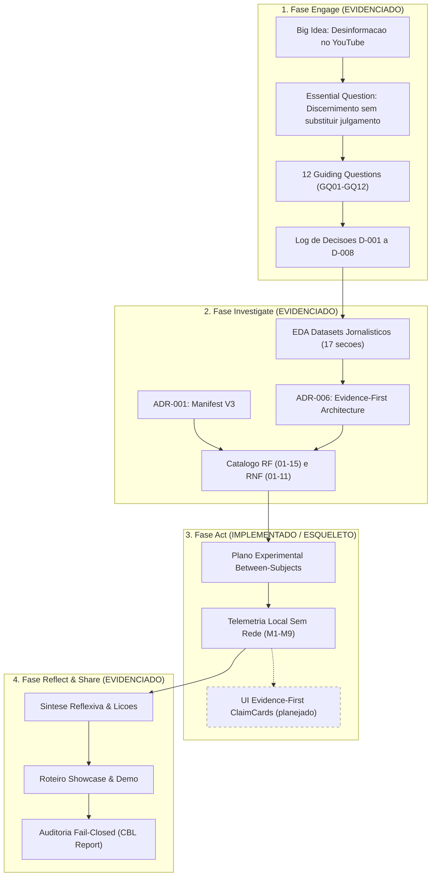
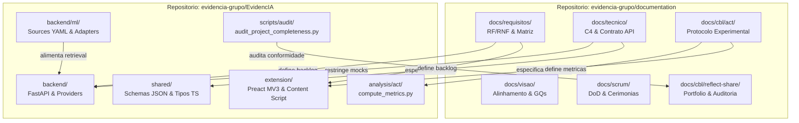

```mermaid
flowchart LR
    CH["Challenge: Fact-Checking"] --> EQ["Essential Question"]
    EQ --> GQs["Guiding Questions<br/>(docs/visao/guiding-questions.md)"]
    GQs --> EDA["EDA em Datasets PT-BR<br/>(notebooks/eda_datasets.ipynb)"]
    EDA --> ADR["ADR-006: Evidence-First<br/>(tecnico/decisoes/ADR-006)"]
    ADR --> HU["HU11: Interface sem Score<br/>(requisitos/backlog-e-historias.md)"]
    HU --> API["Contrato API v1<br/>(backend/app/routers/check.py)"]
    API --> UI["Painel Evidence-First<br/>(extension/src/panel/) (planejado)"]
    UI -.-> ACT["Validacao Empirica Act<br/>(analysis/act/compute_metrics.py)"]

    style UI stroke-dasharray: 5 5,stroke:#888
    style ACT stroke-dasharray: 5 5,stroke:#888
```

```mermaid
flowchart LR
    subgraph S1["Sprint 01 — Fundacao & EDA (EVIDENCIADO)"]
        S1_Goal["Sprint Goal: Fundacao Investigativa & Datasets PT-BR"]
        S1_Scope["Escopo: 36 SP (Backlog, EDA, ADR-001 a 006)"]
        S1_Review["Review: 6 Perguntas Respondidas"]
        S1_Retro["Retrospectiva: Acoes de Melhoria Registradas"]
        S1_Goal --> S1_Scope --> S1_Review --> S1_Retro
    end

    subgraph S2["Sprint 02 — Pipeline Evidence-First (ESQUELETO)"]
        S2_Goal["Sprint Goal: Integracao Evidence-First & Telemetria"]
        S2_Scope["Escopo: 38 SP (HU11, HU13-16, Telemetria Local)"]
        S2_Review["Review: Homologacao com Banca (planejado)"]
        S2_Retro["Retrospectiva: Balanco Final (planejado)"]
        S2_Goal --> S2_Scope -.-> S2_Review -.-> S2_Retro
    end

    S1_Retro --> S2_Goal

    style S2_Review stroke-dasharray: 5 5,stroke:#888
    style S2_Retro stroke-dasharray: 5 5,stroke:#888
```

# Mapa Visual e Topologia do Projeto EvidencIA

> **Proposito:** Visualizar graficamente o ciclo metodologico CBL, a cadeia de rastreabilidade de valor, a topologia de repositorios e a linha do tempo das iteracoes Scrum.  
> **Padrao Visual:** Mermaid nativo do GitHub · Conformidade estrita com a legenda de status textual.

---

<!-- gen:mapa-cbl:start -->
## 1. Ciclo Metodologico CBL (Challenge Based Learning)

> **Legenda de Status:** `EVIDENCIADO` · `IMPLEMENTADO` · `ESQUELETO` · `PLANEJADO` · `AUSENTE`  
> *Gerado em 2026-10-02 sobre 81f2516/60ae479*

---

## 2. Cadeia de Rastreabilidade Estrategica (EQ -> Codigo -> Validacao)

> **Legenda de Status:** Linhas continuas = artefatos existentes; Linhas pontilhadas = componentes planejados.  
> *Gerado em 2026-10-02 sobre 81f2516/60ae479*

---

## 3. Mapa de Relacionamento entre os Dois Repositorios

> **Legenda de Status:** `documentation` (governanca e especificacao) <---> `EvidencIA` (codigo-fonte executavel).  
> *Gerado em 2026-10-02 sobre 81f2516/60ae479*

---

## 4. Linha do Tempo e Governanca das Sprints Scrum

> **Legenda de Status:** Sprint 1 = Concluida com Review/Retrospectiva; Sprint 2 = Em andamento / Planejamento.  
> *Gerado em 2026-10-02 sobre 81f2516/60ae479*

<!-- gen:mapa-cbl:end -->
