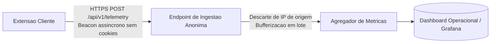

# Instrumentação e Telemetria Ética

## Nesta página

- [Princípios da Telemetria Ética e Privacidade](#principios-da-telemetria)
- [Mapeamento de Coleta dos KPIs de Negócio](#mapeamento-de-kpis)
- [Catálogo de Eventos Operacionais](#catalogo-de-eventos)
- [Estrutura dos Payloads de Telemetria](#estrutura-dos-payloads)
- [Arquitetura de Ingestão e Agregação](#arquitetura-de-ingestao)

---

## Princípios da Telemetria Ética e Privacidade {: #principios-da-telemetria }

Para assegurar a conformidade estrita com o requisito [RNF-05](../requisitos/catalogo-requisitos.md#rnf-05) e com as diretrizes da **LGPD**, a instrumentação da extensão opera sob premissas éticas intransponíveis:

1. **Anonimato Absoluto:** A telemetria não coleta endereço IP, identificadores persistentes de conta Google, histórico de navegação ou dados que permitam a correlação com um indivíduo específico.
2. **Minimização de Eventos:** Apenas eventos operacionais de ciclo de vida e estabilidade são registrados.
3. **Sem Dados de Navegação Geral:** É expressamente vedado monitorar abas não ativas, termos pesquisados na barra de busca do YouTube ou qualquer atividade fora do vídeo sob análise.

---

## Mapeamento de Coleta dos KPIs de Negócio {: #mapeamento-de-kpis }

| KPI de Negócio | Meta Definida | Como é Mensurado Tecnicamente sem Violar Privacidade |
|:---|:---|:---|
| **Taxa de Ativação** | >= 40% na 1ª semana | Comparativo entre contagem de eventos anônimos `extension_installed` e primeiros eventos `check_triggered` emitidos no período. |
| **SLA de Latência** | >= 90% em <= 10s | O evento `check_completed` registra o campo `durationMs`. O cálculo do 90º percentil (P90) é efetuado diretamente no agregador de métricas do servidor. |
| **Retenção (D7)** | >= 20% em 7 dias | Verificação de um contador local efêmero mantido na máquina do usuário, que incrementa dias de uso sem transmitir histórico. |
| **Taxa de Degradação Segura** | >= 95% em erro claro | Proporção entre eventos `check_degraded_gracefully` e o total de falhas reportadas. |

---

## Catálogo de Eventos Operacionais {: #catalogo-de-eventos }

| Nome do Evento | Disparador | Dados Transmitidos |
|:---|:---|:---|
| `extension_installed` | Primeira execução pós-instalação da extensão | `version`, `browserEngine` |
| `check_triggered` | Clique do usuário no botão de acionamento da investigação | `isCached: boolean` |
| `check_completed` | Investigação estruturada renderizada com sucesso no painel | `durationMs`, `analysisMode`, `claimsCount`, `sourcesCount`, `hasUncertainty` |
| `check_aborted_no_captions` | Vídeo sem transcrição ou legendas desativadas | `durationMs` (esperado < 1000ms) |
| `check_degraded_gracefully` | Falha tratada com mensagem clara ou fallback Evidence-Only | `errorCode: string`, `durationMs` |

---

## Estrutura dos Payloads de Telemetria {: #estrutura-dos-payloads }

O payload transmitido para o endpoint de métricas não armazena referências aos títulos de vídeos ou identificadores que violem a privacidade:

```json
{
  "eventName": "check_completed",
  "clientVersion": "1.0.0",
  "browserEngine": "Chromium-128",
  "durationMs": 4120,
  "isCached": false,
  "analysisMode": "evidence_first",
  "claimsCount": 3,
  "sourcesCount": 4,
  "hasUncertainty": false,
  "timestamp": "2026-10-02T12:00:00Z"
}
```


---

## Arquitetura de Ingestão e Agregação {: #arquitetura-de-ingestao }



---

**Próximo:** [Glossário Técnico](../referencia/glossario.md) — vocabulário formal do projeto.  
**Ver também:** [Alinhamento Estratégico](../visao/alinhamento-estrategico.md) — definição formal dos objetivos e métricas do produto.
