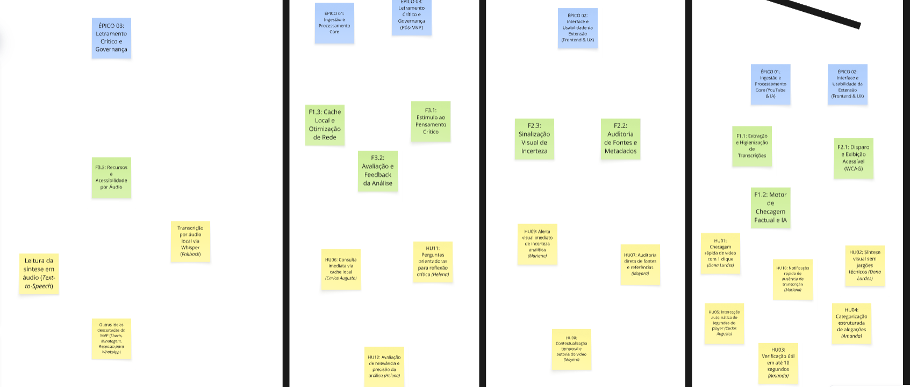
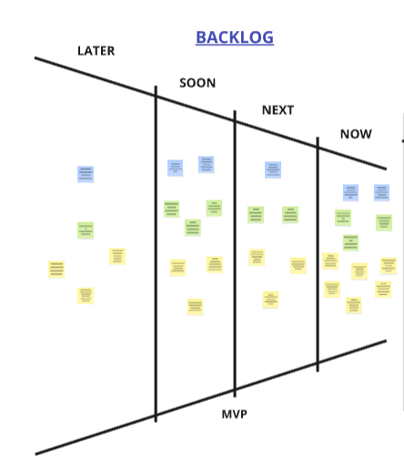

# Backlog e Histórias de Usuário

## Nesta página

- [Visão geral por épico](#backlog-do-produto-por-epico)
- [Índice sequencial de histórias (HU01–HU16)](#indice-sequencial-de-historias)
- [Épico 1 — Gatilho e Ativação](#epico-1-gatilho-e-ativacao) · HU01, HU03
- [Épico 2 — Extração de Transcrição](#epico-2-extracao-de-transcricao) · HU05, HU10
- [Épico 3 — Análise e Checagem via IA](#epico-3-analise-e-checagem-via-ia) · HU02, HU04, HU09
- [Épico 4 — Confiança e Fontes](#epico-4-confianca-e-fontes) · HU07, HU08
- [Épico 5 — Performance e Cache](#epico-5-performance-e-cache) · HU06
- [Épico 6 — Engajamento Reflexivo e Avaliação](#epico-6-engajamento-reflexivo-e-avaliacao) · HU11, HU12
- [Épico 7 — Investigação Orientada por Alegações e Evidências](#epico-7-investigacao-orientada-por-alegacoes-e-evidencias) · HU13, HU14, HU15
- [Épico 8 — Infraestrutura e Provedores de IA](#epico-8-infraestrutura-e-provedores-de-ia) · HU16

!!! info "Legenda de Padronização"
    - **HU** = História de Usuário (formato de valor de negócio com personas mapeadas)
    - **Prioridade MoSCoW** = Must Have (MVP Onda 1), Should Have (Onda 2), Could Have (Onda 3 - Pós-MVP)
    - **Rastreabilidade Bidirecional** = Vinculação estrita com Cenários Operacionais, Casos de Uso, RFs e RNFs
    - **Critérios de Aceitação** = Especificação comportamental em tópicos e cenários executáveis em sintaxe Gherkin

---

## Backlog do Produto por Épico {: #backlog-do-produto-por-epico }


*Figura: Mapeamento visual e estrutural entre Épicos, Features e Histórias de Usuário associadas às personas mapeadas.*

| Épico | Módulo | Histórias | Prioridade MoSCoW | Rastreabilidade a Cenários |
|:---|:---|:---|:---|:---|
| **E1 — Gatilho e Ativação** | Acionamento da extensão | HU01, HU03 | Must Have \| IN | [Cenário 01](cenarios.md#cenario-01), [Cenário 03](cenarios.md#cenario-03) |
| **E2 — Extração de Transcrição** | Ingestão de dados do vídeo | HU05, HU10 | Must Have \| IN | [Cenário 02](cenarios.md#cenario-02), [Cenário 08](cenarios.md#cenario-08) |
| **E3 — Análise e Checagem via IA** | Pipeline de IA e síntese | HU02, HU04, HU09 | Must Have \| IN | [Cenário 03](cenarios.md#cenario-03), [Cenário 06](cenarios.md#cenario-06), [Cenário 10](cenarios.md#cenario-10) |
| **E4 — Confiança e Fontes** | Credibilidade e contexto | HU07, HU08 | Must Have (HU07) / Should Have (HU08) \| IN | [Cenário 04](cenarios.md#cenario-04), [Cenário 09](cenarios.md#cenario-09) |
| **E5 — Performance e Cache** | Otimização e reuso local | HU06 | Should Have \| IN | [Cenário 07](cenarios.md#cenario-07) |
| **E6 — Engajamento Reflexivo e Avaliação** | Pensamento crítico e feedback | HU11, HU12 | Must Have (HU11) \| IN / Could Have (HU12) \| OUT | [Cenário 05](cenarios.md#cenario-05), [Cenário 11](cenarios.md#cenario-11) |
| **E7 — Investigação e Evidências** | UX Evidence-First e Alegações | HU13, HU14, HU15 | Must Have \| IN | [ADR-006](../tecnico/decisoes/ADR-006-evidence-first-architecture.md), [Cenário 03](cenarios.md#cenario-03), [Cenário 05](cenarios.md#cenario-05) |
| **E8 — Infraestrutura de IA** | Desacoplamento de Providers | HU16 | Must Have \| IN | [ADR-006](../tecnico/decisoes/ADR-006-evidence-first-architecture.md) |

### Índice Sequencial de Histórias de Usuário (HU01 a HU16) {: #indice-sequencial-de-historias }

Para facilitar a consulta direta e auditoria técnica, a tabela abaixo consolida todas as 16 histórias de usuário em ordem numérica estrita:

| ID | Título da História | Épico Associado | Persona | Prioridade MoSCoW | Escopo |
|:---:|:---|:---|:---|:---:|:---:|
| [HU01](#hu01) | Acesso Rápido à Investigação de Vídeo | [Épico 1](#epico-1-gatilho-e-ativacao) | Dona Lurdes | Must Have | IN |
| [HU02](#hu02) | Síntese Explicativa Baseada em Evidências | [Épico 3](#epico-3-analise-e-checagem-via-ia) | Dona Lurdes | Must Have | IN |
| [HU03](#hu03) | Checagem Rápida e Factual no Player | [Épico 1](#epico-1-gatilho-e-ativacao) | Amanda | Must Have | IN |
| [HU04](#hu04) | Exibição Transparente de Fontes e Evidências | [Épico 3](#epico-3-analise-e-checagem-via-ia) | Mayara | Must Have | IN |
| [HU05](#hu05) | Ingestão e Processamento de Transcrição | [Épico 2](#epico-2-extracao-de-transcricao) | Carlos Augusto | Must Have | IN |
| [HU06](#hu06) | Desempenho e Reuso Local em Vídeos Já Analisados | [Épico 5](#epico-5-performance-e-cache) | Amanda | Should Have | IN |
| [HU07](#hu07) | Verificação e Validade de Fontes Oficiais | [Épico 4](#epico-4-confianca-e-fontes) | Mayara | Must Have | IN |
| [HU08](#hu08) | Mapeamento de Credibilidade e Diversidade das Fontes | [Épico 4](#epico-4-confianca-e-fontes) | Carlos Augusto | Should Have | IN |
| [HU09](#hu09) | Detecção Fina de Factualidade e Síntese Neutra | [Épico 3](#epico-3-analise-e-checagem-via-ia) | Mariana | Must Have | IN |
| [HU10](#hu10) | Notificação Rápida de Ausência de Transcrição | [Épico 2](#epico-2-extracao-de-transcricao) | Mariana | Must Have | IN |
| [HU11](#hu11) | Transparência Metodológica e Limitações da IA | [Épico 6](#epico-6-engajamento-reflexivo-e-avaliacao) | Helena | Must Have | IN |
| [HU12](#hu12) | Feedback do Usuário sobre Utilidade das Evidências | [Épico 6](#epico-6-engajamento-reflexivo-e-avaliacao) | Helena | Could Have | OUT |
| [HU13](#hu13) | Extração Atômica de Alegações Verificáveis | [Épico 7](#epico-7-investigacao-orientada-por-alegacoes-e-evidencias) | Dona Lurdes | Must Have | IN |
| [HU14](#hu14) | Consulta Multi-Fonte com Busca Semântica Neutra | [Épico 7](#epico-7-investigacao-orientada-por-alegacoes-e-evidencias) | Mayara | Must Have | IN |
| [HU15](#hu15) | Reflexão Crítica na UX | [Épico 7](#epico-7-investigacao-orientada-por-alegacoes-e-evidencias) | Helena | Must Have | IN |
| [HU16](#hu16) | Provedor de IA Independente | [Épico 8](#epico-8-infraestrutura-e-provedores-de-ia) | Engenharia | Must Have | IN |

### Funil de Priorização do Backlog

A alocação de esforço e cadência de entrega de cada história segue o funil estratégico do produto:


*Figura: Funil de refinamento progressivo do backlog de produto (Now, Next, Soon, Later).*

---

## Épico 1 — Gatilho e Ativação {: #epico-1-gatilho-e-ativacao }

### HU01 — Acesso Rápido à Investigação de Vídeo {: #hu01 }

| Propriedade | Detalhamento |
|:---|:---|
| **Descrição** | Eu, como Dona Lurdes, pretendo iniciar a investigação das alegações de um vídeo com apenas um clique para que eu possa examinar as evidências sobre as receitas e dicas caseiras de saúde antes de decidir seguir ou repassar a familiares. |
| **Prioridade** | Must Have \| IN |
| **Persona Relacionada** | [Dona Lurdes](../design/personas-e-jornadas.md#dona-lurdes) |
| **Rastreabilidade** | GQ02, GQ11, [ADR-006](../tecnico/decisoes/ADR-006-evidence-first-architecture.md), [Cenário 01](cenarios.md#cenario-01), [UC-01](casos-de-uso.md#uc-01), [RF-01](catalogo-requisitos.md#rf-01), [RF-03](catalogo-requisitos.md#rf-03), [RNF-01](catalogo-requisitos.md#rnf-01), [RNF-07](catalogo-requisitos.md#rnf-07) |

**Critérios de Aceitação:**

- A extensão deve disponibilizar um botão de acionamento destacado e visível na interface da página de reprodução (`/watch`).
- O primeiro conjunto de alegações e evidências deve ser renderizado no painel lateral em linguagem clara, sem termos técnicos ou jargões da web.
- Caso o vídeo não possua transcrição ou a rede falhe, o sistema deve exibir aviso em linguagem simples e amigável sem travar o navegador.

```gherkin
Funcionalidade: Acesso rápido à investigação de vídeo

  Cenário: Acionar a investigação com um clique
    Dado que Dona Lurdes está em uma página de vídeo ativa do YouTube (/watch)
    Quando ela clica no botão de acionamento da extensão
    Então o painel deve exibir confirmação visual de processamento em até 1 segundo
    E as alegações do vídeo devem ser renderizadas com suas evidências em linguagem clara, sem jargões técnicos
    E nenhum score global ou gauge deve ser exibido

  Cenário: Falha de rede ou ausência de transcrição
    Dado que Dona Lurdes aciona a investigação de um vídeo
    Quando o vídeo não possui transcrição disponível ou a rede falha
    Então o sistema deve exibir um aviso em linguagem simples e amigável
    E o navegador não deve travar
```

### Histórico de Revisão — HU01

| Data | Motivo | Referência |
|:---|:---|:---|
| 2026-10-02 | Reescrita para alinhar com Essential Question: "saber se é seguro" substituído por "examinar evidências antes de decidir"; UX de investigação assistida em vez de veredito; critérios Gherkin atualizados para exigir ausência de score global. | [ADR-006](../tecnico/decisoes/ADR-006-evidence-first-architecture.md) |
| *(original)* | *"Como Dona Lurdes, pretendo iniciar a checagem de um vídeo com apenas um clique para que eu saiba se as receitas e dicas caseiras de saúde são seguras antes de seguir ou repassar a familiares."* | — |

---

### HU03 — Checagem Rápida e Factual no Player {: #hu03 }

| Propriedade | Detalhamento |
|:---|:---|
| **Descrição** | Eu, como Amanda, pretendo ver a primeira evidência útil sobre afirmações de vídeos de divulgação científica em até 5 segundos para validar premissas sem interromper o fluxo dos meus estudos. |
| **Prioridade** | Must Have \| IN |
| **Persona Relacionada** | [Amanda](../design/personas-e-jornadas.md#amanda) |
| **Rastreabilidade** | GQ09, [ADR-006 Decisão 8](../tecnico/decisoes/ADR-006-evidence-first-architecture.md), [Cenário 01](cenarios.md#cenario-01), [Cenário 03](cenarios.md#cenario-03), [UC-01](casos-de-uso.md#uc-01), [UC-03](casos-de-uso.md#uc-03), [RF-01](catalogo-requisitos.md#rf-01), [RF-09](catalogo-requisitos.md#rf-09), [RNF-01](catalogo-requisitos.md#rnf-01) |

**Critérios de Aceitação:**

- O sistema deve fornecer confirmação visual imediata de processamento em até 1 segundo após o clique.
- A primeira evidência útil deve ser renderizada no painel lateral em no máximo 5 segundos (P90) em condições normais de rede.
- O resultado completo (todas as alegações e evidências) deve ser renderizado em no máximo 10 segundos (P90).
- Em vídeos já analisados recentemente, o sistema deve recuperar os dados em menos de 1 segundo a partir do cache local.

```gherkin
Funcionalidade: Checagem rápida e entrega de evidências no player

  Cenário: Confirmação visual imediata
    Dado que Amanda aciona a investigação de um vídeo
    Quando o clique é processado
    Então uma confirmação visual de processamento deve aparecer em até 1 segundo

  Cenário: Entrega da primeira evidência dentro do SLA
    Dado que a transcrição foi extraída com sucesso
    Quando o pipeline processa as alegações e recupera evidências
    Então a primeira evidência útil deve ser renderizada no painel em no máximo 5 segundos (P90)

  Cenário: Resultado completo dentro do SLA
    Dado que o pipeline completou o processamento
    Quando todas as alegações foram analisadas
    Então o resultado completo deve ser renderizado em no máximo 10 segundos (P90), em condições normais de rede

  Cenário: Recuperação instantânea de vídeo já analisado
    Dado que Amanda abre um vídeo investigado recentemente
    Quando ela aciona a extensão
    Então o resultado deve ser recuperado do cache local em menos de 1 segundo, sem nova requisição
```

### Histórico de Revisão — HU03

| Data | Motivo | Referência |
|:---|:---|:---|
| 2026-10-02 | SLA reescrito: "análise" substituído por "primeira evidência útil" (≤ 5s P90); adicionado SLA de resultado completo (≤ 10s P90) e cache hit (< 1s). Alinhado ao ADR-006 Decisão 8. | [ADR-006](../tecnico/decisoes/ADR-006-evidence-first-architecture.md) |
| *(original)* | *"...analisar afirmações... em até 10 segundos..."* | — |

---

## Épico 2 — Extração de Transcrição {: #epico-2-extracao-de-transcricao }

### HU05 — Ingestão e Processamento de Transcrição {: #hu05 }

| Propriedade | Detalhamento |
|:---|:---|
| **Descrição** | Eu, como Carlos Augusto, pretendo que o sistema obtenha e processe automaticamente a transcrição do vídeo para que a verificação de factualidade ocorra a partir do áudio exato do conteúdo. |
| **Prioridade** | Must Have \| IN |
| **Persona Relacionada** | [Carlos Augusto](../design/personas-e-jornadas.md#carlos-augusto) |
| **Rastreabilidade** | [Cenário 02](cenarios.md#cenario-02), [UC-02](casos-de-uso.md#uc-02), [RF-02](catalogo-requisitos.md#rf-02), [RF-08](catalogo-requisitos.md#rf-08), [RNF-03](catalogo-requisitos.md#rnf-03), [RNF-06](catalogo-requisitos.md#rnf-06) |

**Critérios de Aceitação:**

- O sistema deve interceptar as faixas de legenda (nativas ou geradas automaticamente) diretamente do player do YouTube.
- O texto extraído deve ser estruturado e higienizado antes do envio seguro ao backend intermediário.
- Caso o criador tenha desativado as legendas e não haja transcrição disponível, o sistema deve exibir alerta informativo claro e liberar a tela.

```gherkin
Funcionalidade: Ingestão e processamento de transcrição

  Cenário: Extração de legendas nativas ou automáticas
    Dado que Carlos Augusto está em uma página de vídeo ativa
    Quando o sistema intercepta o identificador do vídeo
    Então as faixas de legenda (nativas ou automáticas) devem ser requisitadas ao player
    E o texto deve ser higienizado e estruturado antes do envio ao backend

  Cenário: Vídeo sem legendas disponíveis
    Dado que o criador do vídeo desativou as legendas
    Quando o sistema tenta obter a transcrição
    Então um alerta informativo claro deve ser exibido
    E o fluxo de checagem deve ser encerrado com segurança
```

---

### HU10 — Notificação Rápida de Ausência de Transcrição {: #hu10 }

| Propriedade | Detalhamento |
|:---|:---|
| **Descrição** | Eu, como Mariana, pretendo ser notificada imediatamente caso o vídeo assistido não possua legendas para não perder tempo aguardando um resultado que não pode ser gerado. |
| **Prioridade** | Must Have \| IN |
| **Persona Relacionada** | [Mariana](../design/personas-e-jornadas.md#mariana) |
| **Rastreabilidade** | [Cenário 08](cenarios.md#cenario-08), [UC-02](casos-de-uso.md#uc-02), [RF-08](catalogo-requisitos.md#rf-08), [RNF-01](catalogo-requisitos.md#rnf-01), [RNF-06](catalogo-requisitos.md#rnf-06), [RNF-07](catalogo-requisitos.md#rnf-07) |

**Critérios de Aceitação:**

- O sistema deve validar a disponibilidade da transcrição em até 1 segundo após o acionamento da extensão.
- Exibição de um alerta orientador informando a impossibilidade técnica de processar o vídeo sem legendas.
- Interrupção segura do carregamento sem retenção de estado de espera ou bloqueio da aba.

```gherkin
Funcionalidade: Notificação rápida de ausência de transcrição

  Cenário: Vídeo sem legendas
    Dado que Mariana aciona a checagem de um vídeo sem transcrição disponível
    Quando o sistema valida a disponibilidade da transcrição
    Então um alerta orientador deve ser exibido em até 1 segundo
    E o carregamento deve ser interrompido com segurança, sem bloquear a aba

  Cenário: Falha temporária da API do YouTube
    Dado que ocorre um erro temporário ao consultar as legendas
    Quando o sistema detecta a falha
    Então um botão de nova tentativa deve ser disponibilizado no painel
```

---

## Épico 3 — Análise e Checagem via IA {: #epico-3-analise-e-checagem-via-ia }

### HU02 — Síntese Explicativa Baseada em Evidências {: #hu02 }

| Propriedade | Detalhamento |
|:---|:---|
| **Descrição** | Eu, como Dona Lurdes, pretendo visualizar uma síntese explicativa acessível de cada alegação, baseada nas evidências recuperadas, para compreender o que as fontes encontradas dizem sem que a IA me diga o que é verdade. |
| **Prioridade** | Must Have \| IN |
| **Persona Relacionada** | [Dona Lurdes](../design/personas-e-jornadas.md#dona-lurdes) |
| **Rastreabilidade** | GQ02, GQ03, GQ11, [ADR-006](../tecnico/decisoes/ADR-006-evidence-first-architecture.md), [Cenário 10](cenarios.md#cenario-10), [UC-01](casos-de-uso.md#uc-01), [UC-03](casos-de-uso.md#uc-03), [RF-03](catalogo-requisitos.md#rf-03), [RF-06](catalogo-requisitos.md#rf-06), [RNF-07](catalogo-requisitos.md#rnf-07) |

**Critérios de Aceitação:**

- A síntese de cada alegação deve ser derivada das evidências recuperadas, não de uma classificação prévia da LLM.
- As alegações devem ser agrupadas com separação visual entre as que possuem evidências de suporte, de contradição, de contextualização e de insuficiência.
- Nenhum score global, gauge ou percentual de veracidade deve ser exibido.
- O painel deve seguir normas WCAG de legibilidade, tipografia ampla e contraste cromático adequado.
- A consulta não deve exigir configurações complexas, preenchimento de cadastros ou autenticação externa.

```gherkin
Funcionalidade: Síntese explicativa baseada em evidências

  Cenário: Separação visual entre alegações por estado de evidência
    Dado que a investigação de um vídeo foi concluída
    Quando o painel lateral é renderizado
    Então cada alegação deve exibir sua síntese baseada nas evidências recuperadas
    E as alegações devem ser separadas por estado (suporte, contradição, contextualização, insuficiência)
    E nenhum score global, gauge ou percentual de veracidade deve ser exibido
    E o painel deve seguir contraste e tipografia compatíveis com WCAG AA

  Cenário: Consulta sem cadastro
    Dado que Dona Lurdes deseja visualizar a síntese das evidências
    Quando ela usa a extensão
    Então nenhuma configuração, cadastro ou autenticação externa deve ser exigida
```

### Histórico de Revisão — HU02

| Data | Motivo | Referência |
|:---|:---|:---|
| 2026-10-02 | Reescrita: síntese baseada em classificação substituída por síntese explicativa derivada de evidências recuperadas; critério explícito de ausência de score global/gauge. | [ADR-006](../tecnico/decisoes/ADR-006-evidence-first-architecture.md) |
| *(original)* | *"...entender facilmente o que é verdade, mentira ou sem comprovação..."* | — |

---

### HU04 — Mapeamento Estruturado de Alegações e Evidências {: #hu04 }

| Propriedade | Detalhamento |
|:---|:---|
| **Descrição** | Eu, como Amanda, pretendo visualizar as principais alegações do vídeo mapeadas individualmente para evidências que sustentam, contradizem ou contextualizam cada fala para facilitar meus fichamentos acadêmicos sem aceitar uma classificação simplista. |
| **Prioridade** | Must Have \| IN |
| **Persona Relacionada** | [Amanda](../design/personas-e-jornadas.md#amanda) |
| **Rastreabilidade** | GQ01, GQ02, GQ03, [ADR-006](../tecnico/decisoes/ADR-006-evidence-first-architecture.md), [Cenário 03](cenarios.md#cenario-03), [UC-03](casos-de-uso.md#uc-03), [RF-03](catalogo-requisitos.md#rf-03), [RF-06](catalogo-requisitos.md#rf-06), [RNF-02](catalogo-requisitos.md#rnf-02) |

**Critérios de Aceitação:**

- As alegações extraídas da transcrição devem ser mapeadas separadamente para suas respectivas evidências.
- Cada evidência deve explicitar sua relação factual com a alegação (`supports`, `contradicts`, `contextualizes`).
- O sistema não deve impor vereditos dogmáticos nem scores numéricos que substituam o exame das fontes.
- A injeção dos componentes na aba do YouTube não deve elevar o Tempo Total de Bloqueio (TBT) em mais de 50 ms.

```gherkin
Funcionalidade: Mapeamento estruturado de alegações e evidências

  Cenário: Listagem isolada de alegações com relação às evidências
    Dado que a investigação de um vídeo foi concluída
    Quando o painel exibe o resultado
    Então cada alegação extraída deve ser listada isoladamente
    E cada evidência associada deve explicitar sua relação (sustenta, contradiz ou contextualiza)
    E nenhum score global deve ser associado à alegação

  Cenário: Alegação com fontes divergentes
    Dado que uma alegação possui evidências contraditórias entre fontes legítimas
    Quando o painel apresenta a alegação
    Então ambas as fontes (de apoio e de contradição) devem ser listadas lado a lado com suas relações explícitas

  Cenário: Limite de sobrecarga de renderização
    Dado que os componentes da extensão são injetados na aba ativa do YouTube
    Quando a página é carregada
    Então o Tempo Total de Bloqueio (TBT) não deve aumentar mais de 50 ms
```

### Histórico de Revisão — HU04

| Data | Motivo | Referência |
|:---|:---|:---|
| 2026-10-02 | Reescrita: de categorização automática unificada para mapeamento claim → evidence por alegação com relação explícita (sustenta/contradiz/contextualiza), sem imposição de veredito ou score. | [ADR-006](../tecnico/decisoes/ADR-006-evidence-first-architecture.md) |
| *(original)* | *"Eu, como Amanda, pretendo visualizar as principais alegações do vídeo categorizadas entre evidências que apoiam, contradizem ou contextualizam a fala para facilitar os meus fichamentos acadêmicos."* | — |

---

### HU09 — Alerta de Incerteza e Limitações Analíticas {: #hu09 }

| Propriedade | Detalhamento |
|:---|:---|
| **Descrição** | Eu, como Mariana, pretendo ser alertada visualmente quando uma alegação não possuir evidência suficiente no corpus ou apresentar divergência entre fontes para não repassar informações sem comprovação factual nem assumir falsidade automática. |
| **Prioridade** | Must Have \| IN |
| **Persona Relacionada** | [Mariana](../design/personas-e-jornadas.md#mariana) |
| **Rastreabilidade** | GQ05, GQ06, [ADR-006 Decisão 3](../tecnico/decisoes/ADR-006-evidence-first-architecture.md), [Cenário 06](cenarios.md#cenario-06), [UC-06](casos-de-uso.md#uc-06), [RF-07](catalogo-requisitos.md#rf-07), [RNF-06](catalogo-requisitos.md#rnf-06), [RNF-07](catalogo-requisitos.md#rnf-07) |

**Critérios de Aceitação:**

- Exibição destacada do estado explícito "Sem evidência suficiente" (`insufficient_evidence`) quando a busca de evidências não encontrar registros com relevância suficiente.
- Regra inviolável: ausência de evidência jamais é convertida automaticamente em rótulo "falso".
- Alegações com referências divergentes legítimas devem expor a controvérsia lado a lado, sem declarar vencedor absoluto.
- O painel lateral deve apresentar a seção "O que ainda não sabemos" apontando limitações da checagem, dados antigos ou fontes primárias ausentes.

```gherkin
Funcionalidade: Alerta de incerteza e limitações analíticas

  Cenário: Alegação sem evidência suficiente não é classificada como falsa
    Dado que a busca vetorial não recupera evidências acima do limiar para uma alegação
    Quando o painel exibe o resultado da alegação
    Então o estado da alegação deve ser explicitamente "Sem evidência suficiente" (insufficient_evidence)
    E o sistema não deve rotular a alegação como falsa nem aplicar penalidade de veracidade

  Cenário: Divergência legítima entre fontes
    Dado que existem fontes confiáveis com conclusões opostas sobre a mesma alegação
    Quando o resultado é apresentado no painel
    Então ambas as perspectivas devem ser listadas lado a lado
    E o indicador de estado deve assinalar "Fontes conflitantes" sem arbitrar um veredito

  Cenário: Exibição da seção de lacunas e limitações
    Dado que a investigação do vídeo possui lacunas identificadas (ex.: fontes antigas ou ausência de fontes primárias)
    Quando o painel exibe a síntese
    Então a seção "O que ainda não sabemos" deve listar claramente as limitações identificadas
```

### Histórico de Revisão — HU09

| Data | Motivo | Referência |
|:---|:---|:---|
| 2026-10-02 | Reescrita: incerteza e limitações promovidas a pilar central; formalização do estado `insufficient_evidence` (distinto de falso) e obrigatoriedade da seção "O que ainda não sabemos". | [ADR-006](../tecnico/decisoes/ADR-006-evidence-first-architecture.md) |
| *(original)* | *"Eu, como Mariana, pretendo receber um alerta visual destacado quando houver incerteza ou conflito de fontes sobre o vídeo para conter impulsos de repasse em mensagens no WhatsApp."* | — |

---

## Épico 4 — Confiança e Fontes {: #epico-4-confianca-e-fontes }

### HU07 — Auditoria Direta e Provenance de Fontes {: #hu07 }

| Propriedade | Detalhamento |
|:---|:---|
| **Descrição** | Eu, como Mayara, pretendo auditar a origem primária das evidências acessando suas fontes com metadados de provenance (origem do dataset, data, publisher e hash de integridade) e hiperligações diretas de forma autônoma. |
| **Prioridade** | Must Have \| IN |
| **Persona Relacionada** | [Mayara](../design/personas-e-jornadas.md#mayara) |
| **Rastreabilidade** | GQ04, GQ07, [ADR-006 Decisão 2](../tecnico/decisoes/ADR-006-evidence-first-architecture.md), [Cenário 04](cenarios.md#cenario-04), [UC-04](casos-de-uso.md#uc-04), [RF-04](catalogo-requisitos.md#rf-04), [RNF-05](catalogo-requisitos.md#rnf-05), [RNF-07](catalogo-requisitos.md#rnf-07) |

**Critérios de Aceitação:**

- Cada cartão de evidência deve listar explicitamente título da fonte, URL, data de publicação, entidade publicadora (publisher) e relação com a alegação.
- O bloco de provenance deve conter metadados do corpus de origem (ex.: FactChecks.br), data de indexação e hash/ID do registro.
- Ao clicar no link da fonte, a página externa deve ser aberta em nova aba (`target="_blank"`) preservando o painel e o player.
- Caso a fonte esteja inacessível (ex.: HTTP 404), o navegador gerencia o erro na nova aba sem travar a extensão ou perder os metadados exibidos.

```gherkin
Funcionalidade: Auditoria direta e provenance de fontes

  Cenário: Abertura de fonte em nova aba com preservação de estado
    Dado que Mayara visualiza um cartão de evidência com hiperligação
    Quando ela clica na ligação da fonte
    Então a página original da fonte deve abrir em uma nova aba do navegador
    E o painel lateral da extensão e a reprodução do vídeo devem permanecer inalterados

  Cenário: Exibição completa de metadados e provenance
    Dado que uma evidência é apresentada no painel
    Quando Mayara expande os detalhes da evidência
    Então os campos título, publisher, data de publicação, dataset de origem e hash devem estar visíveis
    E nenhum score arbitrário de confiabilidade da fonte (reliabilityScore) deve ser exibido

  Cenário: Tratamento resiliente de link inacessível
    Dado que a fonte referenciada retorna falha de conexão ou erro HTTP (ex.: 404)
    Quando Mayara tenta acessá-la
    Então o erro de navegação deve ser isolado na nova aba
    E a extensão deve manter os metadados de provenance visíveis no painel
```

### Histórico de Revisão — HU07

| Data | Motivo | Referência |
|:---|:---|:---|
| 2026-10-02 | Reescrita: expansão para inclusão obrigatória de provenance (dataset de origem, publisher, data de indexação e hash); remoção explícita de `reliabilityScore` algorítmico por fonte. | [ADR-006](../tecnico/decisoes/ADR-006-evidence-first-architecture.md) |
| *(original)* | *"Eu, como Mayara, pretendo acessar as fontes utilizadas na checagem por meio de hiperligações e metadados diretos para auditar a origem primária das evidências de forma autônoma."* | — |

---

### HU08 — Contextualização Temporal e Autoria do Vídeo {: #hu08 }

| Propriedade | Detalhamento |
|:---|:---|
| **Descrição** | Eu, como Mayara, pretendo visualizar a data original de publicação do vídeo e as informações do canal para avaliar se as afirmações analisadas estão anacrônicas ou fora de época. |
| **Prioridade** | Should Have \| IN |
| **Persona Relacionada** | [Mayara](../design/personas-e-jornadas.md#mayara) |
| **Rastreabilidade** | [Cenário 09](cenarios.md#cenario-09), [UC-01](casos-de-uso.md#uc-01), [UC-03](casos-de-uso.md#uc-03), [RF-11](catalogo-requisitos.md#rf-11), [RNF-07](catalogo-requisitos.md#rnf-07) |

**Critérios de Aceitação:**

- O painel de checagem deve exibir a data de upload original e o nome do canal responsável pelo vídeo no YouTube.
- O cruzamento de dados deve considerar o marco temporal de publicação para evitar falsas contradições em conteúdos antigos.
- Os metadados de contexto devem ser exibidos de forma compacta no cabeçalho do painel de análise.

```gherkin
Funcionalidade: Contextualização temporal e autoria do vídeo

  Cenário: Exibição de metadados de publicação
    Dado que a checagem de um vídeo foi concluída
    Quando o painel é renderizado
    Então a data de upload original e o nome do canal devem ser exibidos no cabeçalho

  Cenário: Cruzamento temporal das afirmações
    Dado que um vídeo antigo volta a circular como se fosse atual
    Quando a IA analisa as afirmações
    Então o cruzamento deve considerar o ano de produção do material
    E não deve classificar como falsa uma afirmação que era verídica à época
```

---

## Épico 5 — Performance e Cache {: #epico-5-performance-e-cache }

### HU06 — Consulta Imediata via Cache Local {: #hu06 }

| Propriedade | Detalhamento |
|:---|:---|
| **Descrição** | Eu, como Carlos Augusto, pretendo recuperar checagens recentes salvas no cache local para não desperdiçar tráfego de rede nem consumir processamento em vídeos já auditados. |
| **Prioridade** | Should Have \| IN |
| **Persona Relacionada** | [Carlos Augusto](../design/personas-e-jornadas.md#carlos-augusto) |
| **Rastreabilidade** | [Cenário 07](cenarios.md#cenario-07), [UC-01](casos-de-uso.md#uc-01), [RF-09](catalogo-requisitos.md#rf-09), [RNF-01](catalogo-requisitos.md#rnf-01), [RNF-05](catalogo-requisitos.md#rnf-05) |

**Critérios de Aceitação:**

- A extensão deve verificar o armazenamento local pelo identificador do vídeo antes de efetuar chamadas externas de inferência.
- Resultados em cache válido devem ser exibidos de forma instantânea (latência inferior a 1 segundo).
- O armazenamento em cache local deve ser restrito ao escopo da extensão, sem reter histórico geral de navegação do usuário.

```gherkin
Funcionalidade: Consulta imediata via cache local

  Cenário: Cache válido disponível
    Dado que um vídeo já foi analisado recentemente
    Quando Carlos Augusto aciona a extensão nesse vídeo
    Então o sistema deve localizar o registro em cache pelo identificador do vídeo
    E exibir o resultado em menos de 1 segundo, sem nova chamada externa

  Cenário: Cache expirado ou corrompido
    Dado que o registro local de um vídeo está expirado ou corrompido
    Quando a extensão tenta recuperá-lo
    Então o sistema deve descartar o registro
    E disparar uma nova análise completa
```

---

## Épico 6 — Engajamento Reflexivo e Avaliação {: #epico-6-engajamento-reflexivo-e-avaliacao }

!!! note "Escopo da Release 1.0 (MVP)"
    A **HU11 (Reflexão Crítica)** foi promovida a **Must Have do MVP** por determinação da Essential Question ([ADR-006](../tecnico/decisoes/ADR-006-evidence-first-architecture.md)). A HU12 permanece como Could Have (Pós-MVP / Onda 3).

### HU11 — Perguntas Orientadoras para Reflexão Crítica {: #hu11 }

| Propriedade | Detalhamento |
|:---|:---|
| **Descrição** | Eu, como Helena, pretendo receber perguntas reflexivas neutras sobre as alegações do vídeo para orientar a minha própria avaliação crítica e investigar lacunas sem que o sistema imponha conclusões fechadas. |
| **Prioridade** | Must Have \| IN (Promovida de Pós-MVP para MVP) |
| **Persona Relacionada** | [Helena](../design/personas-e-jornadas.md#helena) |
| **Rastreabilidade** | GQ08, GQ11, [ADR-006 Decisão 7](../tecnico/decisoes/ADR-006-evidence-first-architecture.md), [Cenário 05](cenarios.md#cenario-05), [UC-05](casos-de-uso.md#uc-05), [RF-05](catalogo-requisitos.md#rf-05), [RNF-07](catalogo-requisitos.md#rnf-07) |

**Critérios de Aceitação:**

- O painel deve disponibilizar no mínimo 3 perguntas orientadoras neutras associadas às alegações do vídeo (ex.: "Qual é a fonte primária?", "Esta informação ainda é atual?", "Que evidência independente existe?", "O que foi omitido?").
- As perguntas devem manter postura de estrita neutralidade, abstendo-se de direcionar respostas ideológicas ou dogmáticas.
- A reflexão crítica deve ser apresentada como bloco central e indispensável da UX no MVP (seção "Perguntas para você").
- A usuária pode navegar livremente pelo restante do painel e do vídeo sem ser forçada a responder às perguntas.

```gherkin
Funcionalidade: Perguntas orientadoras para reflexão crítica

  Cenário: Exibição de perguntas reflexivas neutras após evidências
    Dado que as alegações e evidências de um vídeo foram carregadas no painel
    Quando o bloco "Perguntas para você" é renderizado
    Então pelo menos 3 perguntas reflexivas devem ser exibidas para estimular o pensamento crítico
    E nenhuma pergunta deve afirmar falsidade ou verdade dogmática

  Cenário: Independência investigativa da usuária
    Dado que Helena lê as perguntas orientadoras
    Quando ela decide avaliar o conteúdo por conta própria
    Então as perguntas devem apontar dimensões de verificação (fonte primária, contexto temporal, omissões)
    E nenhum veredito algorítmico substitui o julgamento da usuária

  Cenário: Navegação sem interrupção forçada
    Dado que Helena visualiza as perguntas reflexivas
    Quando ela decide fechar o painel ou continuar assistindo ao vídeo
    Então a navegação deve prosseguir normalmente, sem obrigatoriedade de resposta
```

### Histórico de Revisão — HU11

| Data | Motivo | Referência |
|:---|:---|:---|
| 2026-10-02 | Promoção de Could Have (Pós-MVP / Onda 3 / OUT) para Must Have (MVP / Onda 1 / IN). Eliminação da restrição de Pós-MVP; garantia de ≥ 3 perguntas reflexivas neutras por análise; alinhamento obrigatório com a Essential Question do desafio. | [ADR-006](../tecnico/decisoes/ADR-006-evidence-first-architecture.md) |
| *(original)* | Prioridade: *Could Have \| OUT (Pós-MVP)*. *"Eu, como Helena, pretendo receber perguntas reflexivas sobre os pontos controversos do vídeo para orientar a minha própria checagem sem que a IA imponha conclusões fechadas."* | — |

---

### HU12 — Avaliação de Relevância e Precisão da Análise {: #hu12 }

| Propriedade | Detalhamento |
|:---|:---|
| **Descrição** | Eu, como Helena, pretendo classificar a utilidade das evidências e perguntas recebidas para colaborar com a melhoria contínua das respostas analíticas do sistema. |
| **Prioridade** | Could Have \| OUT (Pós-MVP) |
| **Persona Relacionada** | [Helena](../design/personas-e-jornadas.md#helena) |
| **Rastreabilidade** | [Cenário 11](cenarios.md#cenario-11), [RF-10](catalogo-requisitos.md#rf-10), [RNF-05](catalogo-requisitos.md#rnf-05) |

**Critérios de Aceitação:**

- Disponibilização de opções discretas de avaliação (ex.: positivo/negativo) ao final do painel de análise.
- O envio da avaliação deve ocorrer de forma assíncrona, sem recarregar a interface nem interromper o vídeo.
- A rotina de retorno não deve recolher dados pessoais identificáveis ou históricos de navegação não consentidos.

```gherkin
Funcionalidade: Avaliação de relevância e precisão da análise

  Cenário: Envio de avaliação sem dados pessoais
    Dado que Helena finalizou a leitura dos cartões de evidências
    Quando ela aciona um botão de avaliação (positivo/negativo)
    Então o registro deve ser enviado de forma assíncrona e anônima
    E nenhum dado pessoal identificável deve ser coletado

  Cenário: Falha no envio
    Dado que ocorre perda de conexão durante o envio do feedback
    Quando a ação de avaliação falha
    Então a falha deve ocorrer silenciosamente, sem interromper a navegação
```

---

## Épico 7 — Investigação Orientada por Alegações e Evidências {: #epico-7-investigacao-orientada-por-alegacoes-e-evidencias }

### HU13 — Investigação Orientada por Alegações {: #hu13 }

| Propriedade | Detalhamento |
|:---|:---|
| **Descrição** | Eu, como usuária, pretendo visualizar as principais alegações verificáveis do vídeo separadamente para investigar cada uma delas sem aceitar uma classificação global ou veredito automático. |
| **Prioridade** | Must Have \| IN |
| **Persona Relacionada** | [Amanda](../design/personas-e-jornadas.md#amanda) |
| **Rastreabilidade** | GQ01, GQ02, GQ11, [ADR-006 Decisão 1 e 2](../tecnico/decisoes/ADR-006-evidence-first-architecture.md), [RF-06](catalogo-requisitos.md#rf-06), [RNF-07](catalogo-requisitos.md#rnf-07) |

**Critérios de Aceitação:**

- As alegações verificáveis extraídas da transcrição devem ser exibidas de forma atômica e individualizada no painel lateral.
- Nenhum score global (0 a 100%), velocímetro gráfico ou medidor único de veracidade do vídeo deve ser exibido na interface.
- Cada alegação deve conter identificador exclusivo e seu contexto temporal correspondente.

```gherkin
Funcionalidade: Investigação orientada por alegações

  Cenário: Listagem individualizada de alegações sem score global
    Dado que a investigação de um vídeo foi processada com sucesso
    Quando o painel lateral é aberto
    Então cada alegação identificada deve ser listada separadamente em um cartão próprio
    E nenhum score global, gauge ou porcentagem de veracidade do vídeo deve ser apresentado

  Cenário: Foco investigativo por alegação
    Dado que o usuário deseja examinar uma afirmação específica
    Quando ele seleciona o cartão daquela alegação
    Então apenas o conjunto de evidências e perguntas pertinentes a ela deve ser expandido

  Cenário: Vídeo composto exclusivamente por opiniões subjetivas
    Dado que a transcrição do vídeo não contém premissas factuais verificáveis
    Quando o pipeline conclui a extração
    Então o painel deve informar que não foram identificadas alegações checáveis, sem atribuir nota ou veredito
```

### Histórico de Revisão — HU13

| Data | Motivo | Referência |
|:---|:---|:---|
| 2026-10-02 | Criação da história para formalizar a alegação como unidade atômica da investigação e a eliminação definitiva de scores globais (Origem: ADR-006). | [ADR-006](../tecnico/decisoes/ADR-006-evidence-first-architecture.md) |

---

### HU14 — Evidência Rastreável {: #hu14 }

| Propriedade | Detalhamento |
|:---|:---|
| **Descrição** | Eu, como usuária, pretendo ver quais fontes sustentam, contradizem ou contextualizam cada alegação para poder verificar a origem das informações de forma autônoma. |
| **Prioridade** | Must Have \| IN |
| **Persona Relacionada** | [Mayara](../design/personas-e-jornadas.md#mayara) |
| **Rastreabilidade** | GQ02, GQ04, GQ06, [ADR-006 Decisão 2 e 5](../tecnico/decisoes/ADR-006-evidence-first-architecture.md), [RF-04](catalogo-requisitos.md#rf-04), [RF-13](catalogo-requisitos.md#rf-13), [RNF-05](catalogo-requisitos.md#rnf-05) |

**Critérios de Aceitação:**

- Cada evidência deve exibir obrigatoriamente: título, hiperligação direta (URL), data de publicação, entidade publicadora (publisher) e relação explícita com a alegação (`supports`, `contradicts`, `contextualizes`).
- As evidências devem ser organizadas agrupando visualmente o tipo de relação com a afirmação avaliada.
- A consulta à fonte externa deve abrir em nova aba (`target="_blank"`), sem recarregar a extensão nem interromper o vídeo.

```gherkin
Funcionalidade: Evidência rastreável

  Cenário: Exibição completa de atributos de evidência
    Dado que uma alegação possui evidências recuperadas de corpora verificados
    Quando o usuário visualiza o cartão de evidência
    Então título, URL, data de publicação, publisher e a relação factual devem estar explicitamente visíveis

  Cenário: Exibição de fontes contraditórias com destaque claro
    Dado que uma fonte contradiz a afirmação realizada no vídeo
    Quando o cartão dessa evidência é apresentado
    Então o indicador de relação "Contradiz" deve ser exibido com destaque e acompanhado do trecho factual correspondente

  Cenário: Exibição de contexto complementar
    Dado que uma evidência fornece contexto temporal ou esclarecimento sem confirmar nem negar
    Quando o cartão é apresentado
    Então o indicador de relação "Contextualiza" deve ser exibido com metadados completos
```

### Histórico de Revisão — HU14

| Data | Motivo | Referência |
|:---|:---|:---|
| 2026-10-02 | Criação da história para assegurar a rastreabilidade estrita de cada evidência por alegação com relação explícita e metadados completos (Origem: ADR-006). | [ADR-006](../tecnico/decisoes/ADR-006-evidence-first-architecture.md) |

---

### HU15 — Reflexão Crítica na UX {: #hu15 }

| Propriedade | Detalhamento |
|:---|:---|
| **Descrição** | Eu, como usuária, pretendo receber perguntas que me ajudem a avaliar a alegação por conta própria antes de formar uma conclusão definitiva sobre o conteúdo assistido. |
| **Prioridade** | Must Have \| IN |
| **Persona Relacionada** | [Helena](../design/personas-e-jornadas.md#helena) |
| **Rastreabilidade** | GQ08, GQ11, [ADR-006 Decisão 7](../tecnico/decisoes/ADR-006-evidence-first-architecture.md), [RF-05](catalogo-requisitos.md#rf-05), [RNF-07](catalogo-requisitos.md#rnf-07) |

**Critérios de Aceitação:**

- O sistema deve gerar e exibir no mínimo 3 perguntas reflexivas neutras associadas a cada alegação ou conjunto analítico.
- Nenhuma pergunta gerada deve emitir veredito, juízo de valor ideológico ou impor conclusões pré-moldadas.
- As perguntas devem incidir sobre pontos investigativos essenciais: credibilidade da fonte original, atualidade dos dados, premissas omitidas e existência de comprovação independente.

```gherkin
Funcionalidade: Reflexão crítica na UX

  Cenário: Formulação de no mínimo 3 perguntas reflexivas
    Dado que a investigação de uma alegação foi concluída
    Quando o componente de perguntas reflexivas é exibido
    Então pelo menos 3 perguntas neutras orientadas à investigação pessoal devem ser apresentadas

  Cenário: Garantia de neutralidade nas perguntas
    Dado que o assistente de IA formula as perguntas de reflexão
    Quando o texto é gerado
    Então nenhuma pergunta deve declarar se o vídeo está "certo" ou "errado", mantendo postura investigativa aberta

  Cenário: Não obrigatoriedade de resposta
    Dado que o usuário lê as perguntas reflexivas
    Quando ele decide continuar assistindo ao vídeo ou fechar o painel
    Então nenhuma ação de resposta compulsória deve ser exigida
```

### Histórico de Revisão — HU15

| Data | Motivo | Referência |
|:---|:---|:---|
| 2026-10-02 | Criação da história para garantir na interface o estímulo contínuo ao pensamento crítico através de perguntas estruturadas (Origem: ADR-006). | [ADR-006](../tecnico/decisoes/ADR-006-evidence-first-architecture.md) |

---

## Épico 8 — Infraestrutura e Provedores de IA {: #epico-8-infraestrutura-e-provedores-de-ia }

### HU16 — Provedor de IA Independente {: #hu16 }

| Propriedade | Detalhamento |
|:---|:---|
| **Descrição** | Eu, como sistema, pretendo utilizar diferentes provedores de LLM por meio de uma interface comum para não depender estruturalmente do Ollama local e operar com flexibilidade de infraestrutura. |
| **Prioridade** | Must Have \| IN |
| **Persona Relacionada** | Equipe de Engenharia / Sistema |
| **Rastreabilidade** | GQ03, GQ07, [ADR-006 Decisão 6](../tecnico/decisoes/ADR-006-evidence-first-architecture.md), [RF-14](catalogo-requisitos.md#rf-14), [RF-15](catalogo-requisitos.md#rf-15), [RNF-06](catalogo-requisitos.md#rnf-06) |

**Critérios de Aceitação:**

- O backend deve implementar a interface abstrata `LLMProvider` permitindo alternar entre Ollama local, provedor remoto via API e provedor mock via configuração de ambiente (`LLM_PROVIDER`), sem modificação no código de negócio.
- O uso de mock é restrito a desenvolvimento e testes automatizados, sendo estritamente proibido em ambiente de produção (`ENV=production`).
- Em caso de falha de conexão, erro 5xx ou timeout no provedor de LLM, o sistema deve degradar graciosamente para o modo Evidence-Only (apresentação de evidências recuperadas sem síntese gerativa), exibindo aviso explícito de limitação.

```gherkin
Funcionalidade: Provedor de IA independente

  Cenário: Troca de provedor por configuração
    Dado que a variável de ambiente LLM_PROVIDER é alterada de "ollama" para "remote"
    Quando o serviço de backend intermediário é iniciado
    Então as inferências de extração e reflexão devem ser direcionadas ao provedor remoto sem qualquer alteração no código de negócio

  Cenário: Bloqueio estrito de mock em produção
    Dado que o sistema está em execução com ENV=production
    Quando há qualquer tentativa de configurar LLM_PROVIDER=mock
    Então o sistema deve abortar a inicialização imediatamente com código de erro e registrar evento no log de auditoria

  Cenário: Degradação graciosa para modo Evidence-Only
    Dado que o provedor de LLM ativo fica indisponível ou excede o timeout de 15 segundos
    Quando a requisição de checagem do vídeo é processada
    Então o sistema deve retornar as evidências obtidas pela busca vetorial no modo Evidence-Only
    E o painel deve exibir uma mensagem indicando que a síntese de linguagem está temporariamente indisponível
```

### Histórico de Revisão — HU16

| Data | Motivo | Referência |
|:---|:---|:---|
| 2026-10-02 | Criação da história para formalizar o desacoplamento de provedores de LLM, a degradação resiliente para modo Evidence-Only e a proibição absoluta de mocks em ambiente produtivo (Origem: ADR-006). | [ADR-006](../tecnico/decisoes/ADR-006-evidence-first-architecture.md) |

---

**Próximo:** [Casos de Uso](casos-de-uso.md) — fluxos detalhados de cada funcionalidade.  
**Ver também:** [Priorização e MVP](../planejamento/priorizacao-e-mvp.md) — sequência de entrega e decisões técnicas.

