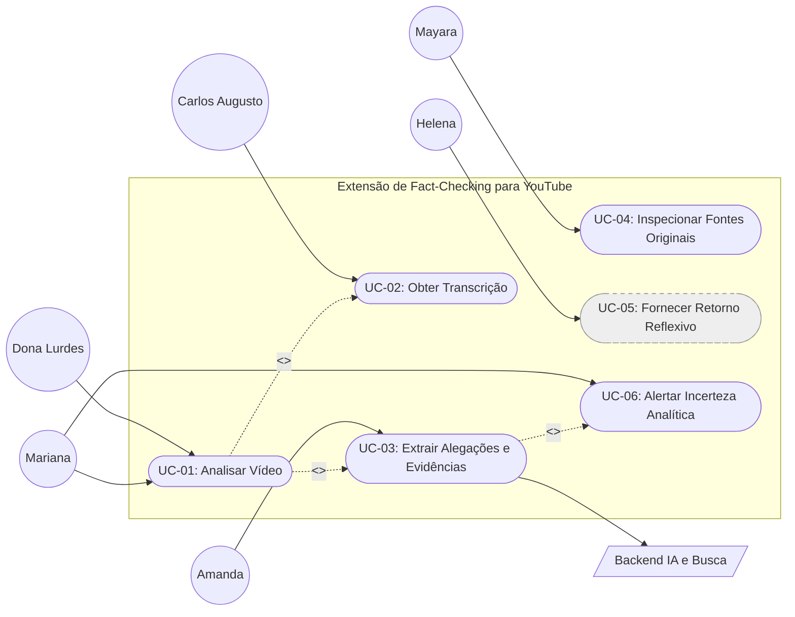

# Casos de Uso

## Nesta página

- [Diagrama de Casos de Uso](#diagrama-de-casos-de-uso)
- [UC-01 — Analisar Vídeo](#uc-01)
- [UC-02 — Obter Transcrição](#uc-02)
- [UC-03 — Extrair Alegações e Evidências](#uc-03)
- [UC-04 — Inspecionar Fontes Originais](#uc-04)
- [UC-05 — Fornecer Retorno Reflexivo *(Fora do MVP)*](#uc-05)
- [UC-06 — Alertar Incerteza Analítica](#uc-06)

---

## Diagrama de Casos de Uso

*Figura: Diagrama UML formal de Casos de Uso da extensão, detalhando os atores, limites do sistema e integrações com o Player do YouTube e o Backend de IA.*

### Mapeamento Estrutural e Atores

> O nó `UC-05` aparece tracejado por estar classificado como **Fora do MVP** (RF-05 | Could Have | OUT), mantido no diagrama apenas para rastreabilidade completa do escopo original.

---

## Especificação dos Casos de Uso Críticos

### UC-01 — Analisar Vídeo {: #uc-01 }

| Campo | Descrição |
|:---|:---|
| **Ator principal** | Dona Lurdes (representativa dos usuários leigos) |
| **Atores secundários** | — |
| **Pré-condição** | Página de reprodução ativa no YouTube (`/watch`) e conexão à internet estabelecida |
| **Pós-condição** | Síntese de alegações, evidências e fontes exibida na interface da extensão |
| **Rastreabilidade** | [Cenário 01](cenarios.md#cenario-01), [Cenário 07](cenarios.md#cenario-07), [Cenário 10](cenarios.md#cenario-10) · [RF-01](catalogo-requisitos.md#rf-01), [RNF-01, RNF-07](catalogo-requisitos.md#rnf-01) · [HU01, HU03, HU06](backlog-e-historias.md#hu01) |

**Fluxo Principal**

1. A usuária aciona o botão da extensão para iniciar a checagem do vídeo.
2. O sistema verifica a existência de dados prévios em cache local para o identificador do vídeo.
3. O sistema obtém a transcrição do vídeo via YouTube (`<<include>>` UC-02).
4. O sistema processa o texto e sintetiza as alegações via IA (`<<include>>` UC-03).
5. O sistema renderiza o painel lateral com o resumo das evidências e fontes em linguagem clara.

**Fluxos Alternativos / de Exceção**

- **Cache Válido (Alternativo):** se o vídeo foi analisado recentemente, exibe o resultado local imediatamente, sem novas requisições. → [HU06](backlog-e-historias.md#hu06)
- **Sem Transcrição (Exceção):** se o vídeo não possuir legendas/transcrição disponíveis, apresenta aviso orientador e encerra o fluxo. → [HU10](backlog-e-historias.md#hu10)
- **Incerteza Analítica (Exceção):** se houver evidências insuficientes ou fontes conflitantes, sinaliza a inconclusão analítica (`<<extend>>` UC-06).

---

### UC-02 — Obter Transcrição {: #uc-02 }

| Campo | Descrição |
|:---|:---|
| **Ator principal** | Carlos Augusto |
| **Atores secundários** | Player do YouTube |
| **Pré-condição** | Página de vídeo ativa do YouTube (`/watch`) |
| **Pós-condição** | Texto da transcrição formatado e disponível para o pipeline de análise |
| **Rastreabilidade** | [Cenário 02](cenarios.md#cenario-02), [Cenário 08](cenarios.md#cenario-08) · [RF-02, RF-08](catalogo-requisitos.md#rf-02), [RNF-06](catalogo-requisitos.md#rnf-06) · [HU05, HU10](backlog-e-historias.md#hu05) |

**Fluxo Principal**

1. O sistema intercepta o identificador do vídeo ativo e requisita as legendas/transcrição ao player.
2. O YouTube retorna as faixas de texto sincronizadas.
3. O sistema higieniza, decodifica e estrutura a transcrição com marcações temporais para processamento.

**Fluxos Alternativos / de Exceção**

- **Transcrição Indisponível (Exceção):** se o vídeo não contiver faixas de legenda nativas ou automáticas, o sistema emite alerta informativo e encerra a checagem.
- **Falha de Extração (Exceção):** se ocorrer instabilidade de comunicação com o player do YouTube, o sistema sinaliza indisponibilidade temporária.

---

### UC-03 — Extrair Alegações e Evidências {: #uc-03 }

| Campo | Descrição |
|:---|:---|
| **Ator principal** | Amanda |
| **Atores secundários** | Backend / IA & Busca |
| **Pré-condição** | Transcrição do vídeo obtida com sucesso (UC-02) |
| **Pós-condição** | Alegações factuais e evidências mapeadas disponíveis para exibição no painel |
| **Rastreabilidade** | [Cenário 03](cenarios.md#cenario-03), [Cenário 09](cenarios.md#cenario-09), [Cenário 10](cenarios.md#cenario-10) · [RF-03, RF-06](catalogo-requisitos.md#rf-03), [RNF-01, RNF-02, RNF-06](catalogo-requisitos.md#rnf-01) · [HU02, HU04](backlog-e-historias.md#hu02) |

**Fluxo Principal**

1. O sistema envia a transcrição ao backend intermediário autenticado.
2. O modelo de IA segmenta o texto e isola as principais alegações factuais.
3. O backend consulta motores de busca e bases de referência para contrapor cada alegação.
4. O sistema gera uma síntese estruturada classificando as evidências que sustentam ou contradizem as alegações.

**Fluxos Alternativos / de Exceção**

- **Tempo Limite Excedido (Exceção):** se a inferência ou a busca externa ultrapassar 10 segundos, o sistema interrompe a requisição e alerta sobre instabilidade temporária.
- **Falha no Backend (Exceção):** se a API externa estiver fora do ar, o sistema degrada graciosamente e notifica o erro sem travar o navegador.

---

### UC-04 — Inspecionar Fontes Originais {: #uc-04 }

| Campo | Descrição |
|:---|:---|
| **Ator principal** | Mayara |
| **Atores secundários** | — |
| **Pré-condição** | Síntese da análise gerada e cards de evidência visíveis no painel lateral |
| **Pós-condição** | Página externa aberta em guia separada, mantendo player e painel intactos |
| **Rastreabilidade** | [Cenário 04](cenarios.md#cenario-04) · [RF-04](catalogo-requisitos.md#rf-04), [RNF-05, RNF-07](catalogo-requisitos.md#rnf-05) · [HU07](backlog-e-historias.md#hu07) |

**Fluxo Principal**

1. A usuária clica na hiperligação ou cartão de uma fonte de referência listada.
2. O sistema direciona o endereço e abre a página original em uma nova aba do navegador.
3. A usuária consulta o conteúdo original para validação autônoma dos dados.

**Fluxos Alternativos / de Exceção**

- **Link Quebrado / Inacessível (Exceção):** caso a página de destino retorne erro HTTP (ex.: 404), o navegador trata a falha na nova aba sem interferir na extensão.

---

### UC-05 — Fornecer Retorno Reflexivo *(Fora do MVP)* {: #uc-05 }

| Campo | Descrição |
|:---|:---|
| **Ator principal** | Helena |
| **Atores secundários** | — |
| **Pré-condição** | Análise de alegações concluída ou em andamento no painel lateral |
| **Pós-condição** | Estímulo ao pensamento crítico entregue sem constrangimento à autonomia decisória da usuária |
| **Rastreabilidade** | [Cenário 05](cenarios.md#cenario-05), [Cenário 11](cenarios.md#cenario-11) · [RF-05, RF-10](catalogo-requisitos.md#rf-05) *(OUT no MVP)* · [HU11, HU12](backlog-e-historias.md#hu11) |

**Fluxo Principal**

1. A usuária visualiza a análise no painel lateral.
2. O sistema formula perguntas reflexivas para orientar o julgamento crítico da usuária.
3. A usuária lê as orientações sem ter uma conclusão imposta pela IA.

**Fluxos Alternativos / de Exceção**

- **Ignorar Interação (Alternativo):** se a usuária optar por não ler as orientações reflexivas, a navegação segue normalmente.

---

### UC-06 — Alertar Incerteza Analítica {: #uc-06 }

| Campo | Descrição |
|:---|:---|
| **Ator principal** | Mariana |
| **Atores secundários** | Backend de IA |
| **Pré-condição** | Processamento de alegações ativo (UC-03) com detecção de carência de dados ou fontes conflitantes |
| **Pós-condição** | Indicador de incerteza exibido no painel lateral, contendo o impulso de compartilhamento de afirmações não confirmadas |
| **Rastreabilidade** | [Cenário 06](cenarios.md#cenario-06) · [RF-07](catalogo-requisitos.md#rf-07), [RNF-06, RNF-07](catalogo-requisitos.md#rnf-06) · [HU09](backlog-e-historias.md#hu09) |

**Fluxo Principal**

1. O backend analisa as fontes consultadas e identifica ausência de evidências conclusivas ou divergência factual aberta.
2. O sistema classifica o resultado com status de inconclusão analítica.
3. O sistema renderiza um badge visual de alerta e uma nota explicativa indicando que a alegação não possui consenso ou validação comprovada.

**Fluxos Alternativos / de Exceção**

- **Controvérsia Aberta (Alternativo):** havendo referências legítimas com conclusões opostas, o sistema expõe ambos os lados sem arbitrar um vencedor absoluto.

---

**Próximo:** [Priorização e MVP](../planejamento/priorizacao-e-mvp.md) — sequência de entrega e estratégias técnicas por feature.  
**Ver também:** [Backlog e Histórias](backlog-e-historias.md) — critérios de aceitação detalhados em Gherkin.
