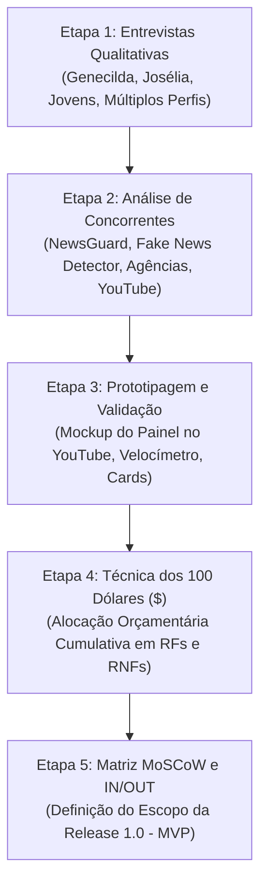
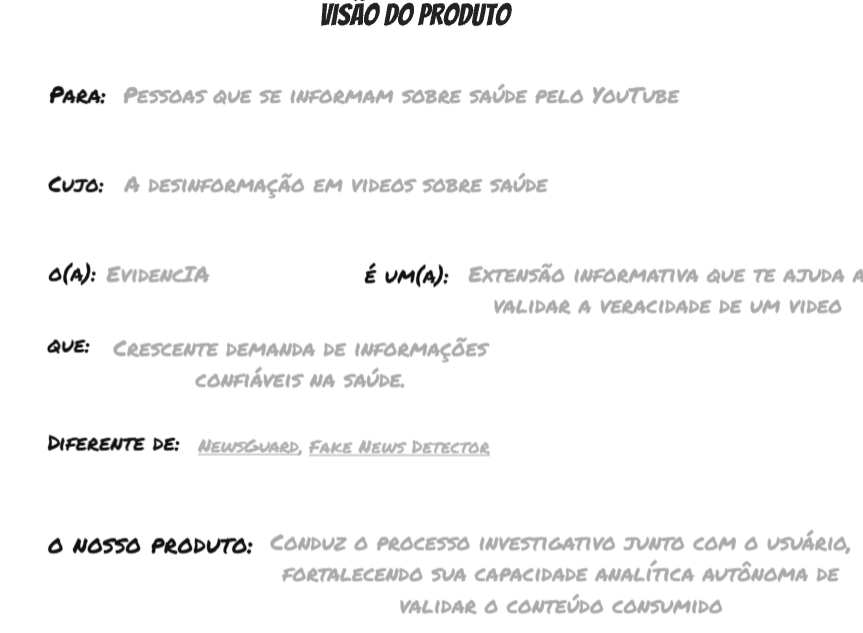
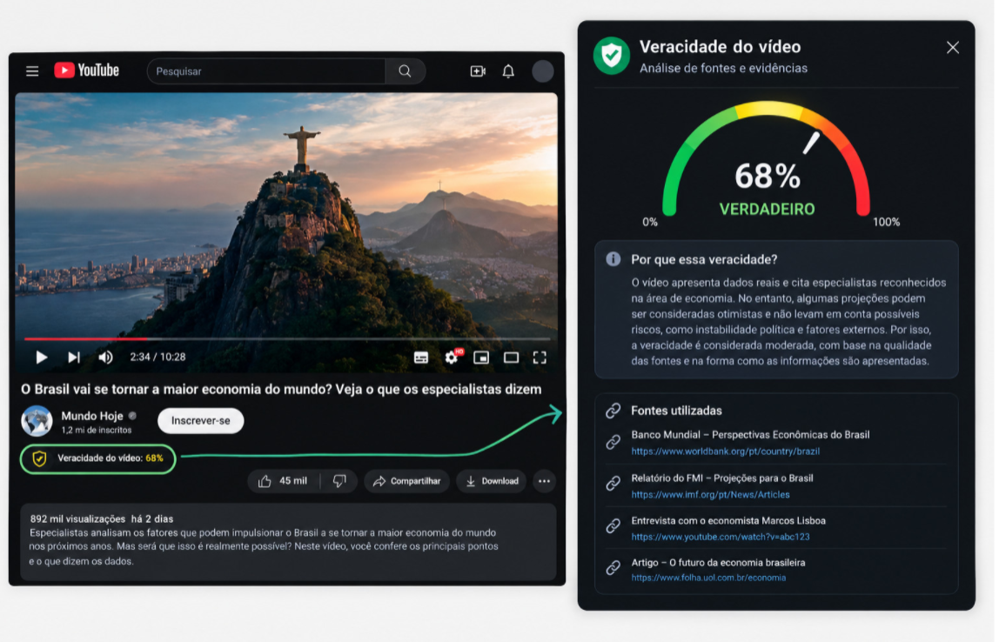
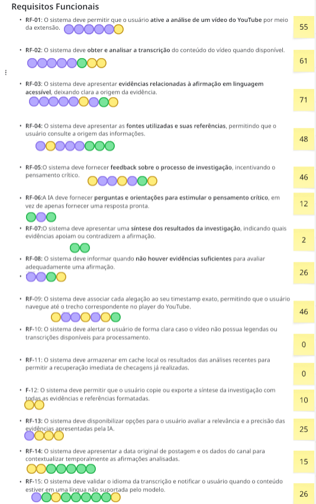
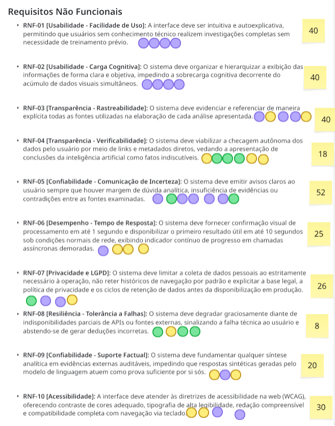
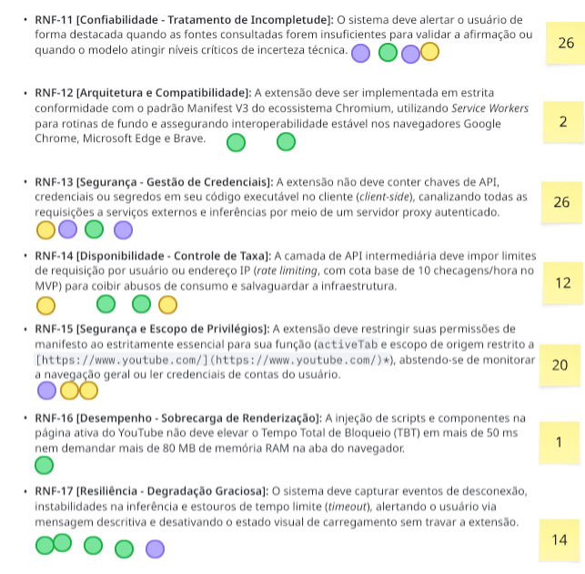
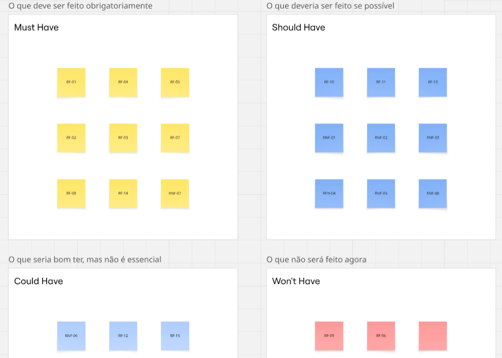
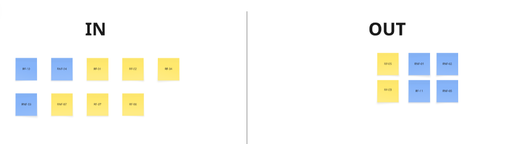

# Processo e Técnicas de Elicitação de Requisitos

## Nesta página

- [Visão Geral e Linha do Tempo da Descoberta](#visao-geral-e-linha-do-tempo)
- [Etapa 1: Entrevistas Qualitativas com Usuários](#etapa-1-entrevistas)
  - [Entrevista 1: Perfil Educação e Fatos Concretos (Professora Genecilda)](#entrevista-genecilda)
  - [Entrevista 2: Perfil Terceira Idade e Acessibilidade Visual (Dona Josélia)](#entrevista-joselia)
  - [Entrevista 3: Perfil Consumo Rápido e Não Interrupção (Jovem)](#entrevista-jovem)
  - [Entrevista 4: Pesquisa Multissetorial Estruturada](#entrevista-multissetorial)
- [Etapa 2: Análise de Concorrentes (Benchmarking Competitivo)](#etapa-2-concorrentes)
- [Etapa 3: Prototipagem e Validação Ergonômica](#etapa-3-prototipagem)
- [Etapa 4: Dinâmica de Priorização dos 100 Dólares ($100 Test)](#etapa-4-100-dolares)
  - [Alocação Orçamentária em Requisitos Funcionais ($)](#alocacao-rf)
  - [Alocação Orçamentária em Requisitos Não Funcionais ($)](#alocacao-rnf)
- [Etapa 5: Matriz MoSCoW e Classificação IN/OUT do MVP](#etapa-5-moscow-in-out)
- [Mapeamento: Dores e Descobertas vs. Requisitos Técnicos Gerados](#mapeamento-dores-requisitos)

---

## Visão Geral e Linha do Tempo da Descoberta {: #visao-geral-e-linha-do-tempo }

O processo de engenharia de requisitos da **Extensão de Fact-Checking para YouTube** seguiu uma abordagem empírica e centrada no usuário, dividida em cinco etapas sequenciais para eliminar hipóteses abstratas e ancorar as decisões técnicas em evidências verificáveis.

A priorização dos requisitos não foi conduzida de forma isolada: a dinâmica quantitativa de alocação de orçamento (**Técnica dos 100 Dólares**) ocorreu **após** a realização das entrevistas em profundidade com usuários reais, a análise comparativa de concorrentes de mercado e a prototipagem interativa das telas da extensão.

---

## Etapa 1: Entrevistas Qualitativas com Usuários {: #etapa-1-entrevistas }

Foram conduzidas entrevistas semiestruturadas com perfis representativos do público-alvo, visando identificar hábitos de navegação, modelos mentais, limitações perceptivas e critérios de confiança.

### Entrevista 1: Perfil Educação e Fatos Concretos (Professora Genecilda, 40 a 60 anos) {: #entrevista-genecilda }

- **Dispositivos e Hábitos:** Utiliza o celular para pesquisas rápidas e o notebook com teclado físico para digitação e estudos, buscando maior segurança mecânica. Opera o navegador na configuração padrão e nunca utilizou extensões de navegador por falta de familiaridade.
- **Percepção sobre Fake News e IA:** Declara postura de desconfiança inicial generalizada (*"Hoje tudo que eu vejo, a minha primeira fala é: é mentira"*). Reconhece que a inteligência artificial pode auxiliar na checagem, mas teme o uso indevido da tecnologia para amplificar desinformação.
- **Expectativa do Produto:** Deseja uma ferramenta fidedigna, objetiva e que apresente fatos concretos e comprováveis, reduzindo a sobrecarga de pesquisa manual após assistir a um vídeo.
- **Impacto nos Requisitos:** Fundamentou a criação do **RF-03** (linguagem clara), **RF-04** (fontes auditáveis) e **RNF-04** (suporte factual sem alucinações da IA).

### Entrevista 2: Perfil Terceira Idade e Acessibilidade Visual (Dona Josélia) {: #entrevista-joselia }

- **Desconhecimento de Jargões da Web:** Quando questionada sobre extensões de navegador, declarou: *"Extensão para mim é fio de tomada ou cabo de extensão para ligar o abajur"*. Não utiliza termos técnicos como "aba", "extensão" ou "browser"; opera interfaces com base estrita no reconhecimento de **cores e formas visuais** (*"retângulo vermelho com triângulo dentro"*, *"bolinha colorida"*).
- **Limitações Sensoriais e Ergonomia:** Relata visão reduzida e rejeita letras miúdas ou termos em língua estrangeira: *"Tem que ser um negócio bem escandaloso... com letras grandes e vermelhas, tipo sinal de trânsito perigoso. Se colocarem letrinha miúda lá no rodapé ou nomes em inglês, eu nem vou enxergar"*.
- **Postura perante Interrupções:** Rejeita veementemente que a extensão pause ou interrompa o vídeo no meio: prefere assistir à transmissão e conferir o aviso de veracidade ao lado sem corte de fluxo.
- **Confiança e Simplicidade:** Não deseja ler relatórios acadêmicos longos; confia em avisos diretos de verdadeiro/falso baseados em símbolos claros (como indicador visual de aprovação ou desaprovação).
- **Impacto nos Requisitos:** Base empírica direta da persona **Dona Lurdes**, do **RF-01** (acionamento em um clique), do **RF-06** (velocímetro visual com divisões cromáticas de alto contraste) e do **RNF-07** (acessibilidade estrita WCAG AA).

### Entrevista 3: Perfil Consumo Rápido e Não Interrupção (Jovem) {: #entrevista-jovem }

- **Dispositivo Predominante:** Consumo em dispositivos móveis e vídeos curtos (Shorts); desconhece rotinas tradicionais de extensões.
- **Rejeição a Interrupções Forçadas:** Declarou que pausar o vídeo automaticamente no meio geraria irritação imediata (*"Daria raiva ser interrompido na hora em que estou aproveitando"*).
- **Visualização Esperada:** Espera que avisos de checagem apareçam de forma contextualizada na descrição ou ao lado do conteúdo, de forma concisa.
- **Impacto nos Requisitos:** Ratificou a decisão de arquitetura de **não travar ou pausar o player do YouTube compulsoriamente**, mantendo o painel lateral em execução assíncrona desacoplada da reprodução do vídeo.

### Entrevista 4: Pesquisa Multissetorial Estruturada {: #entrevista-multissetorial }

Uma bateria com profissionais, estudantes e servidores públicos (Entrevistados 1, 2 e 3) aprofundou dimensões comportamentais e operacionais:

1. **Perfil e Dispositivos:**
   - O consumo informativo divide-se entre celular (manhã e noite) e computador no trabalho/estudo (tarde).
   - Uso de extensões é comum em ambiente profissional para produtividade (ex.: SEI PRO, What Web Plus, bloqueadores de anúncio); quem não usa cita receio de distrações.
2. **Design de Interação e Alertas:**
   - Preferência majoritária por receber o aviso logo no início do vídeo, em mensagem curta, objetiva e visualmente clara que apareça uma única vez e possa ser facilmente fechada.
   - Pausas automáticas de vídeo só foram aceitas em situações extremas de perigo imediato à integridade física (ex.: receitas caseiras venenosas, acidentes); para divergências informativas comuns, pausas forçadas foram rejeitadas.
3. **Transparência, Explicabilidade e Confiança:**
   - Primeiro elemento visual desejado: uma explicação em uma única frase sobre qual afirmação foi contestada e o porquê.
   - Detalhamento sob demanda: desejo de clicar na síntese para acessar as fontes oficiais e referências completas.
   - Indicador de confiança: forte preferência pela exibição de uma porcentagem ou índice de certeza claro.
   - **Gatilhos de Desconfiança Imediata:** Ferramentas com vieses ideológicos declarados, ausência de fontes e, de forma categórica, **qualquer solicitação de senhas, cartões de crédito ou dados pessoais não estritamente essenciais**.
4. **Compartilhamento Responsável no WhatsApp:**
   - Os entrevistados relatam verificar a procedência antes de alertar familiares em grupos de mensagens.
   - Desejam que a ferramenta disponibilize um formato de correção pronto para compartilhamento.
   - **Tom de Linguagem Exigido:** Linguagem formal, educada, neutra e sem deboche (*"Linguagem igual à da Defesa Civil"*, *"Sem acusar a pessoa de ignorante"*). Linguagens agressivas ou alarmistas fazem o usuário desistir do compartilhamento.
5. **Critérios de Desinstalação:**
   - O principal motivo apontado para abandono da ferramenta no terceiro dia de uso foi: *"Ficou apitando toda hora e me distraindo, além de eu considerar inútil"*.

---

## Etapa 2: Análise de Concorrentes (Benchmarking Competitivo) {: #etapa-2-concorrentes }

Com as necessidades e rejeições dos usuários mapeadas, a equipe conduziu um benchmarking competitivo formal das alternativas existentes no mercado, contrastando seus modelos com a visão do produto.

| Solução Analisada | Categoria | Pontos Fortes | Limitações e Lacunas Identificadas | Diferencial da Extensão |
|:---|:---|:---|:---|:---|
| **NewsGuard** | Extensão de Navegador | Avaliação criteriosa de credibilidade editorial e histórico jornalístico do domínio | Avalia apenas o domínio geral (ex.: `globo.com` vs. blog não confiável). Não analisa vídeos específicos do YouTube e não inspeciona o áudio falado. Modelo pago por assinatura. | Análise contextual do áudio e transcrição de cada vídeo específico, sem cobrança e operando sob demanda. |
| **Fake News Detector** | Extensão de Navegador | Detecção automatizada de texto em páginas web | Baseada em heurísticas e palavras-chave genéricas; gera alta incidência de falsos positivos; não analisa mídia em vídeo nem contextualiza afirmações temporais. | Segmentação precisa de alegações via LLM a partir da transcrição oficial do vídeo, com separação de fatos e opiniões. |
| **Agências Tradicionais** (Lupa, Aos Fatos, Comprova) | Portais de Fact-Checking | Rigor jornalístico internacional (IFCN), equipes especializadas e alta credibilidade | Processo manual, estático e demorado. O usuário precisa pausar o vídeo, abrir uma nova aba, pesquisar no Google e torcer para a agência já ter checado aquele conteúdo exato. | Checagem integrada diretamente na interface do YouTube, com entrega da síntese em até 10 segundos no fluxo do vídeo. |
| **Painéis Nativos do YouTube** (Wikipedia / OMS / TSE) | Recurso da Plataforma | Presentes nativamente na tela sem necessidade de instalar extensões | Alertas genéricos ativados por tags amplas (ex.: aviso da OMS em qualquer vídeo que mencione "vacina"). Não informam se o que o locutor disse é verídico ou falso. | Verificação individualizada do roteiro do vídeo, apontando exatamente quais declarações possuem respaldo científico ou são falsas. |

**Conclusão do Benchmarking:** Nenhuma solução de mercado combinava a ingestão do áudio do YouTube com checagem assíncrona rápida (< 10s), exibição lateral sem travamento do player e linguagem acessível para o usuário comum.

---

## Etapa 3: Prototipagem e Validação Ergonômica {: #etapa-3-prototipagem }

A partir das dores dos usuários e das lacunas dos concorrentes, a equipe desenvolveu wireframes e protótipos navegáveis, culminando no mockup de alta fidelidade integrado à interface do YouTube:

### Decisões de Design Validadas no Protótipo:

1. **Painel Lateral Desacoplado (Side Panel):** Injetado à direita do player de reprodução (`/watch`), garantindo que o vídeo continue rodando enquanto a checagem é consultada (resposta direta à exigência de Dona Josélia e do público jovem contra pausas forçadas).
2. **Velocímetro Cromático de Veracidade (Gauge):** Indicador visual semafórico (verde, amarelo e vermelho) com score percentual de 0 a 100%, permitindo leitura imediata da confiabilidade global da mídia em menos de 2 segundos.
3. **Cartões Estruturados de Evidência:** Divisão em três blocos bem definidos:
   - *Fatos Apoiados por Evidências:* Destaque positivo com síntese clara.
   - *Fatos Contraditados por Evidências:* Alerta visual com contra-argumentação objetiva.
   - *Contexto Adicional e Incertezas:* Esclarecimento de meias-verdades ou temas sem consenso.
4. **Hiperligações Diretas para Fontes:** Cada cartão expõe a instituição de referência (ex.: Ministério da Saúde, Fiocruz, OMS) com link direto abrindo em nova aba, permitindo a auditoria autônoma do usuário.

---

## Etapa 4: Dinâmica de Priorização dos 100 Dólares ($100 Test) {: #etapa-4-100-dolares }

Após consolidar as entrevistas, o benchmarking e o protótipo funcional, a equipe multidisciplinar e stakeholders submeteram os requisitos brutos à **Técnica dos 100 Dólares** (*Cumulative Voting* / *Hundred Dollar Test*).

Cada participante recebeu um orçamento virtual fixo de **$100 (cem dólares)** para alocar livremente entre os requisitos funcionais e não funcionais candidatos, ponderando retorno de valor, custo de implementação e mitigação de riscos.

### Alocação Orçamentária em Requisitos Funcionais ($) {: #alocacao-rf }

*Quadro de Investimento Acumulado nos Requisitos Funcionais:*

| Requisito Candidato | Investimento Acumulado ($) | Análise de Prioridade Técnica | Decisão de Escopo |
|:---|:---|:---|:---|
| **RF-03** (Evidências em linguagem acessível e clara) | **$71** | Requisito com maior alocação orçamentária do projeto. Reflete a dor central expressa nas entrevistas e protótipos de que resumos herméticos afastam o usuário leigo. | **Must Have \| IN** |
| **RF-02** (Obtenção e análise da transcrição do vídeo) | **$61** | Insumo tecnológico essencial. Sem extração da transcrição do áudio, o pipeline analítico de IA não opera. | **Must Have \| IN** |
| **RF-01** (Acionamento da análise na página de vídeo) | **$55** | Ponto de contato de entrada da extensão. Necessidade de ativação simples em 1 clique no player. | **Must Have \| IN** |
| **RF-04** (Fontes e referências com links diretos) | **$48** | Pilar de autoridade e credibilidade. Permite ao usuário auditar os dados primários de forma independente. | **Must Have \| IN** |
| **RF-05** (Retorno reflexivo sobre a investigação) | **$46** | Importante para estimular pensamento crítico, mas demanda engenharia avançada de prompts. | **Could Have \| OUT** |
| **RF-09** (Cache local de análises recentes) | **$46** | Otimização vital de custo de tokens e resposta rápida para vídeos virais repetidos. | **Should Have \| IN** |
| **RF-07** (Alerta de incerteza e controvérsia) | **$44** | Evita decisões dogmáticas em temas em aberto na ciência; badge visual de cautela. | **Must Have \| IN** |
| **RF-06** (Síntese estruturada de resultados) | **$42** | Componente visual do painel (velocímetro + cartões divididos em apoiada/contraditada). | **Must Have \| IN** |
| **RF-08** (Notificação de ausência de legendas) | **$38** | Tratamento gracioso de exceção para vídeos sem transcrição disponível no YouTube. | **Must Have \| IN** |
| **RF-11** (Contextualização temporal e canal) | **$34** | Evita falsas contradições em vídeos antigos que representavam o consenso da época. | **Should Have \| IN** |
| **RF-10** (Feedback de utilidade da IA pelo usuário) | **$28** | Mecanismo comunitário de avaliação; não bloqueia a entrega da análise inicial. | **Could Have \| OUT** |

---

### Alocação Orçamentária em Requisitos Não Funcionais ($) {: #alocacao-rnf }

*Quadro de Investimento Acumulado nos Requisitos Não Funcionais:*

| Requisito Não Funcional | Investimento Acumulado ($) | Meta Técnica Associada | Requisito Formal |
|:---|:---|:---|:---|
| **Comunicação de Incerteza Analítica** | **$52** | Transparência obrigatória sobre divergências e insuficiência de dados | **RNF-05** (incorporado em RF-07 / RNF-06) |
| **Baixa Carga Cognitiva e Usabilidade** | **$40** | Hierarquia limpa, linguagem acessível e foco visual | **RNF-07** (WCAG 2.1 AA) |
| **SLA de Latência e Resposta Rápida** | **$40** | Feedback em <= 1s e resultado útil em <= 10s (P90) | **RNF-01** (Desempenho) |
| **Rastreabilidade e Fontes Auditáveis** | **$40** | Metadados e links diretos para veículos oficiais | **RNF-04 / RF-04** |
| **Acessibilidade Digital e Alto Contraste** | **$30** | Contraste de cores >= 4,5:1 e suporte integral a teclado | **RNF-07** (Acessibilidade) |
| **Privacidade e LGPD por Padrão** | **$26** | Permissão restrita `activeTab`, sem login e sem rastreamento | **RNF-05** (Privacidade) |
| **Segurança e Gestão de Segredos** | **$26** | Zero chaves de API no cliente; tráfego via Backend Proxy | **RNF-04** (Segurança) |
| **Leveza e Sobrecarga de Renderização** | **$24** | TBT <= 50 ms e memória adicional <= 80 MB na aba ativa | **RNF-02** (Performance) |
| **Tolerância a Falhas e Resiliência** | **$22** | Degradação segura sem travamentos da extensão ou do navegador | **RNF-06** (Resiliência) |

---

## Etapa 5: Matriz MoSCoW e Classificação IN/OUT do MVP {: #etapa-5-moscow-in-out }

O resultado quantitativo do investimento na dinâmica dos 100 Dólares foi consolidado na **Matriz MoSCoW** e na **Matriz IN/OUT** de produto, segregando o que compõe o núcleo da primeira versão em produção (MVP) do que fica programado para evoluções:

- **Must Have (MVP Onda 1 - IN):** RF-01, RF-02, RF-03, RF-04, RF-06, RF-07, RF-08 e a totalidade dos requisitos não funcionais (RNF-01 a RNF-07).
- **Should Have (Onda 2 - IN):** RF-09 (cache local persistente) e RF-11 (contextualização temporal por data de upload e canal).
- **Could Have (Onda 3 - OUT):** RF-05 (estímulo ao pensamento crítico socrático) e RF-10 (módulo de feedback e telemetria anônima).
- **Won't Have (Fora de Escopo):** Pausas forçadas de vídeo, cadastro/login compulsório, transcrição por reconhecimento de voz no navegador do usuário e moderação com poder de censura.

---

## Mapeamento: Dores e Descobertas vs. Requisitos Técnicos Gerados {: #mapeamento-dores-requisitos }

A tabela a seguir estabelece a rastreabilidade bidirecional entre as evidências empíricas coletadas nas etapas de descoberta e as soluções de engenharia adotadas:

| Descoberta / Evidência Elicitada | Fonte / Origem | Requisito Gerado | Solução de Engenharia Implementada |
|:---|:---|:---|:---|
| *"Extensão para mim é fio de tomada... decorei a cor e o desenho"* | Dona Josélia (Entrevistas) | **RF-01, RF-06, RNF-07** | Botão contextual destacado no player, velocímetro gráfico tricolor e ausência total de configurações manuais. |
| *"Tem que ter letra grande, tipo sinal de trânsito perigoso"* | Dona Josélia (Entrevistas) | **RNF-07** | Tipografia ampla, cores de alto contraste conformes com as normas WCAG 2.1 AA (relação superior a 4,5:1). |
| *"Daria raiva ser interrompido na hora em que estou aproveitando o vídeo"* | Jovem / Criança (Entrevistas) | **RNF-02, RNF-06** | A extensão não pausa nem desestrutura o player do YouTube; opera em painel lateral assíncrono desacoplado. |
| *"Concorrentes como Lupa e Aos Fatos exigem pesquisa manual lenta fora do vídeo"* | Benchmarking Competitivo | **RF-01, RF-02, RNF-01** | Extração automática da transcrição na página ativa e entrega da síntese factual em menos de 10 segundos. |
| *"NewsGuard só avalia o site geral, não avalia o conteúdo falado do vídeo"* | Benchmarking Competitivo | **RF-02, RF-03, RF-06** | Processamento textual estruturado do áudio falado no YouTube via pipeline de inteligência artificial. |
| *"Desconfiaria se pedisse senhas, número de cartão ou dados pessoais"* | Entrevistado 2 (Entrevistas) | **RNF-05** | Privacidade estrita (LGPD): permissão limitada a `activeTab`, sem telas de login, sem cartões e sem rastreamento. |
| *"Gostaria de ver uma porcentagem de certeza"* | Entrevistado 2 (Entrevistas) | **RF-06** | Componente de velocímetro analítico apresentando índice quantitativo de 0 a 100% de veracidade. |
| *"Uma frase seria suficiente, desde que eu possa clicar para ver as fontes"* | Entrevistado 1 (Entrevistas) | **RF-03, RF-04** | Arquitetura em camadas: síntese objetiva no topo do painel e cartões expansíveis de fontes com links diretos embaixo. |
| *"Precisa ser neutra e formal para eu mandar no WhatsApp da família"* | Entrevistado 1 (Entrevistas) | **RF-03, RF-07** | Síntese redigida em português polido e neutro, sem juízos ideológicos ou expressões agressivas. |
| *"Requisito de linguagem acessível recebeu o maior investimento financeiro ($71)"* | Técnica dos 100 Dólares | **RF-03** | Priorização máxima de engenharia de prompt para traduzir laudos médicos e científicos em linguagem simples. |
| *"Se ficar apitando toda hora e me distraindo, eu desinstalo no terceiro dia"* | Questionário Estruturado | **RF-01, RNF-02** | Modelo de ativação sob demanda do usuário: a checagem só é executada quando o usuário aciona o botão da extensão. |

---

**Próximo:** [Catálogo Consolidado de Requisitos](catalogo-requisitos.md) — detalhamento formal de RF-01 a RF-11 e RNF-01 a RNF-07.  
**Ver também:** [Cenários de Uso e Operação](cenarios.md) — desdobramento dos requisitos em cenários concretos.
