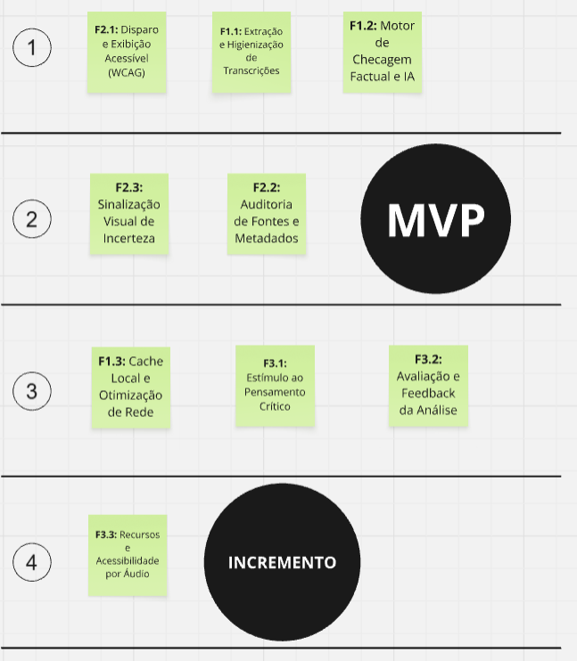

# Priorização e MVP

## Nesta página

- [Matriz MoSCoW](#matriz-moscow)
- [Sequenciador de Features (Lean Inception)](#sequenciador-de-features-lean-inception)
- [Funil de Priorização do Backlog](#funil-de-priorizacao-do-backlog)
- [Critérios de Exclusão e Limites de Escopo](#criterios-de-exclusao-e-limites-de-escopo)
- [Matriz de Revisão Técnica](#matriz-de-revisao-tecnica-o-que-como-fazer)
- [Planejamento de Sprints e Cadência (Fast-Track 2 Semanas)](#planejamento-sprints)
- [Alocação de Responsabilidades da Equipe (5 Integrantes)](#alocacao-equipe)
- [Resumo Executivo](#resumo-executivo)

---

## Matriz MoSCoW {: #matriz-moscow }

A classificação MoSCoW foi consolidada a partir da alocação de recursos da [Técnica dos 100 Dólares](elicitacao.md#etapa-4-100-dolares), estabelecendo os limites estritos do produto mínimo viável:


*Figura: Matriz MoSCoW validada após a dinâmica da Técnica dos 100 Dólares com os participantes.*

!!! note "Revisão Evidence-First (2026-10-02 — ADR-006):"
    O requisito **RF-05 (Retorno Reflexivo / HU11)** foi promovido para **Must Have (MVP)** para cumprir a Essential Question ("estimular pensamento crítico sem substituí-lo"). Foram incorporados ao MVP os requisitos **RF-12 a RF-15** (estado `insufficient_evidence`, provenance, desacoplamento de provider e bloqueio de mock em produção).

| Prioridade | Item | Justificativa |
|:---|:---|:---|
| **Must Have** | RF-01 a RF-04, RF-05 (promovido), RF-06 a RF-08, RF-12 a RF-15, RNF-01 a RNF-07 | Núcleo do produto: investigação assistida orientada a alegações, recuperação factual de evidências com provenance, reflexão crítica ativa e segurança de infraestrutura ([ADR-006](../arquitetura/decisoes/ADR-006-evidence-first-architecture.md)) |
| **Should Have** | RF-09 (cache local com TTL), RF-11 (metadados temporais do vídeo) | Otimizam a experiência de uso repetido e evitam falsas contradições em conteúdos antigos |
| **Could Have** | RF-10 (avaliação de relevância / HU12) | Feedback anônimo de utilidade pelos usuários para ciclos posteriores |
| **Won't Have (agora)** | Vereditos algorítmicos automatizados, scores numéricos de veracidade (0–100%), gauge, suporte multi-idioma, login social obrigatório | Proibidos por desenho (ADR-006) ou fora de escopo para manter foco na investigação assistida |


---

## Sequenciador de Features (Lean Inception) {: #sequenciador-de-features-lean-inception }

A estruturação das ondas de entrega e a priorização executiva foram definidas diretamente no Sequenciador Lean Inception, demarcando as fronteiras entre a linha de corte do MVP e os incrementos seguintes:


*Figura: Sequenciador de Features estruturado em ondas contínuas de entrega (Lean Inception), com a demarcação explícita da linha de corte do MVP.*

| Onda | Features Contempladas | Esforço Técnico | Valor de Negócio |
|:---|:---|:---|:---|
| **Onda 1 — MVP** | F2.1 (Disparo e Exibição Acessível WCAG), F1.1 (Extração e Higienização de Transcrições), F1.2 (Motor de Checagem Factual e IA), F2.3 (Sinalização Visual de Incerteza), F2.2 (Auditoria de Fontes e Metadados) | **Alto** (pipeline IA + integração com player do YouTube + backend proxy + Shadow DOM) | **Alto** — valida a hipótese central de confiança do usuário na checagem factual |
| **Onda 2 — Incremento 1** | F1.3 (Cache Local e Otimização de Rede), F3.1 (Estímulo ao Pensamento Crítico), F3.2 (Avaliação e Feedback da Análise) | **Médio** (requer estruturação de armazenamento local e componentes interativos) | **Médio-Alto** — reforça retenção, engajamento analítico e redução de latência de rede |
| **Onda 3 — Incremento 2** | F3.3 (Recursos e Acessibilidade por Áudio / Text-to-Speech) | **Alto** (síntese vocal acessível e possíveis modelos adicionais de processamento) | **Médio** — ampliação da inclusão para usuários com baixa literacia ou deficiência visual severa |

---

## Funil de Priorização do Backlog {: #funil-de-priorizacao-do-backlog }

A passagem do escopo conceitual para a cadência operacional de engenharia adota o modelo de funil progressivo (Now, Next, Soon, Later), assegurando foco absoluto no valor prioritário e mitigando o risco de sobrecarga:


*Figura: Funil estratégico de refinamento contínuo do Backlog — organizando a esteira de desenvolvimento de Now (MVP) até horizontes futuros (Later).*

- **Now (Linha do MVP):** Foco imediato na entrega dos Épicos E1, E2, E3 e E4 (disparo, transcrição, checagem e síntese categorizada).
- **Next (Incremento 1):** Introdução de cache local avançado com TTL ([ADR-003](../arquitetura/decisoes/ADR-003-estrategia-cache-local.md)) e refinamento de metadados temporais.
- **Soon (Incremento 2):** Incorporação de perguntas reflexivas para fomento do pensamento crítico e avaliação de precisão.
- **Later (Visão Futura):** Transcrição de áudio via Whisper como contingência e integração com plataformas adicionais de vídeo.

---

## Critérios de Exclusão e Limites de Escopo {: #criterios-de-exclusao-e-limites-de-escopo }

A eficácia do produto depende da delimitação do que deliberadamente **não** será implementado no estágio atual. Os critérios de exclusão atuam como salvaguardas contra desvios de esforço, sobrecarga de usuário e riscos de segurança:


*Figura: Mapeamento visual dos critérios de exclusão, diretrizes de antipersonas e salvaguardas de integridade do produto.*

| Categoria | Diretriz Aplicada | Justificativa Técnica e de Produto |
|:---|:---|:---|
| **Dispositivos Móveis** | Não criar suporte inicial ao aplicativo móvel do YouTube | Extensões de navegador enfrentam severas restrições técnicas no mobile; o foco prioritário é o ecossistema desktop Chromium (Chrome, Edge, Brave). |
| **Proteção contra Abusos** | Bloqueio de raspagem de dados e testes em lote automatizados | Aplicação de limites estritos de taxa (*rate limiting*) no Backend Proxy para blindar o serviço contra ataques de negação de serviço e custos de IA. |
| **Sem Feedback de Contorno** | Jamais indicar parâmetros que facilitem driblar a detecção | Evitar que agentes disseminadores de desinformação utilizem a extensão como ferramenta de engenharia reversa para aperfeiçoar conteúdos enganosos. |
| **Vedação Clínica** | Não fornecer diagnósticos médicos ou prescrições individuais | A extensão avalia a sustentação científica de alegações de saúde, sem jamais emitir aconselhamento médico personalizado. |
| **Ergonomia e Concisão** | Proibição de textos longos e jargões herméticos | Usuários leigos e ocupados não leem blocos densos; a interface deve priorizar síntese visual, velocímetro intuitivo e leitura rápida. |

---

## Matriz de Revisão Técnica (O quê / Como fazer) {: #matriz-de-revisao-tecnica-o-que-como-fazer }

| Feature de Negócio | O quê (valor entregue) | Como fazer (estratégia técnica) |
|:---|:---|:---|
| **RF-01 — Acionar análise** | Botão visível na página de reprodução | Content script (Manifest V3) injetado condicionalmente em URLs `/watch`; botão renderizado em Shadow DOM para isolar estilos do YouTube |
| **RF-02 / RF-08 — Obter transcrição** | Extração automática de legendas, com alerta se ausentes | Interceptação das faixas de legenda expostas pelo player do YouTube (nativas/automáticas); tratamento de exceção local sem chamar o backend quando ausentes |
| **RF-03 / RF-06 — Síntese categorizada** | Painel lateral com evidências apoiam/contradizem/contextualizam | Painel renderizado em iframe sandbox (isolamento de CSS/JS); dados consumidos via `fetch` ao backend proxy, componentes de UI leves (ex.: Preact) |
| **RF-07 / RF-06 (UC-06) — Alerta de incerteza** | Badge de inconclusão quando há divergência entre fontes | Campo `status: apoiada \| contraditada \| inconclusiva` retornado pela API do backend, mapeado diretamente para o componente de badge |
| **RF-04 — Fontes com link direto** *(Onda 2)* | Cartões de evidência com hiperligação e metadados | Estrutura de dados da API já prevendo array de `sources[{titulo, url, dominio}]`; abertura via `window.open` em nova aba, sem afetar a aba ativa |
| **RF-09 — Cache local** | Recuperação instantânea de checagens recentes | `chrome.storage.local` com chave = hash do `videoId`, TTL configurável (ex.: 24h), invalidação automática em leitura expirada |
| **RF-11 — Metadados temporais** *(Onda 2)* | Data de publicação e canal exibidos no cabeçalho | Consumo da YouTube Data API (ou scraping controlado da página) no momento da extração da transcrição, cacheado junto ao resultado |
| **RNF-03 — Manifest V3 / multi-browser** | Compatibilidade Chrome, Edge, Brave | Service Worker para lógica de fundo (sem `background page` persistente); `host_permissions` restritos a `https://www.youtube.com/*` · [ADR-001](../arquitetura/decisoes/ADR-001-manifest-v3.md) |
| **RNF-04 — Segurança de credenciais** | Nenhuma chave exposta no client | Todas as chamadas de IA/busca passam por um backend proxy autenticado em Python FastAPI ([ADR-004](../arquitetura/decisoes/ADR-004-stack-tecnologica.md)); a extensão nunca armazena segredos |
| **RNF-05 — Privacidade (LGPD)** | Sem coleta de histórico geral | Apenas permissão `activeTab` + escopo `youtube.com`; nenhuma persistência de dados analíticos por padrão, cache local restrito ao escopo da extensão |
| **RNF-01 / RNF-02 — Performance** | Resposta em até 10s, TBT +50ms, RAM +80MB | Chamadas assíncronas com indicador de progresso desde o primeiro clique; lazy-loading do painel; monitoramento de bundle size do content script |
| **RNF-07 — Acessibilidade (WCAG AA)** | Interface hierarquizada e navegável por teclado | Uso de HTML semântico, contraste validado (ferramenta tipo axe-core em CI), foco gerenciado via `tabindex` no painel |

---

## Planejamento de Sprints e Cadência (Fast-Track 2 Semanas) {: #planejamento-sprints }

Com o prazo fatal estabelecido para **09 de outubro de 2026** (2 semanas a partir de 28 de setembro de 2026), o plano de execução divide o MVP em duas iterações rígidas orientadas a evidências:

```
Fast-Track (28/09/2026 a 09/10/2026)
├── Sprint 1 (28/09 a 02/10): Happy Path E2E & Contratos Fundamentais
│   ├── Setup do monorepo (extension, backend, shared) e esteira de CI/CD
│   ├── Ingestao e extracao de legendas no player do YouTube via Content Script
│   ├── Backend Proxy em FastAPI com schemas Pydantic v2 e orquestracao assincrona
│   └── Renderizacao inicial do Painel Lateral Preact com comunicacao postMessage
└── Sprint 2 (05/10 a 09/10): Cache Local, Acessibilidade, SLAs & Homologacao
    ├── Implementacao de cache em chrome.storage.local com TTL de 24h
    ├── Conformidade WCAG 2.1 AA (navegacao por teclado, leitor de tela, contraste)
    ├── Auditoria de fontes com links externos seguros e badges de incerteza
    ├── Validacao estrita de SLAs (<= 10s P90, TBT <= 50ms, RAM <= 80MB)
    └── Code Freeze e homologacao final do release
```

| Sprint | Período | Foco de Entrega | Histórias Mapeadas | Critério de Aceitação da Sprint |
|:---|:---|:---|:---|:---|
| **Sprint 1** | 28/09 a 02/10 | Integração ponta a ponta funcional (Happy Path) | HU01, HU02, HU04, HU05, HU10 | Usuário clica no botão injetado, o sistema extrai a legenda, submete ao backend FastAPI e exibe o velocímetro com o score inicial. |
| **Sprint 2** | 05/10 a 09/10 | Robustez, cache local, acessibilidade e validação de SLAs | HU03, HU06, HU07, HU08, HU09 | Cache local com entrega instantânea (< 100ms) em reincidência, painel 100% navegável por teclado, fontes auditadas e esteira de CI validada. |

---

## Alocação de Responsabilidades da Equipe (5 Integrantes) {: #alocacao-equipe }

Para garantir paralelismo e autonomia com entrega no prazo de 2 semanas, o escopo de engenharia foi distribuído entre os 5 integrantes:

| Integrante / Responsável | Módulo Principal | Escopo Técnico e Histórias de Usuário | Tecnologias Envolvidas |
|:---|:---|:---|:---|
| **@MylenaTrindade** | UI/UX & Acessibilidade | [HU01, HU09](backlog-e-historias.md#hu01) — Desenvolvimento do Painel Lateral em Preact, velocímetro (gauge), cartões analíticos, contraste de cores e navegação completa por teclado (WCAG 2.1 AA). | Preact 10, CSS Modules, axe-core |
| **@pedrohpsantos** | Backend Proxy & Orquestração IA | [HU02, HU04](backlog-e-historias.md#hu02) — Arquitetura da API FastAPI, validação Pydantic v2, orquestrador de modelos de IA com timeout de 8,0s, controle de vazão (SlowAPI) e esteira de CI/CD. | Python 3.12+, FastAPI, Pydantic v2, Pytest |
| **@luizoryone** | Content Script & Ingestão Player | [HU05, HU10](backlog-e-historias.md#hu05) — Injeção do botão no YouTube via Shadow DOM, interceptação do `videoId`, extração de faixas de legenda (nativas/automáticas) e tratamento para vídeos sem legenda. | TypeScript, Shadow DOM API, YouTube DOM |
| **@lipestile** | Service Worker & Cache Local | [HU03, HU06](backlog-e-historias.md#hu03) — Roteador do Service Worker (Manifest V3), estratégia de cache em `chrome.storage.local` com TTL de 24 horas, otimização de latência e resiliência de rede. | TypeScript, Manifest V3 Service Worker, Storage API |
| **@mahiaara** | Auditoria de Fontes & Contexto | [HU07, HU08](backlog-e-historias.md#hu07) — Estruturação de dados de evidências factuais, metadados temporais, abertura segura de fontes externas em nova aba e tratamento de incerteza/conflito de fontes. | TypeScript, JSON Schema, HTML Semântico |

---

## Resumo Executivo {: #resumo-executivo }

!!! success "Resumo executivo"
    A **Onda 1 (MVP)** concentra 100% do valor de validação da hipótese central — confiança do usuário leigo na síntese apresentada — com o menor conjunto de features tecnicamente viável. As Ondas 2 e 3 são incrementais e não bloqueiam o lançamento inicial.

---

**Ver também:** [Arquitetura do Sistema](../arquitetura/arquitetura.md) — componentes e decisões técnicas detalhadas.  
**Ver também:** [Casos de Uso](casos-de-uso.md) — fluxos detalhados de cada funcionalidade do MVP.
