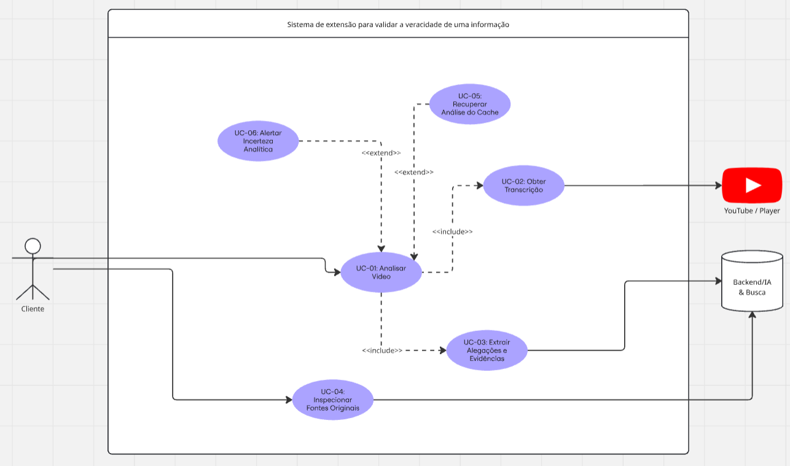
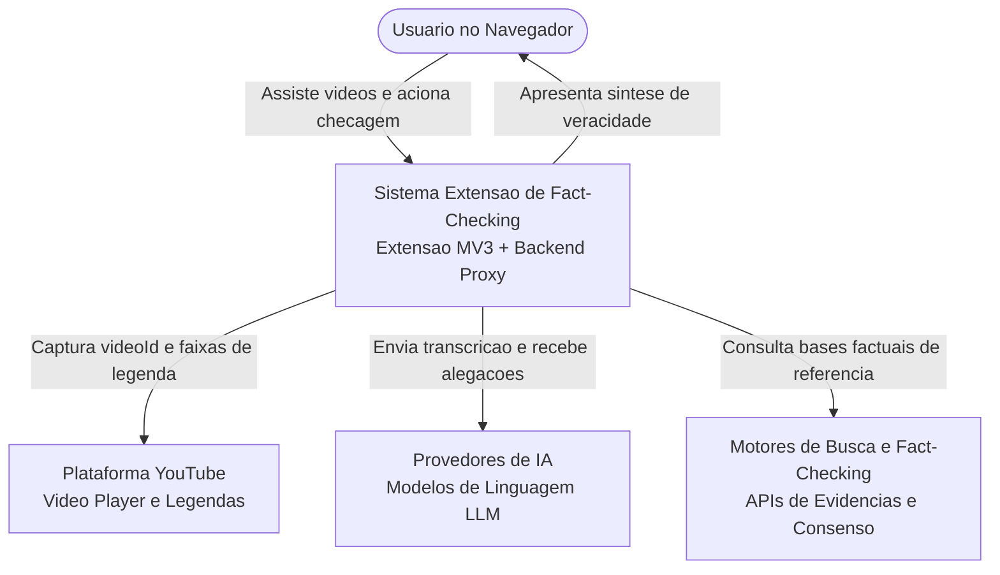
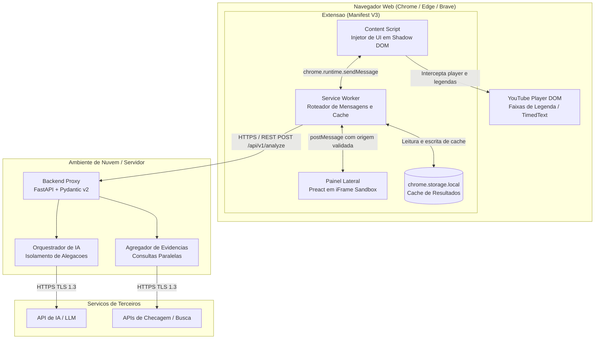
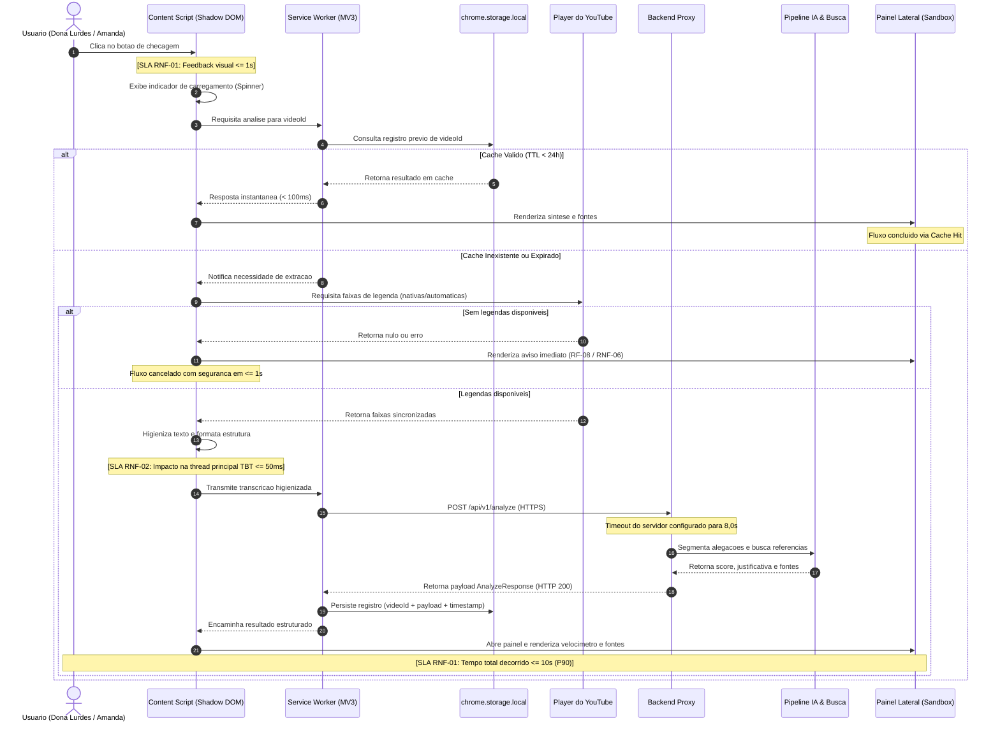

# Arquitetura do Sistema

## Nesta página

- [Visão Geral da Arquitetura](#visao-geral)
- [Modelo C4 — Nível 1: Diagrama de Contexto](#c4-contexto)
- [Modelo C4 — Nível 2: Diagrama de Contêineres](#c4-conteineres)
- [Diagrama de Sequência do Fluxo Crítico (UC-01)](#diagrama-sequencia)
- [Componentes Técnicos e Responsabilidades](#componentes-principais)
- [Organização do Código-Fonte (Monorepo)](#organizacao-monorepo)
- [Estratégia de Cache e Armazenamento Local](#estrategia-de-cache)
- [Padrões de Degradação Graciosa](#fluxo-de-degradacao-segura)
- [Segurança e Privacidade](#seguranca-e-privacidade)
- [Decisões Arquiteturais Registradas (ADRs)](#decisoes-de-design-adrs)

---

## Visão Geral da Arquitetura {: #visao-geral }

A solução adota uma arquitetura cliente-servidor desacoplada, composta por uma **extensão de navegador construída sob o padrão Manifest V3** e um **Backend Proxy seguro**.

Nenhuma credencial ou chave privada de serviços de inteligência artificial é distribuída com a extensão. Todo o processamento sensível e a orquestração de buscas externas ocorrem em ambiente protegido de servidor.



---

## Modelo C4 — Nível 1: Diagrama de Contexto {: #c4-contexto }

O diagrama abaixo ilustra o contexto no qual o sistema opera, demarcando os limites entre o usuário, o ecossistema YouTube e os serviços externos.



---

## Modelo C4 — Nível 2: Diagrama de Contêineres {: #c4-conteineres }

O detalhamento de contêineres evidencia os limites de execução, isolamento de processos e protocolos de comunicação:



---

## Diagrama de Sequência do Fluxo Crítico (UC-01) {: #diagrama-sequencia }

O diagrama a seguir especifica o fluxo completo de acionamento, processamento assíncrono e entrega da síntese, com o mapeamento explícito de onde os SLAs e limites de performance ([RNF-01 e RNF-02](../requisitos/catalogo-requisitos.md#rnf-01)) são fiscalizados:



---

## Componentes Técnicos e Responsabilidades {: #componentes-principais }

| Componente | Tecnologia Base | Escopo e Responsabilidade Técnica |
|:---|:---|:---|
| **Content Script** | TypeScript + Vite (Manifest V3) | Injeção do botão de veracidade na página `/watch` do YouTube via Shadow DOM; interceptação do `videoId` e das faixas de legenda expostas pelo player; coordenação de abertura do painel. |
| **Service Worker** | TypeScript + Vite (Manifest V3) | Gerenciamento de ciclo de vida em segundo plano; verificação e invalidação do cache em `chrome.storage.local`; comunicação de rede HTTPS com o Backend Proxy. |
| **Painel Lateral** | Preact 10 / TypeScript / CSS Modules | Renderização do velocímetro de veracidade, card de justificativa analítica e lista de fontes; isolamento de estilos e scripts via `iframe` com atributo `sandbox="allow-scripts"`. |
| **Backend Proxy** | Python 3.12+ (FastAPI + Pydantic v2 + Uvicorn) | Ponto único de entrada para chamadas externas; validação de tokens de cliente; controle rigoroso de requisições (*Rate Limiting*); orquestração assíncrona de chamadas para LLM e bases de checagem com timeout de 8,0s. |
| **Pipeline IA & Datasets** | Ollama (Qwen 2.5-3B) + FactChecks.br | Extração estruturada de alegações em JSON, síntese sem jargões e correspondência local imediata com base em checagens jornalísticas brasileiras ([Detalhes](ia-e-datasets.md)). |
| **Contratos Compartilhados** | JSON Schema / TypeScript | Definições canônicas de tipos e schemas (`shared/schemas/api-schema.json` e `shared/types/api.ts`) consumidas por cliente e servidor. |
| **Cache Local** | `chrome.storage.local` API | Persistência cliente das análises efetuadas por 24 horas, indexadas pelo hash do `videoId`. |

---

## Organização do Código-Fonte (Monorepo) {: #organizacao-monorepo }

Conforme deliberado no [ADR-004](decisoes/ADR-004-stack-tecnologica.md), o projeto é estruturado como um monorepo para garantir consistência de contratos, alinhamento de versões e fluxo unificado de CI/CD:

```
evidencia/
├── extension/             # Extensao de navegador (Manifest V3)
│   ├── manifest.json      # Declaracao de permissoes minimas (activeTab, storage)
│   ├── package.json       # Dependencias Preact, TypeScript e Vite
│   ├── vite.config.ts     # Build multi-entry (service-worker, content-script, panel)
│   └── src/
│       ├── background/    # Service Worker e gerenciador de cache
│       ├── content/       # Content Script e injetor Shadow DOM
│       └── panel/         # UI em Preact (Velocimetro, Claims, Fontes)
├── backend/               # Backend Proxy de seguranca e orquestracao
│   ├── pyproject.toml     # Dependencias e configuracao de testes
│   ├── requirements.txt   # FastAPI, Pydantic v2, Uvicorn, SlowAPI
│   ├── .python-version    # Declaracao de versao Python para uv
│   ├── app/
│   │   ├── main.py        # Ponto de entrada FastAPI, CORS e Rate Limiting
│   │   ├── config.py      # Gestao segura de variaveis de ambiente
│   │   ├── schemas.py     # Modelos Pydantic v2 alinhados ao contrato
│   │   ├── api/v1/        # Endpoints /analyze e /health
│   │   └── services/      # Orquestrador assincrono, Ollama e Brazilian Fact Matcher
│   ├── ml/                # Inteligência Artificial e Datasets
│   │   └── datasets/      # Script de download e sample_facts.json (FactChecks.br)
│   └── tests/             # Testes automatizados com Pytest
├── shared/                # Fonte unica da verdade para integracao
│   ├── schemas/           # api-schema.json validavel
│   └── types/             # api.ts (interfaces TypeScript para a extensao)
└── .github/
    └── workflows/ci.yml   # Esteira de CI unificada com 4 estagios para front e back
```

---

## Estratégia de Cache e Armazenamento Local {: #estrategia-de-cache }

A extensão emprega armazenamento estritamente local no navegador do usuário para otimização de latência e contenção de custos de infraestrutura:

```
chrome.storage.local
  └── [chave: videoId]
        ├── score: number (0-100)
        ├── classification: "verdadeiro" | "moderado" | "falso" | "inconclusivo"
        ├── summary: string
        ├── claims: Array<VerificationClaim>
        ├── sources: Array<FactCheckingSource>
        ├── timestamp: epoch_milliseconds
        └── ttl: 86400000 (24 horas em milissegundos)
```

- **Leitura Proativa:** Toda requisição verifica primeiro a presença do `videoId` no storage. Caso `Date.now() - timestamp < ttl`, o resultado é entregue sem tráfego de rede.
- **Invalidação Transparente:** Ao identificar um registro com tempo expirado, o Service Worker o descarta e aciona o pipeline padrão de checagem.
- **Isolamento e Privacidade:** Os dados permanecem exclusivamente no dispositivo do usuário e não são sincronizados entre navegadores ou contas do Google ([ADR-003](decisoes/ADR-003-estrategia-cache-local.md)).

---

## Padrões de Degradação Graciosa {: #fluxo-de-degradacao-segura }

Para satisfazer o requisito [RNF-06](../requisitos/catalogo-requisitos.md#rnf-06), o sistema incorpora tratamentos defensivos em todos os pontos de falha:

1. **Vídeo Sem Legendas Disponíveis:** Identificação local instantânea (< 1s), exibindo mensagem orientadora amigável sem acionar o backend.
2. **Indisponibilidade do Backend ou Provedores Upstream:** Em caso de erro HTTP 500, 502 ou 503, o painel exibe aviso de instabilidade temporária e botão de nova tentativa, mantendo o player em execução normal.
3. **Esgotamento de Timeout (> 10s):** Cancelamento gracioso da promessa no cliente, liberando os recursos da aba e exibindo mensagem explicativa.
4. **Fonte Externa Inacessível (Erro 404):** A abertura de links de evidência ocorre em aba separada (`_blank`), isolando qualquer instabilidade da página de destino.

---

## Segurança e Privacidade {: #seguranca-e-privacidade }

- **Zero Trust Client-Side:** Chaves secretas de APIs de inteligência artificial nunca são empacotadas na extensão ([ADR-002](decisoes/ADR-002-backend-proxy.md)).
- **Privacidade por Padrão (LGPD):** Não há coleta nem persistência de histórico de navegação. A extensão atua única e exclusivamente no vídeo onde o usuário acionou a análise ([Threat Model](threat-model.md)).
- **Isolamento de Estilos e Scripts:** O uso de Shadow DOM no botão injetado e de iFrame Sandbox no painel lateral impede que o YouTube capture eventos da extensão ou que estilos conflitantes causem deformações visuais.

---

## Decisões Arquiteturais Registradas (ADRs) {: #decisoes-de-design-adrs }

| Registro | Decisão Técnica | Status | Impacto Principal |
|:---|:---|:---:|:---|
| [ADR-001](decisoes/ADR-001-manifest-v3.md) | Adoção do padrão Manifest V3 com Service Worker | Aceito | Conformidade obrigatória com a Chrome Web Store e navegadores modernos. |
| [ADR-002](decisoes/ADR-002-backend-proxy.md) | Intermediação via Backend Proxy Dedicado | Aceito | Proteção absoluta de chaves de API, controle de custos e rate limiting. |
| [ADR-003](decisoes/ADR-003-estrategia-cache-local.md) | Cache local via `chrome.storage.local` com TTL de 24h | Aceito | Redução de 100% de latência em vídeos reincidentes e privacidade de dados. |
| [ADR-004](decisoes/ADR-004-stack-tecnologica.md) | Definição da Stack Tecnológica (Preact + FastAPI + Monorepo) | Aceito | Desempenho ultraleve no navegador, ecossistema de IA robusto no backend e contratos unificados. |
| [ADR-005](decisoes/ADR-005-modelo-local-e-datasets-brasileiros.md) | Modelo Local (Ollama Qwen 2.5-3B) e Datasets Brasileiros | Aceito | Soberania de dados, latência zero de rede para LLM, ausência de custos de API e alinhamento cultural com FactChecks.br e Fake.br. |

---

**Próximo:** [Pipeline de IA e Datasets](ia-e-datasets.md) — integração com Ollama e bases de checagem brasileiras.  
**Ver também:** [Contrato de Dados e API](contrato-api.md) e [Threat Model](threat-model.md).
