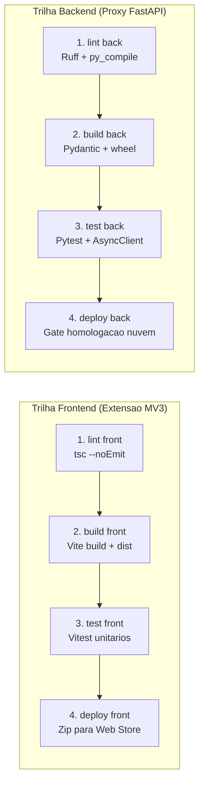

# Estratégia de Testes e Critérios de Aceite (DoD)

## Nesta página

- [Visão Geral da Qualidade](#visao-geral-da-qualidade)
- [Pirâmide e Níveis de Teste](#piramide-e-niveis-de-teste)
  - [Testes Unitários](#testes-unitarios)
  - [Testes de Integração](#testes-de-integracao)
  - [Testes de Contrato de API](#testes-de-contrato-de-api)
  - [Testes de Ponta a Ponta (E2E)](#testes-de-ponta-a-ponta-e2e)
- [Protocolos de Medição dos Requisitos Não Funcionais](#protocolos-de-medicao-dos-rnf)
  - [Validação do SLA de Latência (RNF-01)](#validacao-rnf-01)
  - [Validação de Sobrecarga e TBT (RNF-02)](#validacao-rnf-02)
  - [Validação de Degradação Graciosa (RNF-06)](#validacao-rnf-06)
  - [Validação de Acessibilidade (RNF-07)](#validacao-rnf-07)
- [Arquitetura da Esteira de CI/CD e Portões de Qualidade](#pipeline-ci-cd)
- [Definition of Done (DoD)](#definition-of-done-dod)
  - [DoD para Histórias de Usuário](#dod-historias-de-usuario)
  - [DoD para Releases e Publicação](#dod-releases-e-publicacao)

---

## Visão Geral da Qualidade {: #visao-geral-da-qualidade }

A garantia de qualidade da **Extensão de Fact-Checking para YouTube** baseia-se em automação contínua e validação rigorosa de desempenho e segurança. Como o software é injetado diretamente no fluxo de navegação do usuário em uma plataforma de terceiros de alta complexidade (YouTube), qualquer falha de estabilidade pode impactar a percepção de credibilidade do produto.

---

## Pirâmide e Níveis de Teste {: #piramide-e-niveis-de-teste }

```
        / \
       /   \        Testes E2E (Playwright em Chromium com extensão carregada)
      / ----\
     / Testes \     Testes de Integração e Contrato (API Schemas + chrome.runtime mock)
    /  de Inte \
   /------------\
  /    Testes    \  Testes Unitários (Higienização, Parser de Legendas, Componentes Preact)
 /   Unitários    \
--------------------
```

### 1. Testes Unitários {: #testes-unitarios }

- **Escopo:** Lógica isolada de decodificação e limpeza de legendas, sanitização de textos de transcrição, cálculo de expiração de TTL de cache, validação de URLs e renderização individual de componentes de UI.
- **Ferramentas:** Vitest / Jest com `@testing-library/preact`.
- **Meta de Cobertura:** Mínimo de **80% de cobertura de linhas** e ramificações nos módulos core do cliente e do backend proxy.

### 2. Testes de Integração {: #testes-de-integracao }

- **Escopo:** Comunicação interna de mensagens entre Content Script e Service Worker utilizando mocks da API `chrome.runtime`; integração do Backend Proxy com adaptadores de IA e mecanismos de cache em memória.
- **Ambiente:** Execução automatizada no runner de CI em ambientes isolados: Node.js 20 LTS para o cliente da extensão (Vitest com mocks da API `chrome.runtime`) e Python 3.12 para o Backend Proxy (Pytest com `httpx.AsyncClient` e FastAPI TestClient).

### 3. Testes de Contrato de API {: #testes-de-contrato-de-api }

- **Escopo:** Validação estrita das cargas úteis transmitidas entre a extensão e o Backend Proxy em conformidade com as especificações do [Contrato de Dados e API](contrato-api.md).
- **Ferramentas:** Validadores de JSON Schema e ferramentas de teste de contrato baseadas em OpenAPI 3.0.

### 4. Testes de Ponta a Ponta (E2E) {: #testes-de-ponta-a-ponta-e2e }

- **Escopo:** Execução real da extensão empacotada em instâncias dedicadas de navegadores Chromium (Chrome e Edge) gerenciadas pelo **Playwright**.
- **Cenários Cobertos:**
  - Injeção bem-sucedida do botão de veracidade em páginas `/watch`.
  - Acionamento da checagem em vídeo com legendas disponíveis.
  - Abertura suave do painel lateral com renderização do velocímetro e cartões de fontes.
  - Comportamento de clique em links externos (`target="_blank"`).
  - Fechamento do painel via clique no botão de fechar e via tecla `Escape`.

---

## Protocolos de Medição dos Requisitos Não Funcionais {: #protocolos-de-medicao-dos-rnf }

### Validação do SLA de Latência (RNF-01) {: #validacao-rnf-01 }

- **Objetivo:** Garantir a entrega do resultado útil em até 10 segundos no 90º percentil.
- **Procedimento:**
  1. Durante a execução da suíte de testes E2E, um timer de alta precisão (`performance.now()`) é iniciado no momento exato do clique no botão da extensão.
  2. O timer é interrompido quando o componente do painel atinge o estado de renderização completa dos dados da análise.
  3. A esteira de CI falha compulsoriamente se a duração de qualquer execução ultrapassar 10,0 segundos em condições normais de rede simulada.

### Validação de Sobrecarga e TBT (RNF-02) {: #validacao-rnf-02 }

- **Objetivo:** Assegurar que a presença da extensão não degrade o carregamento da página do YouTube em mais de 50 ms de Total Blocking Time (TBT).
- **Procedimento:**
  1. Executar 5 medições com **Google Lighthouse** na página do YouTube sem a extensão instalada (linha de base).
  2. Executar 5 medições com a extensão ativa e injetada na mesma página.
  3. Calcular a diferença média de TBT. A aprovação exige: `TBT_com_extensao - TBT_linha_de_base <= 50 ms`.

### Validação de Degradação Graciosa (RNF-06) {: #validacao-rnf-06 }

- **Objetivo:** Assegurar que falhas de rede, timeouts ou quedas de backend não congelem a aba do usuário nem quebrem o player do YouTube.
- **Procedimento:**
  1. Simular via interceptação de rede respostas HTTP 500, 502, 503 e 504 no endpoint `/api/v1/analyze`.
  2. Verificar que o painel lateral exibe a mensagem de erro amigável correspondente e oferece o botão de nova tentativa.
  3. Confirmar que a reprodução do vídeo do YouTube permanece ininterrupta.

### Validação de Acessibilidade (RNF-07) {: #validacao-rnf-07 }

- **Objetivo:** Conformidade estrita com as diretrizes WCAG 2.1 nível AA.
- **Procedimento:**
  1. Executar a biblioteca automatizada `axe-core` contra a árvore DOM do painel lateral.
  2. Nenhuma violação crítica ou séria de contraste ou rotulagem ARIA é permitida.
  3. Validar manualmente o ciclo de foco via teclado (`Tab`, `Shift+Tab`, `Escape`).

---

## Arquitetura da Esteira de CI/CD e Portões de Qualidade {: #pipeline-ci-cd }

A esteira de integração contínua do repositório de desenvolvimento (`evidencia/.github/workflows/ci.yml`) materializa a garantia de qualidade através de duas trilhas independentes executadas em paralelo, cada uma estruturada em quatro estágios sequenciais rigorosos:



### 1. Trilha Frontend (Extensão Manifest V3)

1. **`lint front`:** Verificação estática de tipagem e integridade do código TypeScript com `tsc --noEmit`, bloqueando antecipadamente inconsistências em componentes Preact e contratos de dados.
2. **`build front`:** Compilação multi-entry via Vite (`background.js`, `content.js`, `panel/index.html`), verificação de tamanho de bundle e arquivamento dos artefatos em `extension/dist/`.
3. **`test front`:** Execução automatizada da suíte de testes com Vitest, cobrindo parsing e higienização de legendas, mocks da API Chromium e renderização básica.
4. **`deploy front`:** Compactação em arquivo `.zip` padronizado para submissão à Chrome Web Store e arquivamento como release asset quando acionado na branch `main`.

### 2. Trilha Backend (Proxy FastAPI)

1. **`lint back`:** Análise estática com Ruff e compilação de bytecode Python (`py_compile`), garantindo ausência de erros de sintaxe ou violações de boas práticas em todos os módulos.
2. **`build back`:** Instalação de dependências, smoke test de inicialização da aplicação FastAPI e geração dos pacotes binários e de código-fonte (`sdist` e `wheel`).
3. **`test back`:** Execução da suíte de integração e testes de endpoint assíncronos com Pytest e `httpx.AsyncClient`, validando rate limiting, schemas e timeout de 8,0s.
4. **`deploy back`:** Validação de imagem de contêiner e portão de homologação para ambiente de nuvem gerenciado (Cloud Run / Serverless) na branch `main`.

---

## Definition of Done (DoD) {: #definition-of-done-dod }

### DoD para Histórias de Usuário (Features) {: #dod-historias-de-usuario }

Uma história de usuário é considerada concluída e apta para integração apenas quando:

- [ ] Todos os cenários descritos em formato Gherkin foram implementados e validados por testes automatizados.
- [ ] Cobertura de testes unitários superior a 80% no módulo modificado.
- [ ] Nenhum aviso ou erro gerado por linters estáticos ou checadores de tipos (TypeScript/Python).
- [ ] O [Catálogo Consolidado de Requisitos](../requisitos/catalogo-requisitos.md) e a [Matriz de Rastreabilidade](../requisitos/matriz-rastreabilidade.md) foram atualizados.
- [ ] O comando de validação estrita da documentação (`uv run mkdocs build --strict`) é executado com zero avisos e zero erros.

### DoD para Releases e Publicação {: #dod-releases-e-publicacao }

Uma versão é homologada para publicação na Chrome Web Store apenas quando:

- [ ] Todos os testes unitários, de integração, de contrato e E2E foram executados com 100% de sucesso.
- [ ] O teste de carga e latência confirma conformidade com o SLA de 10 segundos ([RNF-01](../requisitos/catalogo-requisitos.md#rnf-01)).
- [ ] A auditoria de TBT confirma sobrecarga inferior a 50 ms ([RNF-02](../requisitos/catalogo-requisitos.md#rnf-02)).
- [ ] A auditoria de acessibilidade automatizada (`axe-core`) não acusa nenhuma pendência.
- [ ] Análise de segurança SAST e varredura de credenciais (*Secret Scanning*) não identificam riscos.
- [ ] O arquivo `CHANGELOG.md` foi atualizado com a versão numerada e data de lançamento.

---

**Próximo:** [Gestão de Riscos Técnicos](../planejamento/gestao-riscos.md) — identificação de ameaças de projeto e planos de mitigação.  
**Ver também:** [Matriz de Rastreabilidade](../requisitos/matriz-rastreabilidade.md) — conexão entre requisitos e testes.
