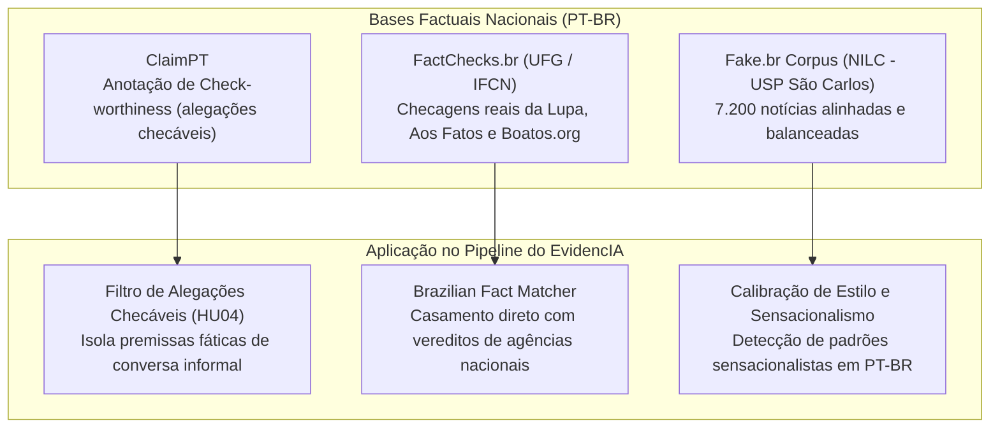
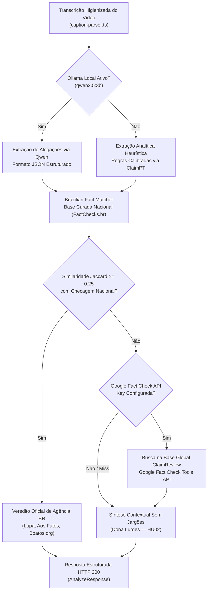

# Pipeline de Inteligência Artificial e Datasets Brasileiros

## Nesta página

- [Visão Geral do Pipeline de IA](#visao-geral)
- [Priorização de Datasets Brasileiros](#datasets-brasileiros)
    - [FactChecks.br](#factchecks-br)
    - [Fake.br Corpus (USP)](#fake-br-corpus)
    - [ClaimPT](#claimpt)
- [Motor de IA Local via Ollama (Qwen 2.5-3B)](#motor-local-ollama)
- [Arquitetura de Verificação Factual (RAG em Tempo de Inferência)](#arquitetura-rag)
- [Governança e Versionamento no Repositório (MLOps)](#gestao-repositorio)
- [Guia Operacional para Desenvolvedores](#guia-operacional)

---

## Visão Geral do Pipeline de IA {: #visao-geral }

O projeto **EvidencIA** adota uma estratégia de inteligência artificial soberana e alinhada ao contexto sociolinguístico brasileiro. Em vez de depender exclusivamente de modelos de nuvem pagos com latência imprevisível ou classificadores genéricos em língua inglesa, a solução combina três pilares:

1. **Inferência Local via Ollama com Qwen 2.5-3B-Instruct:**  
   Execução de modelo *open-weights* local com latência mínima (< 100ms/token), sem custos recorrentes de nuvem e com geração de JSON estruturado nativa.

2. **Prioridade Absoluta a Datasets Brasileiros:**  
   Bases de dados curadas por agências de checagem do IFCN no Brasil (Agência Lupa, Aos Fatos, Boatos.org, UOL Confere) e universidades públicas (USP, UFG).

3. **RAG Factual em Tempo de Inferência com Degradação Graciosa:**  
   Consulta automatizada a checagens de `ClaimReview` prévias combinadas a uma base curada local, prevenindo alucinações e vereditos dogmáticos.

!!! info "Decisão Arquitetural Formal"
    Para os fundamentos técnicos, matriz de riscos e alternativas analisadas, consulte a [ADR-005 — Modelo Local e Datasets Brasileiros](decisoes/ADR-005-modelo-local-e-datasets-brasileiros.md).

---

## Priorização de Datasets Brasileiros {: #datasets-brasileiros }

A desinformação no Brasil apresenta peculiaridades linguísticas, culturais e temáticas (como receitas curativas caseiras no WhatsApp, fraudes via Pix e alegações envolvendo Anvisa, SUS ou IBGE). Por essa razão, o projeto prioriza três bases brasileiras:



### 1. FactChecks.br (UFG / Agências IFCN) {: #factchecks-br }

* **Origem:** Universidade Federal de Goiás (UFG) em parceria com agências certificadas pelo *International Fact-Checking Network* (IFCN).
* **Conteúdo:** Milhares de pares contendo afirmações checadas, links originais, metadados dos checadores e vereditos categorizados (*Falso, Verdadeiro, Distorcido, Sem Contexto*).
* **Papel no EvidencIA:** Base de verdade factual para o serviço `brazilian_fact_matcher.py` e amostra de ouro (`sample_facts.json`), viabilizando checagens instantâneas sem consumo de quota externa.

### 2. Fake.br Corpus (NILC - USP São Carlos) {: #fake-br-corpus }

* **Origem:** Núcleo Interinstitucional de Linguística Computacional (NILC) do ICMC-USP São Carlos.
* **Conteúdo:** 7.200 notícias completas (3.600 falsas e 3.600 verdadeiras pareadas por tamanho e tópico).
* **Papel no EvidencIA:** Avaliação e calibração de classificadores de estilo textual, identificação de manchetes clickbait e métricas de emotividade/sensacionalismo.

### 3. ClaimPT {: #claimpt }

* **Origem:** Dataset de referência acadêmica em Português para *Check-worthiness*.
* **Conteúdo:** Textos anotados no nível de sentença para distinguir proposições verificáveis de opiniões, saudações ou comentários casuais.
* **Papel no EvidencIA:** Guia a heurística de segmentação atômica e os prompts do Qwen 2.5-3B para descartar introduções de YouTubers e isolar apenas alegações verificáveis ([HU04](../../requisitos/backlog-e-historias.md#hu04)).

---

## Motor de IA Local via Ollama (Qwen 2.5-3B) {: #motor-local-ollama }

O backend proxy integra-se ao **Ollama** (`http://localhost:11434`), aproveitando a eficiência do **Qwen 2.5-3B-Instruct**:

| Característica | Detalhe Técnico | Benefício no EvidencIA |
|:---|:---|:---|
| **Parâmetros e Quantização** | 3.09 bilhões de parâmetros (quantizado em 4-bit `qwen2.5:3b`) | Consome apenas **~2.2 GB de memória RAM**, executando com folga em máquinas de desenvolvimento locais. |
| **Janela de Contexto** | Até 32.768 tokens nativos | Processa transcrições longas de vídeos do YouTube integralmente, sem janelas deslizantes que percam premissas. |
| **Geração de JSON Nativa** | Modo estrito `format: "json"` | Retorna arrays tipados de alegações diretamente compatíveis com os schemas Pydantic v2 do backend. |
| **Resiliência e Fallback** | `OllamaService` com detecção de falha | Se o daemon do Ollama estiver desligado ou em ambiente de CI/CD, o backend degrada automaticamente para o classificador analítico sem falhas. |

---

## Arquitetura de Verificação Factual (RAG em Tempo de Inferência) {: #arquitetura-rag }

A checagem de um vídeo no EvidencIA segue uma cascata de decisão determinística, econômica e resiliente:



---

## Governança e Versionamento no Repositório (MLOps) {: #gestao-repositorio }

Para garantir a integridade do repositório e respeitar o limite de 100 MB por arquivo imposto pelo GitHub:

* **Arquivos Bloqueados no Git (`.gitignore`):** Nenhum peso binário (`.bin`, `.safetensors`, `.gguf`) ou dump bruto de dados é commitado no controle de versão.
* **Amostra de Ouro Versionada (`sample_facts.json`):** Um arquivo JSON compacto (< 40 KB) contendo 10 checagens reais de alta relevância acompanha o repositório, garantindo testes unitários imediatos e esteira de CI/CD sem dependência de internet.
* **Download Automatizado sob Demanda:** O script `ml/datasets/dataset_downloader.py` gerencia o download pontual via Hugging Face Hub.

---

## Guia Operacional para Desenvolvedores {: #guia-operacional }

### 1. Inicializar o Motor Local Ollama

```bash
# 1. Iniciar o daemon do Ollama (caso não execute como serviço)
ollama serve

# 2. Baixar o modelo Qwen 2.5-3B (download único de ~2.2 GB)
ollama run qwen2.5:3b
```

### 2. Configurar o Backend Proxy

No arquivo `.env` do backend (`evidencia/backend/.env`):

```ini
LLM_PROVIDER=ollama
OLLAMA_BASE_URL=http://localhost:11434
OLLAMA_MODEL=qwen2.5:3b
OLLAMA_TIMEOUT_SECONDS=6.0
```

### 3. Baixar ou Inspecionar Datasets Brasileiros

```bash
cd evidencia/backend

# Visualizar a amostra local brasileira embutida
python ml/datasets/dataset_downloader.py --dataset sample

# Baixar o dataset FactChecks.br completo do Hugging Face Hub
python ml/datasets/dataset_downloader.py --dataset factchecks --output-dir ml/datasets/data
```

### 4. Executar os Testes Automatizados

```bash
cd evidencia/backend

# Executar suíte de testes com cobertura
uv run pytest -v

# Linter de código
uv run ruff check .
```
