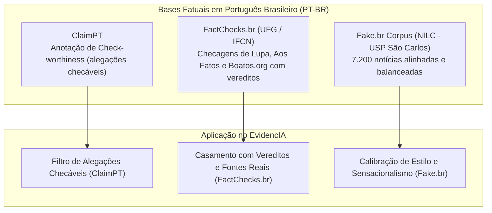

# Pipeline de Inteligência Artificial e Datasets Brasileiros

## Nesta página

- [Visão Geral do Pipeline de IA](#visao-geral)
- [Priorização de Datasets Brasileiros](#datasets-brasileiros)
  - [FactChecks.br](#factchecks-br)
  - [Fake.br Corpus (USP)](#fake-br-corpus)
  - [ClaimPT](#claimpt)
- [Motor de IA Local via Ollama (Qwen 2.5-3B)](#motor-local-ollama)
- [Arquitetura de Verificação Factual (RAG em Tempo de Inferência)](#arquitetura-rag)
- [Gestão e Versionamento no Repositório (MLOps)](#gestao-repositorio)
- [Guia Operacional para Desenvolvedores](#guia-operacional)

---

## Visão Geral do Pipeline de IA {: #visao-geral }

O projeto **EvidencIA** adota uma estratégia de inteligência artificial soberana e focada no contexto sociolinguístico brasileiro. Em vez de depender exclusivamente de modelos de nuvem pagos com latência externa ou classificadores genéricos em língua inglesa, a solução combina:

1. **Inferência Local via Ollama com Qwen 2.5-3B-Instruct:** Execução de modelo open-weights local com baixíssima latência (< 100ms/token), sem custos de nuvem e com suporte nativo a respostas em JSON estruturado.
2. **Prioridade Absoluta a Datasets Brasileiros:** Bases de dados curadas por agências de checagem do IFCN no Brasil (Agência Lupa, Aos Fatos, Boatos.org, UOL Confere) e universidades públicas (USP, UFG).
3. **RAG Factual em Tempo de Inferência:** Consulta automatizada a bases prévias de `ClaimReview` via **Google Fact Check Tools API** combinada a uma base curada local, eliminando alucinações e vereditos dogmáticos.

---

## Priorização de Datasets Brasileiros {: #datasets-brasileiros }

A desinformação no Brasil apresenta peculiaridades linguísticas, culturais e temáticas (como receitas milagrosas de saúde no WhatsApp e teorias sobre instituições públicas). Por essa razão, o projeto prioriza três bases brasileiras:



### 1. FactChecks.br (UFG / Agências IFCN) {: #factchecks-br }
* **Origem:** Universidade Federal de Goiás (UFG) e agências certificadas pelo IFCN (International Fact-Checking Network).
* **Conteúdo:** Milhares de pares contendo afirmações checadas, links originais, metadados dos checadores e vereditos categorizados (*Falso, Verdadeiro, Distorcido, Sem Contexto*).
* **Papel no EvidencIA:** Base de verdade para o serviço `brazilian_fact_matcher.py` e amostra de ouro (`sample_facts.json`), viabilizando checagens instantâneas sem consumo de quota.

### 2. Fake.br Corpus (NILC - USP São Carlos) {: #fake-br-corpus }
* **Origem:** Núcleo Interinstitucional de Linguística Computacional (NILC) do ICMC-USP.
* **Conteúdo:** 7.200 notícias completas (3.600 falsas e 3.600 verdadeiras pareadas por tamanho e tópico).
* **Papel no EvidencIA:** Treinamento e avaliação de classificadores de estilo linguístico e detecção de padrões sensacionalistas típicos de notícias fraudulentas em PT-BR.

### 3. ClaimPT {: #claimpt }
* **Conteúdo:** Textos anotados no nível de sentença para identificar **check-worthiness** (se a frase expressa uma alegação factual verificável ou apenas opinião/conversa fiada).
* **Papel no EvidencIA:** Calibração dos prompts do extrator de alegações, descartando saudações de YouTubers e isolando apenas alegações verificáveis para as fichas de Amanda (HU04).

---

## Motor de IA Local via Ollama (Qwen 2.5-3B) {: #motor-local-ollama }

O backend proxy integra-se ao **Ollama** (`http://localhost:11434`), aproveitando a eficiência do **Qwen 2.5-3B-Instruct**:

| Característica | Detalhe Técnico | Benefício no EvidencIA |
|:---|:---|:---|
| **Parâmetros e Quantização** | 3.09 bilhões de parâmetros (quantizado em 4-bit Q4_K_M) | Consome apenas ~2.2 GB de memória RAM/VRAM, rodando com folga em máquinas de desenvolvimento locais. |
| **Janela de Contexto** | Até 32.768 tokens | Processa transcrições longas de vídeos do YouTube inteiras, sem necessidade de janelas deslizantes que perdem o contexto. |
| **Geração de JSON Nativa** | Modo estrito `format: "json"` | Retorna arrays tipados de `claims` com `text`, `status` e `evidence_summary` diretamente compatíveis com os schemas Pydantic. |
| **Resiliência e Fallback** | `ollama_service.py` com circuit-breaker | Se o daemon do Ollama estiver desligado ou em ambiente de CI/CD, o backend degrada automaticamente para o classificador heurístico e o dataset de amostra sem gerar erro HTTP 500. |

---

## Arquitetura de Verificação Factual (RAG em Tempo de Inferência) {: #arquitetura-rag }

A checagem de um vídeo no EvidencIA segue uma cascata de decisão determinística e econômica:

```
[Transcrição do Vídeo]
         │
         ▼
[1. Extração de Alegações Checáveis]
         ├──► Via Ollama Local (Qwen 2.5-3B)
         └──► Fallback: Extrator Analítico Baseado no ClaimPT
         │
         ▼
[2. Consulta a Bases Brasileiras (FactChecks.br)]
         │
    (Match Encontrado?)
         ├──► SIM: Retorna fonte e veredito da Lupa/Aos Fatos (< 5ms)
         │
         └──► NÃO:
                ▼
        [3. Google Fact Check Tools API] (ClaimReview)
                │
            (Match Encontrado?)
                ├──► SIM: Retorna checagem registrada de agência IFCN
                │
                └──► NÃO: Análise contextual não-dogmática (HU04)
```

---

## Gestão e Versionamento no Repositório (MLOps) {: #gestao-repositorio }

Para respeitar as diretrizes de governança e o limite de 100 MB por arquivo do GitHub:

* **Arquivos Bloqueados no Git (`.gitignore`):** Nenhum peso binário (`.bin`, `.safetensors`, `.gguf`) ou dump bruto de dados é commitado no Git.
* **Amostra Versionada (`sample_facts.json`):** Um arquivo JSON compacto (< 40 KB) contendo 10 checagens reais de alta relevância acompanha o repositório, garantindo que testes unitários e esteiras de CI/CD executem com 100% de sucesso sem necessidade de internet.
* **Download Automatizado sob Demanda:** Scripts em `ml/datasets/dataset_downloader.py` permitem baixar volumes maiores do Hugging Face Hub sempre que necessário.

---

## Guia Operacional para Desenvolvedores {: #guia-operacional }

### 1. Inicializar o Motor Local Ollama
```bash
# 1. Iniciar o Ollama (caso não esteja como serviço em segundo plano)
ollama serve

# 2. Baixar o modelo Qwen 2.5-3B (download único de ~2.2 GB)
ollama run qwen2.5:3b
```

### 2. Configurar o Backend Proxy
No arquivo `.env` do backend:
```env
LLM_PROVIDER=ollama
OLLAMA_BASE_URL=http://localhost:11434
OLLAMA_MODEL=qwen2.5:3b
OLLAMA_TIMEOUT_SECONDS=6.0
```

### 3. Baixar ou inspecionar Datasets Brasileiros
```bash
cd backend

# Visualizar a amostra local brasileira offline
python -m ml.datasets.dataset_downloader --dataset sample

# Baixar lote completo do FactChecks.br do Hugging Face
python -m ml.datasets.dataset_downloader --dataset factchecksbr --limit 100
```
