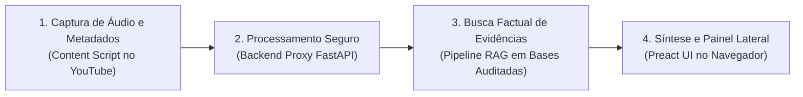

# Visão Geral do Projeto EvidencIA

> **O que você vai encontrar aqui:** Uma síntese executiva do projeto EvidencIA em uma única página. Este documento explica o que é o produto, a quem se destina, como funciona sua arquitetura, o que já foi entregue e quais são os próximos passos.
>
> **Tempo estimado de leitura:** 5 a 10 minutos.

---

## 1. O que é o Projeto

O **EvidencIA** é uma extensão de navegador de código aberto desenvolvida sob o padrão **Manifest V3** para o ecossistema Chromium (Google Chrome, Microsoft Edge e Brave). O sistema atua diretamente na interface de reprodução de vídeos do YouTube (`youtube.com/watch*`), oferecendo suporte à checagem de fatos e ao discernimento crítico da informação consumida.

O projeto surge no contexto do método de ensino e pesquisa **Challenge Based Learning (CBL)**, orientado pela seguinte pergunta fundamental (*Essential Question*):

> *"Como sistemas de IA podem ajudar as pessoas a avaliar a confiabilidade de informações sem substituir seu pensamento crítico?"*

Ao contrário das ferramentas tradicionais de verificação, o EvidencIA não emite vereditos algorítmicos prontos nem exibe pontuações numéricas de "confiabilidade". Ele adota a filosofia **Evidence-First** ([ADR-006](../tecnico/decisoes/ADR-006-evidence-first-architecture.md)): o sistema localiza e apresenta evidências factuais auditáveis, destacando fontes jornalísticas de referência e formulando perguntas orientadoras para que a pessoa usuária exerça seu próprio julgamento.

---

## 2. Para Quem É (Público-Alvo)

O produto foi concebido para pessoas que consomem conteúdo informativo na internet e precisam verificar alegações sem interromper o fluxo de navegação:

- **Pessoas consumidoras leigas:** que assistem a conteúdos de saúde, ciência, política e utilidade pública e querem saber se determinada afirmação encontra respaldo na imprensa e na comunidade técnica.
- **Estudantes e pesquisadores:** que realizam pesquisas temáticas em vídeo e necessitam de links diretos para apurações jornalísticas originais.
- **Educadores e comunicadores:** que utilizam a ferramenta como instrumento pedagógico de educação midiática e combate à desinformação.

---

## 3. Como Funciona (Fluxo Operacional)

A operação do EvidencIA ocorre em quatro etapas sequenciais:

1. **Captura:** Ao clicar no botão da extensão em um vídeo, o *Content Script* extrai as legendas do player, o identificador do vídeo (`videoId`), a data de publicação e as informações do canal.
2. **Intermediação Segura:** A extensão envia o conteúdo ao **Backend Proxy** via protocolo seguro. Nenhuma chave de API ou credencial sensível reside na extensão ([ADR-002](../tecnico/decisoes/ADR-002-backend-proxy.md)).
3. **Recuperação de Evidências (RAG):** O backend decompõe a transcrição em alegações atômicas e busca reportagens de agências de checagem brasileiras homologadas (como Aos Fatos e Agência Lupa).
4. **Apresentação Investigativa:** O painel lateral renderiza cada alegação acompanhada de suas fontes com links auditáveis.
   - Quando não há reportagens sobre o tema, o sistema assume expressamente o estado **"Sem evidência suficiente"** ([RF-12](../requisitos/catalogo-requisitos.md#rf-12)), evitando falsas certezas.
   - O modo de contingência **Evidence-Only** assegura resposta mesmo em caso de indisponibilidade momentânea do modelo de linguagem.

---

## 4. O que Já Está Pronto

| Marco | Artefatos Entregues | Status |
|:---|:---|:---:|
| **Fundação CBL (Engage)** | 12 *Guiding Questions* mapeadas, alinhamento estratégico e registro de decisões arquiteturais. | `EVIDENCIADO` |
| **Engenharia de Requisitos** | Catálogo formal com 15 RFs, 7 RNFs, 6 Casos de Uso e 16 Histórias de Usuário (HUs com Gherkin). | `EVIDENCIADO` |
| **Arquitetura e Decisões** | Especificação C4 completa, modelos de dados e ADR-001 a ADR-006 formalizados. | `EVIDENCIADO` |
| **Sprint 1 (Fundação)** | Ingestão e higienização de legendas, cache local com retenção de 24 horas e EDA de bases jornalísticas. | `IMPLEMENTADO` |
| **Proteção e Governança** | Suíte de testes automatizados no backend e no frontend, com bloqueio estrito de mocks em produção. | `IMPLEMENTADO` |
| **Protocolo Científico (Act)** | Desenho do experimento comparativo (*between-subjects*), métricas M1 a M9 e telemetria ética sem rede. | `EVIDENCIADO` |

---

## 5. O que Falta Fazer (Próximos Passos)

1. **Sprint 2 (Interface Evidence-First):** Implementação dos componentes `ClaimCard`, `EvidenceCard` e `ReflectionQuestions` no painel lateral em Preact, concluindo as histórias HU11, HU13, HU14 e HU15.
2. **Execução de Campo do Estudo Act:** Aplicação do protocolo experimental com participantes humanos reais e preenchimento dos resultados consolidados em `results.md` (portão para transição de `SCAFFOLD` para homologação).
3. **Pós-MVP (Sprint 3):** Implementação do canal anônimo e voluntário de retorno sobre a utilidade da análise ([HU12](../requisitos/backlog-e-historias.md#hu12) / [RF-10](../requisitos/catalogo-requisitos.md#rf-10)).

---

## Documentos Relacionados
- [Mapa Geral e Topologia do Projeto](mapa-do-projeto.md) — Visualização gráfica detalhada dos componentes e das fases metodológicas.
- [Painel Consolidado de Status](status.md) — Situação atual de cada artefato e dos portões de qualidade G1 a G8.
- [Catálogo de Requisitos](../requisitos/catalogo-requisitos.md) — Especificação detalhada de todos os requisitos funcionais e não funcionais.
- [Glossário Unificado](../glossario.md) — Definições de todos os termos técnicos e conceituais do ecossistema.
